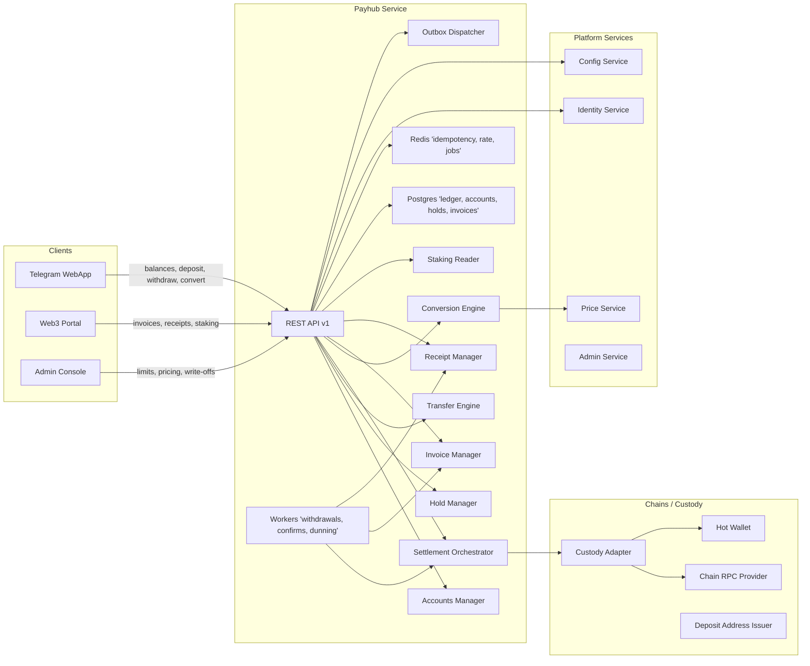
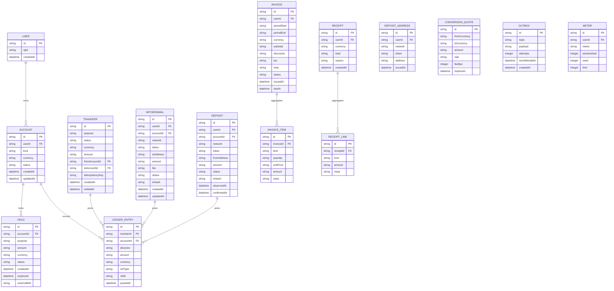
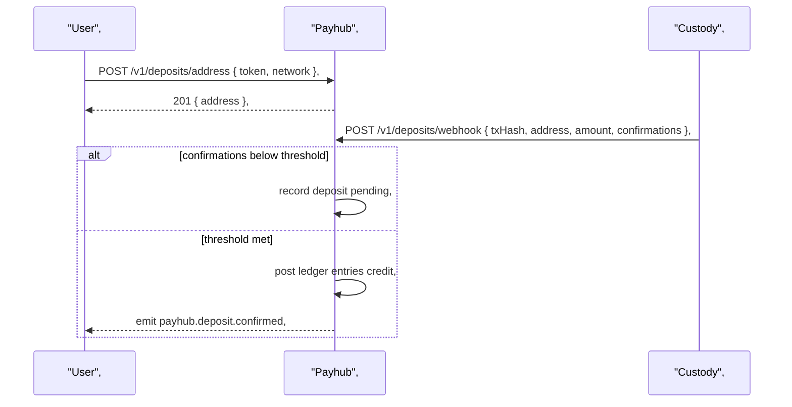
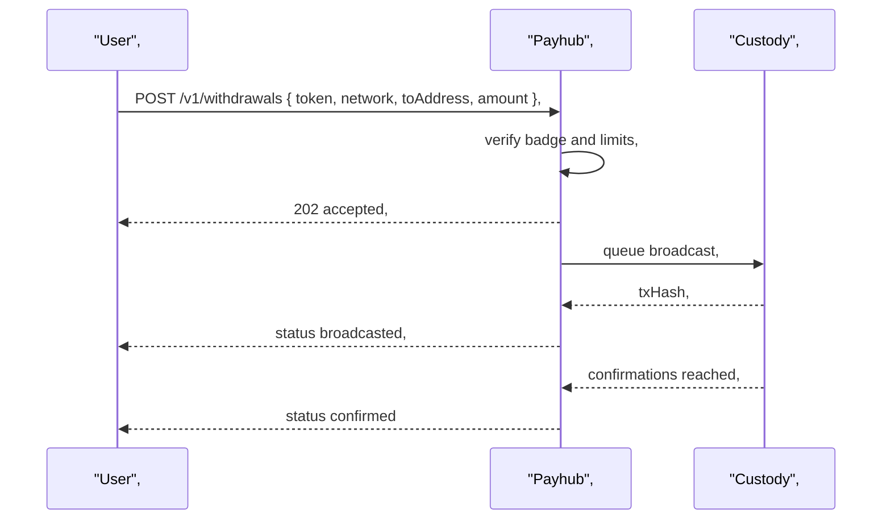
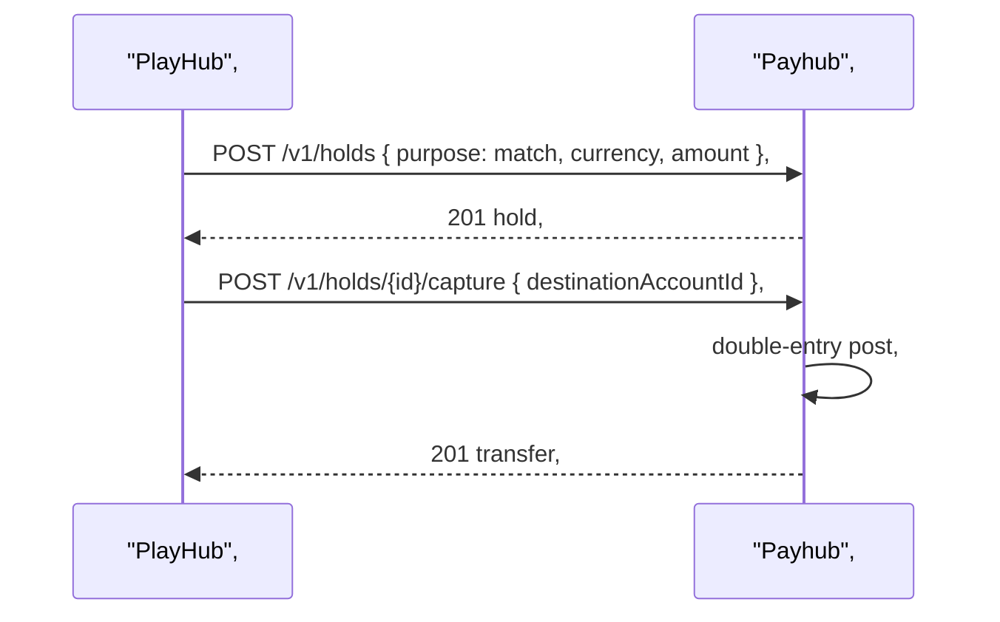
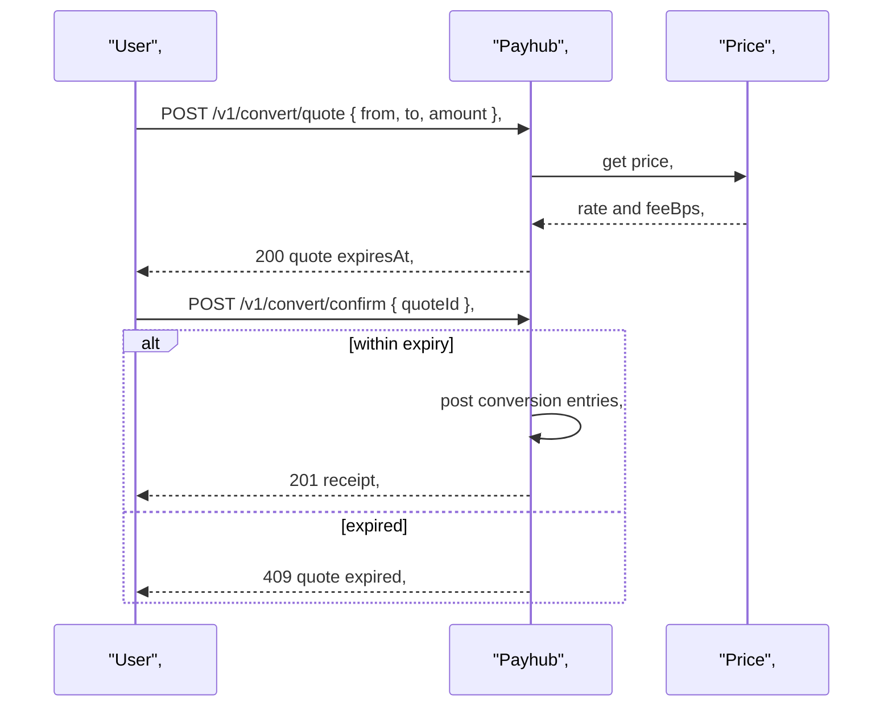
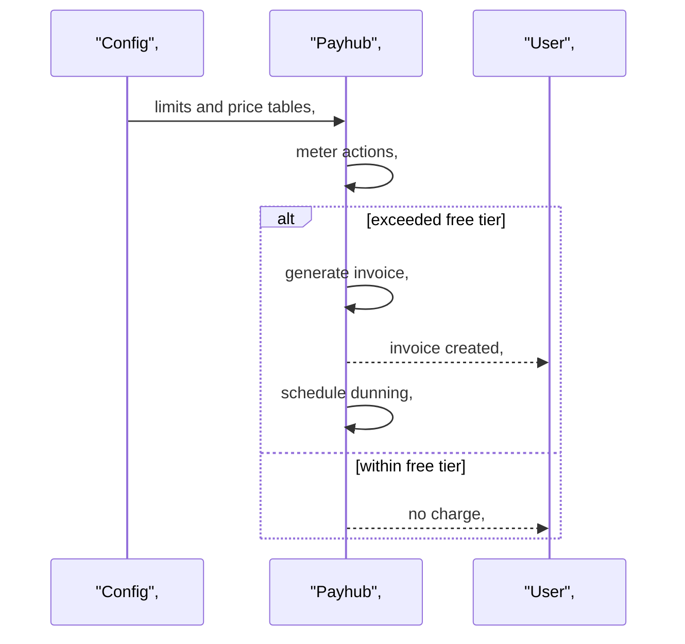

**Repo:** tg-miniapp-payhub-service  
**File:** SystemDesign.md  
**SHA-256:** 038f0a9a04538af79790c95add74680f6f8e3e48840ebf0bb2fe853c2084fbd7  
**Bytes:** 26534  
**Updated:** 2025-09-26 18:40 GMT+7  

---

# 1) Architecture Diagram (flowchart)



---

# 2) Technology Stack

| Layer | Choice | Notes |
|---|---|---|
| Runtime | Node.js 20, TypeScript | Consistent with platform |
| API | Fastify, Zod, OpenAPI 3.1 | Spec-first contracts, validation |
| DB | Postgres 15 | ACID ledger, outbox, invoices, holds |
| Caching / Jobs | Redis Cluster, BullMQ | Idempotency keys, rate limits, retries, DLQ |
| Messaging | Outbox table + workers, Webhooks | Durable fan-out to consumers |
| Crypto | Ed25519 and HMAC-SHA256 | Webhook signatures, receipt integrity |
| Observability | OpenTelemetry, Prometheus, Loki | RED/USE metrics, tracing |
| CI/CD | Docker, Helm, Argo CD | Blue/green and canary deployments |
| Security | JWKS via Identity, mTLS options | S2S hardening |

---

# 3) Responsibilities and Scope

**Owns**  
- **Accounts and balances** for users and services,  
- **Holds and releases** for wagers, purchases, and withdrawals,  
- **Transfers and settlements** with double-entry ledger,  
- **Deposits and withdrawals** across supported chains via Custody Adapter,  
- **Conversions** between on/off-chain credits and internal units,  
- **Invoices and dunning** for quotas overage and fees,  
- **Receipts** for completed financial actions,  
- **Events** to downstream services and UIs.

**Collaborates**  
Identity for authentication, roles, badges, KYC, Config for limits and pricing, Price for quotes and TWAP, Admin for overrides and manual ops, Custody for broadcast and confirmations.

**Non-goals**  
- Price discovery beyond consuming Price Service,  
- KYC decision storage,  
- Gameplay or business domain decisions of other services.

---

# 4) Data Design (Mermaid Data Schema)



**Indexes**  
- `ACCOUNT(userId, currency) unique`, `LEDGER_ENTRY(accountId, postedAt)`, `HOLD(accountId, status, expiresAt)`, `TRANSFER(idempotencyKey) unique`,  
- `WITHDRAWAL(userId, createdAt)`, `DEPOSIT(userId, observedAt)`, `DEPOSIT_ADDRESS(userId, token, network) unique`,  
- `INVOICE(userId, dueAt)`, `OUTBOX(topic, nextAttemptAt)`, `METER(userId, metric) unique`

**Constraints**  
- `ACCOUNT.kind` in `user, system`, `ACCOUNT.status` in `active, frozen, closed`,  
- `LEDGER_ENTRY.direction` in `debit, credit`, two entries per transfer with equal amounts,  
- `HOLD.status` in `open, released, captured, expired, canceled`,  
- `WITHDRAWAL.status` in `draft, requested, pending_broadcast, broadcasted, confirmed, failed, refunded`,  
- Monetary fields are canonical decimal strings with 18 dp precision unless network requires otherwise.

---

# 5) Interfaces (API Specification)

```yaml
openapi: 3.1.0
info:
  title: tg-miniapp-payhub-service API
  version: 2.0.0
servers:
  - url: https://payhub.api
security:
  - BearerAuth: []
paths:
  /v1/accounts:
    get:
      summary: List accounts for the session user
      responses:
        "200":
          description: Accounts
          content:
            application/json:
              schema:
                type: array
                items:
                  $ref: '#/components/schemas/Account'
  /v1/balances:
    get:
      summary: Get aggregated balances per currency
      responses:
        "200":
          description: Balances
          content:
            application/json:
              schema:
                type: array
                items:
                  $ref: '#/components/schemas/Balance'
  /v1/holds:
    post:
      summary: Create a hold for a purpose, idempotent
      parameters:
        - $ref: '#/components/parameters/IdempotencyKey'
      requestBody:
        required: true
        content:
          application/json:
            schema:
              $ref: '#/components/schemas/HoldCreate'
      responses:
        "201":
          description: Hold created
          content:
            application/json:
              schema:
                $ref: '#/components/schemas/Hold'
        "402":
          description: Insufficient available balance
    get:
      summary: List holds
      responses:
        "200":
          description: Holds
          content:
            application/json:
              schema:
                type: array
                items:
                  $ref: '#/components/schemas/Hold'
  /v1/holds/{holdId}/release:
    post:
      summary: Release an open hold
      parameters:
        - in: path
          name: holdId
          required: true
          schema: { type: string }
        - $ref: '#/components/parameters/IdempotencyKey'
      responses:
        "200": { description: Released }
        "409": { description: Not open }
  /v1/holds/{holdId}/capture:
    post:
      summary: Capture an open hold into a transfer
      parameters:
        - in: path
          name: holdId
          required: true
          schema: { type: string }
        - $ref: '#/components/parameters/IdempotencyKey'
      requestBody:
        required: true
        content:
          application/json:
            schema:
              $ref: '#/components/schemas/HoldCapture'
      responses:
        "201":
          description: Captured to transfer
          content:
            application/json:
              schema:
                $ref: '#/components/schemas/Transfer'
        "409":
          description: Not open or expired
  /v1/transfers:
    post:
      summary: Create a transfer between accounts
      parameters:
        - $ref: '#/components/parameters/IdempotencyKey'
      requestBody:
        required: true
        content:
          application/json:
            schema:
              $ref: '#/components/schemas/TransferCreate'
      responses:
        "201":
          description: Transfer posted
          content:
            application/json:
              schema:
                $ref: '#/components/schemas/Transfer'
  /v1/deposits/address:
    post:
      summary: Issue a deposit address
      requestBody:
        required: true
        content:
          application/json:
            schema:
              $ref: '#/components/schemas/DepositAddressIssue'
      responses:
        "201":
          description: Address issued
          content:
            application/json:
              schema:
                $ref: '#/components/schemas/DepositAddress'
  /v1/deposits/webhook:
    post:
      summary: Custody webhook for on-chain deposits
      parameters:
        - $ref: '#/components/parameters/HmacSig'
      requestBody:
        required: true
        content:
          application/json:
            schema:
              $ref: '#/components/schemas/CustodyDepositEvent'
      responses:
        "202": { description: Accepted }
  /v1/withdrawals:
    post:
      summary: Request withdrawal
      parameters:
        - $ref: '#/components/parameters/IdempotencyKey'
      requestBody:
        required: true
        content:
          application/json:
            schema:
              $ref: '#/components/schemas/WithdrawalRequest'
      responses:
        "202": { description: Accepted }
        "403": { description: Badge required }
        "409": { description: Conflicting pending withdrawal }
  /v1/withdrawals/{id}:
    get:
      summary: Get withdrawal status
      parameters:
        - in: path
          name: id
          required: true
          schema: { type: string }
      responses:
        "200":
          description: Withdrawal
          content:
            application/json:
              schema:
                $ref: '#/components/schemas/Withdrawal'
  /v1/convert/quote:
    post:
      summary: Get a conversion quote
      requestBody:
        required: true
        content:
          application/json:
            schema:
              $ref: '#/components/schemas/ConvertQuoteRequest'
      responses:
        "200":
          description: Quote
          content:
            application/json:
              schema:
                $ref: '#/components/schemas/ConversionQuote'
  /v1/convert/confirm:
    post:
      summary: Confirm a conversion using a quote
      parameters:
        - $ref: '#/components/parameters/IdempotencyKey'
      requestBody:
        required: true
        content:
          application/json:
            schema:
              $ref: '#/components/schemas/ConvertConfirmRequest'
      responses:
        "201":
          description: Conversion completed
          content:
            application/json:
              schema:
                $ref: '#/components/schemas/Receipt'
        "409":
          description: Quote expired
  /v1/staking/positions:
    get:
      summary: List staking positions visible to the user
      responses:
        "200":
          description: Positions
          content:
            application/json:
              schema:
                type: array
                items:
                  $ref: '#/components/schemas/StakingPosition'
  /v1/invoices:
    get:
      summary: List invoices for the user
      responses:
        "200":
          description: Invoices
          content:
            application/json:
              schema:
                type: array
                items:
                  $ref: '#/components/schemas/Invoice'
  /v1/receipts:
    get:
      summary: List receipts for the user
      responses:
        "200":
          description: Receipts
          content:
            application/json:
              schema:
                type: array
                items:
                  $ref: '#/components/schemas/Receipt'
components:
  securitySchemes:
    BearerAuth:
      type: http
      scheme: bearer
      bearerFormat: JWT
  parameters:
    IdempotencyKey:
      in: header
      name: Idempotency-Key
      required: false
      schema:
        type: string
        format: uuid
    HmacSig:
      in: header
      name: X-Signature
      required: true
      schema:
        type: string
  schemas:
    Account:
      type: object
      required: [id, userId, currency, status]
      properties:
        id: { type: string }
        userId: { type: string }
        currency: { type: string }
        status: { type: string, enum: [active, frozen, closed] }
    Balance:
      type: object
      required: [currency, available, pending]
      properties:
        currency: { type: string }
        available: { type: string }
        pending: { type: string }
    HoldCreate:
      type: object
      required: [purpose, currency, amount]
      properties:
        purpose: { type: string }
        currency: { type: string }
        amount: { type: string }
        ttlSeconds: { type: integer, minimum: 30 }
        externalRef: { type: string }
    Hold:
      type: object
      required: [id, accountId, amount, currency, status]
      properties:
        id: { type: string }
        accountId: { type: string }
        amount: { type: string }
        currency: { type: string }
        status: { type: string, enum: [open, released, captured, expired, canceled] }
        expiresAt: { type: string, format: date-time }
    HoldCapture:
      type: object
      required: [destinationAccountId]
      properties:
        destinationAccountId: { type: string }
        feeBps: { type: integer, minimum: 0, maximum: 10000 }
    TransferCreate:
      type: object
      required: [fromAccountId, toAccountId, amount, currency, purpose]
      properties:
        fromAccountId: { type: string }
        toAccountId: { type: string }
        amount: { type: string }
        currency: { type: string }
        purpose: { type: string }
    Transfer:
      type: object
      required: [id, status, currency, amount, createdAt]
      properties:
        id: { type: string }
        status: { type: string, enum: [pending, posted, failed] }
        currency: { type: string }
        amount: { type: string }
        createdAt: { type: string, format: date-time }
    DepositAddressIssue:
      type: object
      required: [token, network]
      properties:
        token: { type: string }
        network: { type: string }
    DepositAddress:
      type: object
      required: [id, token, network, address]
      properties:
        id: { type: string }
        token: { type: string }
        network: { type: string }
        address: { type: string }
    CustodyDepositEvent:
      type: object
      required: [network, token, txHash, address, amount, confirmations]
      properties:
        network: { type: string }
        token: { type: string }
        txHash: { type: string }
        address: { type: string }
        amount: { type: string }
        confirmations: { type: integer }
        observedAt: { type: string, format: date-time }
    WithdrawalRequest:
      type: object
      required: [token, network, toAddress, amount]
      properties:
        token: { type: string }
        network: { type: string }
        toAddress: { type: string }
        amount: { type: string }
        fee: { type: string }
    Withdrawal:
      type: object
      required: [id, status]
      properties:
        id: { type: string }
        status: { type: string, enum: [draft, requested, pending_broadcast, broadcasted, confirmed, failed, refunded] }
        txHash: { type: string }
        createdAt: { type: string, format: date-time }
        updatedAt: { type: string, format: date-time }
    ConvertQuoteRequest:
      type: object
      required: [from, to, amount]
      properties:
        from: { type: string }
        to: { type: string }
        amount: { type: string }
    ConversionQuote:
      type: object
      required: [id, from, to, amount, rate, feeBps, expiresAt]
      properties:
        id: { type: string }
        from: { type: string }
        to: { type: string }
        amount: { type: string }
        rate: { type: string }
        feeBps: { type: integer }
        expiresAt: { type: string, format: date-time }
    ConvertConfirmRequest:
      type: object
      required: [quoteId]
      properties:
        quoteId: { type: string }
    Invoice:
      type: object
      required: [id, currency, total, status, dueAt]
      properties:
        id: { type: string }
        currency: { type: string }
        total: { type: string }
        status: { type: string, enum: [open, paid, void, overdue] }
        dueAt: { type: string, format: date-time }
    Receipt:
      type: object
      required: [id, currency, total, createdAt]
      properties:
        id: { type: string }
        currency: { type: string }
        total: { type: string }
        createdAt: { type: string, format: date-time }
  responses:
    BadRequest: { description: Bad request }
    Unauthorized: { description: Unauthorized }
    Forbidden: { description: Forbidden }
    NotFound: { description: Not found }
    Conflict: { description: Conflict }
```

**Webhooks**  
- `payhub.deposit.confirmed@v1`, payload `CustodyDepositEvent` plus resolved `userId`,  
- `payhub.withdrawal.updated@v1`, status transitions,  
- `payhub.hold.created@v1`, `payhub.hold.captured@v1`, `payhub.hold.released@v1`,  
- `payhub.invoice.created@v1`, `payhub.invoice.due@v1`, `payhub.receipt.created@v1`,  
All HMAC signed, with 5 minute replay window and idempotent receivers.

---

# 6) Data Flows (sequence diagrams)

## A) Deposit address issuance and confirmation



## B) Withdrawal with KYC badge and broadcast



## C) Hold, capture, settlement for PlayHub result



## D) Convert with expiring quote and fee



## E) Overage invoice and dunning



---

# 7) Rules and Calculations

- **Double entry**: Every transfer creates one debit and one credit with same amount and currency.  
- **Rounding**: Internal arithmetic uses 18 dp fixed decimals, display rounded down to 6 dp unless otherwise required.  
- **Fees**: Configurable per action and token, applied at capture or settlement.  
- **Hold TTL**: Defaults to 10 minutes unless caller requests shorter, auto-expire releases funds.  
- **Confirmations**: Token and network specific thresholds, handle reorg by reversing and re-posting.  
- **Conversion**: `pay = amount * rate`, `fee = pay * feeBps / 10000`, `final = pay - fee`.  
- **Invoices**: Windowed by calendar month, status transitions `open -> paid | void | overdue`.  
- **Quotas**: Per-user metric windows in `METER`, overage generates invoice lines and charges in FZ/PT.  
- **Staking**: Read-only positions surfaced from staking backends into receipts when distributions occur.

---

# 8) Security and Compliance

- **Auth**: Bearer JWT issued by Identity, short TTL, scopes for admin endpoints.  
- **Badges**: Withdrawals and high-risk actions require `Investor` or `ProjectOwner` badges.  
- **PII**: Store only minimal identifiers and addresses, no seed phrases or private keys.  
- **Webhooks**: HMAC header `X-Signature`, timestamp header, 5 minute max skew, replay cache in Redis.  
- **Secrets**: Stored in secret manager, rotated on schedule, never logged.  
- **RPC**: Broadcast via Custody Adapter with fee and nonce management, fallback RPCs and circuit breakers.  
- **Audit**: All mutations include `actorId`, `idempotencyKey`, and immutable ledger entries.

---

# 9) Scalability and Reliability

- **Idempotency** on all POSTs using `Idempotency-Key`.  
- **Outbox pattern** for durable event fan-out with retry and DLQ.  
- **Partitioning**: Ledger partitioned by month, indexes per account and date.  
- **Backpressure**: Job concurrency caps, exponential backoff with jitter.  
- **SLOs**: P99 settlement under 2 minutes after result, deposit detection P95 under 1 minute.  
- **RTO/RPO**: RTO 30 minutes, RPO 1 minute with streaming WAL replicas.

---

# 10) Observability

- **Logs**: Structured JSON, include `traceId`, `spanId`, `actorId`, `idempotencyKey`.  
- **Metrics**: balances.read, hold.create, hold.capture, transfer.posted, withdrawal.confirmed, deposit.confirmed, quote.issued, invoice.created.  
- **Traces**: End-to-end from clients through Payhub to Custody and Price.  
- **Dashboards**: Ledger health, outbox lag, confirmation lag, failure rates.  
- **Alerts**: Spike in 5xx or DLQ size, delayed confirmations, high reorg reversals.

---

# 11) Configuration and ENV

| Key | Type | Secret | Notes |
|---|---|---|---|
| PAYHUB_POSTGRES_URI | string | yes | Primary database |
| PAYHUB_REDIS_URI | string | yes | Idempotency, rate, jobs |
| IDENTITY_BASE_URL | string | no | JWT introspection |
| CONFIG_BASE_URL | string | no | Limits, pricing |
| PRICE_BASE_URL | string | no | Quotes and TWAP |
| CUSTODY_BASE_URL | string | no | Broadcast adapter |
| HMAC_SECRET | string | yes | Webhook signing |
| WITHDRAW_MIN_CONFIRMATIONS | int | no | Per network default |
| CONVERT_FEE_BPS | int | no | Default conversion fee |
| OUTBOX_MAX_ATTEMPTS | int | no | Retry policy |
| RATE_LIMIT_RPS | int | no | Global rate |
| TZ | string | no | Presentation time zone |

Precedence: ENV > Config Service > defaults.

---

# 12) User Stories and Feature List (traceability)

| Story | APIs | Entities / Events | Diagrams |
|---|---|---|---|
| Balances read | GET /v1/balances | ACCOUNT, LEDGER_ENTRY | — |
| Hold for match | POST /v1/holds, POST /v1/holds/{id}/capture | HOLD, TRANSFER | C |
| Deposit | POST /v1/deposits/address, POST /v1/deposits/webhook | DEPOSIT, LEDGER_ENTRY | A |
| Withdrawal | POST /v1/withdrawals, GET /v1/withdrawals/{id} | WITHDRAWAL, LEDGER_ENTRY | B |
| Convert | POST /v1/convert/quote, POST /v1/convert/confirm | CONVERSION_QUOTE, RECEIPT | D |
| Overage billing | GET /v1/invoices | INVOICE, INVOICE_ITEM | E |

**Deltas vs old SystemDesign**  
- Clarified hold lifecycle and capture semantics,  
- Added outbox and webhook hardening,  
- Expanded conversion and invoice models with precision and fees,  
- Formalized reorg handling and reversal policy.

---

# 13) Roadmap

- Multi-chain custody adapters with priority and fee optimization,  
- Partial withdrawals and batched broadcasts,  
- Chargeback and dispute workflows,  
- Automated reconciliation jobs with external statements,  
- Real-time streaming balances for UI.

---

# 14) Compatibility Notes

- Versioned `/v1` API, additive-first changes, breaking behind feature flags,  
- Migrations use online schema change with shadow tables for large partitions,  
- Contract changes require OpenAPI bump and consumer approval.
