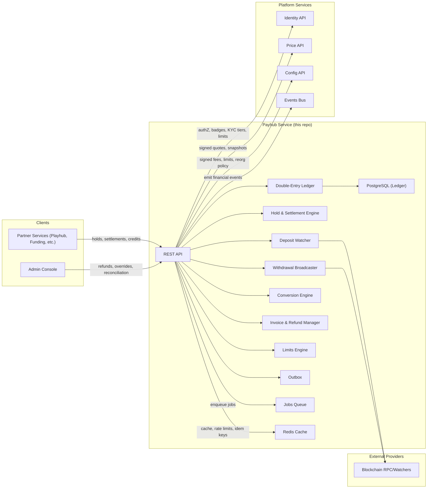
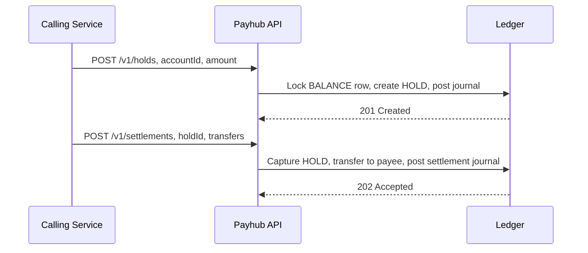
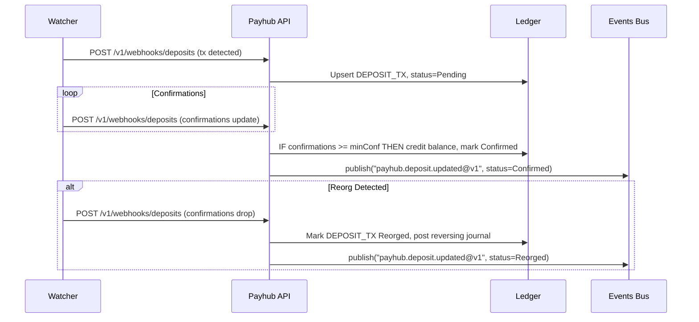
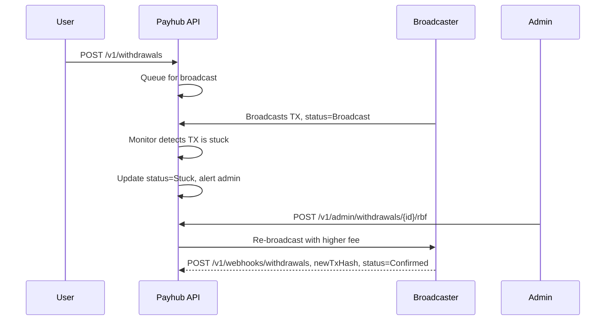
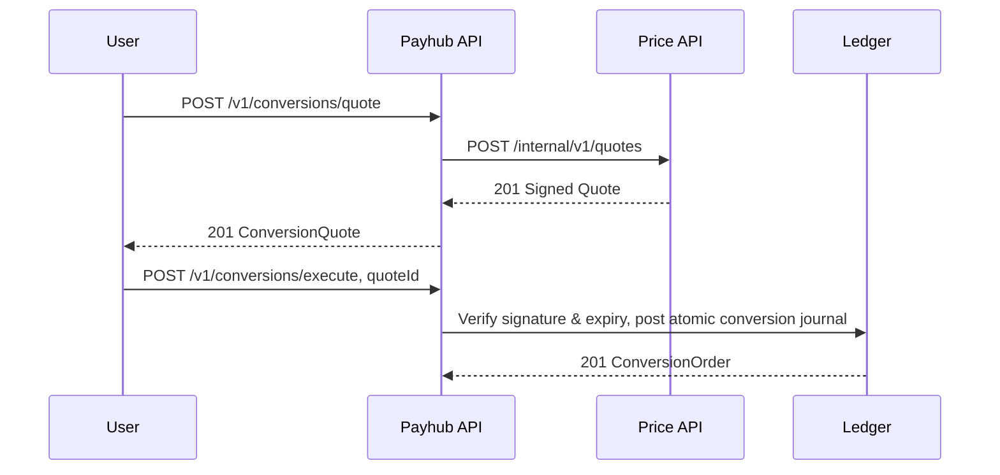

Repo: tg-miniapp-payhub-service
File: SystemDesign.md
SHA-256: 7d6c544bd0a793a521481b4737d6e5d590e0c905de70e7e174246067b45f4705
Bytes: 31735
Generated: 2025-09-30 00:13 GMT+7
Sources: UserStories.md (authoritative), prior SystemDesign.md (baseline)

-----

## 1\. Architecture Diagram — Mermaid flowchart



-----

## 2\. Technology Stack

  - **Runtime**: Node.js 20, TypeScript, Fastify, OpenAPI 3.1 spec-first
  - **DB**: PostgreSQL 15 (PKs are UUID v7), partitioned tables for `ledger_entry`, `journal_tx`, and on-chain transaction tables.
  - **Ledger**: Strict double-entry accounting model with transactional integrity enforced by stored procedures and constraints.
  - **Cache/Queue**: Redis 7, BullMQ for outbox relay, hold expirations, and withdrawal broadcasting jobs.
  - **Chain Interaction**: EVM and TON abstractions for watching deposits and broadcasting withdrawals, with reorg handling logic.
  - **Security**: JWT for S2S auth, HMAC for webhooks, KMS for secrets.
  - **Observability**: OpenTelemetry, Prometheus, structured JSON logs with correlation IDs.
  - **CI/CD**: GitHub Actions, Spectral (OpenAPI), database migrations, canary deployments.

-----

## 3\. Responsibilities and Scope

**Owns**

  - Canonical source of truth for **Accounts**, **Balances**, and the immutable **Double-Entry Ledger**.
  - Lifecycle of **Holds** and multi-party **Settlements** for other platform services.
  - **Deposits**: crediting after sufficient on-chain confirmations and handling reorgs.
  - **Withdrawals**: broadcasting, tracking, and managing stuck transactions via Replace-by-Fee (RBF).
  - **Conversions**: providing signed quotes via the Price service and executing atomic swaps between assets.
  - **Invoices** for overages and service fees, plus a dual-control **Refund** process.
  - Enforcement of per-account **limits and velocity checks** based on KYC tiers from Identity.
  - Financial reporting, reconciliation jobs, and a reliable event outbox.

**Non-Goals**

  - Identity/KYC data storage (delegated to Identity).
  - Price oracle generation (delegated to the Price service).
  - Direct on-chain custody; interacts with a custodian or wallet node but does not hold private keys.

**Boundaries**

  - Consumes Identity for auth and limit profiles, Price for quotes, and Config for fees and policies.
  - Emits authoritative financial events (e.g., `payhub.settlement.succeeded`) to the platform Events Bus.

-----

## 4\. Data Design — Mermaid erDiagram

```mermaid
erDiagram
  ACCOUNT ||--o{ BALANCE : "has"
  ACCOUNT ||--o{ HOLD : "places"
  ACCOUNT ||--o{ DEPOSIT_INTENT : "initiates"
  ACCOUNT ||--o{ WITHDRAWAL_REQUEST : "requests"
  ACCOUNT ||--o{ INVOICE : "pays/receives"
  JOURNAL_TX ||--o{ LEDGER_ENTRY : "posts"
  HOLD }o--|| SETTLEMENT : "is captured by"
  DEPOSIT_INTENT ||--o{ DEPOSIT_TX : "monitors"
  WITHDRAWAL_REQUEST ||--o{ WITHDRAWAL_TX : "creates"
  WITHDRAWAL_REQUEST ||--o{ WITHDRAWAL_RBF_ATTEMPT : "retries with"
  CONVERSION_QUOTE ||--|| CONVERSION_ORDER : "is executed as"
  INVOICE ||--o{ REFUND : "can be refunded by"
  OUTBOX_EVENT ||--o{ WEBHOOK_DELIVERY : "delivers"

  ACCOUNT {
    string id PK "uuidv7"
    string userId FK "uuidv7"
    string status "enum: Active|Suspended"
    datetime createdAt
  }

  BALANCE {
    string id PK "uuidv7"
    string accountId FK "uuidv7"
    string asset "enum: STAR|FZ|PT|USDT"
    numeric available
    numeric held
    string unique_accountId_asset "unique"
  }

  JOURNAL_TX {
    string id PK "uuidv7"
    string type "enum: Deposit|Withdrawal|Hold|Settlement|Conversion|Invoice"
    string status "enum: Posted|Reversed"
    string correlationId "uuidv7"
    datetime postedAt
  }

  LEDGER_ENTRY {
    string id PK "uuidv7"
    string journalTxId FK "uuidv7"
    string accountId FK "uuidv7"
    string asset
    numeric amount "credit > 0, debit < 0"
  }

  HOLD {
    string id PK "uuidv7"
    string accountId FK "uuidv7"
    string purposeId "uuidv7"
    string asset
    numeric amount
    string status "enum: Active|Captured|Released|Expired"
    datetime expiresAt
    datetime createdAt
  }

  SETTLEMENT {
    string id PK "uuidv7"
    string purposeId "uuidv7"
    string status "enum: Pending|Succeeded|Failed"
    jsonb breakdown
    datetime createdAt
  }

  DEPOSIT_INTENT {
    string id PK "uuidv7"
    string accountId FK "uuidv7"
    string asset
    string network
    string address
    integer minConf
  }

  DEPOSIT_TX {
    string id PK "uuidv7"
    string intentId FK "uuidv7"
    string txHash "unique"
    numeric amount
    integer confirmations
    string status "enum: Pending|Confirmed|Reorged"
  }

  WITHDRAWAL_REQUEST {
    string id PK "uuidv7"
    string accountId FK "uuidv7"
    string asset
    string toAddress
    numeric amount
    string status "enum: Pending|Queued|Broadcast|Confirmed|Failed|Stuck"
    string idemKey "unique"
  }

  WITHDRAWAL_TX {
    string id PK "uuidv7"
    string requestId FK "uuidv7"
    string txHash "unique"
    string status "enum: Pending|Confirmed|Reorged"
  }

  WITHDRAWAL_RBF_ATTEMPT {
    string id PK "uuidv7"
    string requestId FK "uuidv7"
    string newTxHash "unique"
    numeric newFee
  }

  CONVERSION_QUOTE {
    string id PK "uuidv7"
    string accountId FK "uuidv7"
    string fromAsset
    string toAsset
    numeric rate
    datetime expiresAt
  }

  CONVERSION_ORDER {
    string id PK "uuidv7"
    string quoteId FK "uuidv7"
    string status "enum: Succeeded|Failed"
  }

  INVOICE {
    string id PK "uuidv7"
    string accountId FK "uuidv7"
    numeric amount
    string status "enum: Open|Paid|Void"
  }

  REFUND {
    string id PK "uuidv7"
    string invoiceId FK "uuidv7"
    string reason
    string status "enum: Issued|Failed"
  }

  OUTBOX_EVENT {
    string id PK "uuidv7"
    string eventName
    jsonb payload
  }

  WEBHOOK_DELIVERY {
    string id PK "uuidv7"
    string outboxId FK "uuidv7"
    string destination
    string status "enum: Pending|Succeeded|Failed"
  }
```



-----

## 5\. Interfaces — OpenAPI 3.1 (YAML)

```yaml
openapi: 3.1.0
info:
  title: tg-miniapp-payhub-service API
  version: 1.0.0
servers:
  - url: https://payhub.api.fuze.local
security:
  - BearerAuth: []
tags:
  - name: Accounts
  - name: Holds
  - name: Settlements
  - name: Deposits
  - name: Withdrawals
  - name: Conversions
  - name: Invoices
  - name: Admin
  - name: Webhooks
paths:
  /v1/accounts:
    post:
      operationId: accounts.create
      summary: Create an account for a user
      tags: [Accounts]
      parameters:
        - { $ref: "#/components/parameters/IdempotencyKey" }
      requestBody:
        required: true
        content:
          application/json:
            schema: { type: object, required: [userId], properties: { userId: { type: string, format: uuid } } }
      responses:
        "201": { description: Account, content: { application/json: { schema: { $ref: "#/components/schemas/Account" } } } }
        "409": { $ref: "#/components/responses/Conflict" }
  /v1/accounts/{accountId}/balances:
    get:
      operationId: accounts.balances.get
      summary: Get balances for an account
      tags: [Accounts]
      parameters:
        - { in: path, name: accountId, required: true, schema: { type: string, format: uuid } }
      responses:
        "200": { description: Balances, content: { application/json: { schema: { type: array, items: { $ref: "#/components/schemas/Balance" } } } } }
  /v1/holds:
    post:
      operationId: holds.create
      summary: Create a hold on funds
      tags: [Holds]
      parameters:
        - { $ref: "#/components/parameters/IdempotencyKey" }
      requestBody: { $ref: "#/components/requestBodies/HoldCreate" }
      responses:
        "201": { description: Hold, content: { application/json: { schema: { $ref: "#/components/schemas/Hold" } } } }
        "402": { $ref: "#/components/responses/InsufficientFunds" }
        "403": { $ref: "#/components/responses/Forbidden" }
  /v1/settlements:
    post:
      operationId: settlements.create
      summary: Settle one or more holds
      tags: [Settlements]
      parameters:
        - { $ref: "#/components/parameters/IdempotencyKey" }
      requestBody: { $ref: "#/components/requestBodies/SettlementCreate" }
      responses:
        "202": { description: Accepted, content: { application/json: { schema: { $ref: "#/components/schemas/Settlement" } } } }
  /v1/deposits:
    post:
      operationId: deposits.createIntent
      summary: Create a deposit intent
      tags: [Deposits]
      parameters:
        - { $ref: "#/components/parameters/IdempotencyKey" }
      requestBody: { $ref: "#/components/requestBodies/DepositIntentCreate" }
      responses:
        "201": { description: Intent, content: { application/json: { schema: { $ref: "#/components/schemas/DepositIntent" } } } }
  /v1/withdrawals:
    post:
      operationId: withdrawals.create
      summary: Request a withdrawal
      tags: [Withdrawals]
      parameters:
        - { $ref: "#/components/parameters/IdempotencyKey" }
      requestBody: { $ref: "#/components/requestBodies/WithdrawalRequestCreate" }
      responses:
        "202": { description: Accepted, content: { application/json: { schema: { $ref: "#/components/schemas/WithdrawalRequest" } } } }
        "403": { $ref: "#/components/responses/Forbidden" }
  /v1/withdrawals/{withdrawalId}:
    delete:
      operationId: withdrawals.cancel
      summary: Cancel a withdrawal if not yet broadcast
      tags: [Withdrawals]
      parameters:
        - { in: path, name: withdrawalId, required: true, schema: { type: string, format: uuid } }
      responses:
        "204": { description: Canceled }
        "409": { $ref: "#/components/responses/Conflict" }
  /v1/conversions/quote:
    post:
      operationId: conversions.quote
      summary: Get a conversion quote
      tags: [Conversions]
      requestBody: { $ref: "#/components/requestBodies/ConversionQuoteCreate" }
      responses:
        "201": { description: Quote, content: { application/json: { schema: { $ref: "#/components/schemas/ConversionQuote" } } } }
        "502": { description: Upstream unavailable }
  /v1/conversions/execute:
    post:
      operationId: conversions.execute
      summary: Execute a conversion
      tags: [Conversions]
      requestBody:
        required: true
        content:
          application/json:
            schema: { type: object, required: [quoteId], properties: { quoteId: { type: string, format: uuid } } }
      responses:
        "201": { description: Order, content: { application/json: { schema: { $ref: "#/components/schemas/ConversionOrder" } } } }
        "409": { description: Quote expired or balance changed }
  /v1/invoices:
    post:
      operationId: invoices.create
      summary: Create an invoice
      tags: [Invoices]
      requestBody: { $ref: "#/components/requestBodies/InvoiceCreate" }
      responses:
        "201": { description: Invoice, content: { application/json: { schema: { $ref: "#/components/schemas/Invoice" } } } }
  /v1/admin/refunds:
    post:
      operationId: admin.refunds.issue
      summary: Issue a refund
      tags: [Admin]
      requestBody: { $ref: "#/components/requestBodies/RefundCreate" }
      responses:
        "201": { description: Refund, content: { application/json: { schema: { $ref: "#/components/schemas/Refund" } } } }
  /v1/admin/withdrawals/{withdrawalId}/rbf:
    post:
      operationId: admin.withdrawals.rbf
      summary: Retry a stuck withdrawal with Replace-By-Fee
      tags: [Admin]
      parameters:
        - { in: path, name: withdrawalId, required: true, schema: { type: string, format: uuid } }
      responses:
        "202": { description: RBF attempt accepted }
        "409": { description: Withdrawal is not in a 'Stuck' state }
  /v1/webhooks/deposits:
    post:
      operationId: webhooks.deposits
      summary: Receive deposit transaction from a watcher
      tags: [Webhooks]
      security: []
      requestBody:
        required: true
        content:
          application/json:
            schema: { $ref: "#/components/schemas/DepositTx" }
      responses:
        "202": { description: Accepted }
components:
  schemas:
    Error: { type: object, required: [code, message], properties: { code: { type: string }, message: { type: string } } }
    Account: { type: object, properties: { id: { type: string, format: uuid, example: "018f2a2e-9b1c-7b1f-bc1d-7f3b3f7c5e6a" } } }
    Balance: { type: object }
    Hold: { type: object }
    Settlement: { type: object }
    DepositIntent: { type: object }
    WithdrawalRequest: { type: object }
    ConversionQuote: { type: object }
    ConversionOrder: { type: object }
    Invoice: { type: object }
    Refund: { type: object }
    DepositTx: { type: object }
  requestBodies:
    HoldCreate: { required: true, content: { application/json: { schema: { type: object, required: [accountId, asset, amount, purposeId], properties: { accountId: { type: string, format: uuid }, asset: { type: string }, amount: { type: number }, purposeId: { type: string, format: uuid } } } } } }
    SettlementCreate: { required: true, content: { application/json: { schema: { type: object, required: [purposeId, items], properties: { purposeId: { type: string, format: uuid }, items: { type: array, items: { type: object } } } } } } }
    DepositIntentCreate: { required: true, content: { application/json: { schema: { type: object, required: [accountId, asset, network], properties: { accountId: { type: string, format: uuid }, asset: { type: string }, network: { type: string } } } } } }
    WithdrawalRequestCreate: { required: true, content: { application/json: { schema: { type: object, required: [accountId, asset, toAddress, amount], properties: { accountId: { type: string, format: uuid }, asset: { type: string }, toAddress: { type: string }, amount: { type: number } } } } } }
    ConversionQuoteCreate: { required: true, content: { application/json: { schema: { type: object, required: [accountId, from, to, amount], properties: { accountId: { type: string, format: uuid }, from: { type: string }, to: { type: string }, amount: { type: number } } } } } }
    InvoiceCreate: { required: true, content: { application/json: { schema: { type: object, required: [payeeAccountId, asset, amount], properties: { payeeAccountId: { type: string, format: uuid }, asset: { type: string }, amount: { type: number } } } } } }
    RefundCreate: { required: true, content: { application/json: { schema: { type: object, required: [invoiceId, amount, reason], properties: { invoiceId: { type: string, format: uuid }, amount: { type: number }, reason: { type: string } } } } } }
  parameters:
    Idempotency-Key: { in: header, name: Idempotency-Key, required: true, schema: { type: string } }
  responses:
    Conflict: { description: Conflict }
    Forbidden: { description: Forbidden }
    InsufficientFunds: { description: Insufficient Funds }
    RateLimited: { description: Too Many Requests, headers: { Retry-After: { schema: { type: integer } } } }
  securitySchemes:
    BearerAuth: { type: http, scheme: bearer, bearerFormat: JWT }
```

-----

## 6\. Data Flows — Mermaid sequenceDiagram

### 6.1 Create Hold → Settle



### 6.2 Deposit Credit with Reorg Handling



### 6.3 Stuck Withdrawal with RBF



### 6.4 Conversion Quote → Execute



-----

## 7\. Rules and Calculations

  - **Double-Entry**: Every financial operation must result in a balanced `JOURNAL_TX`, enforced at the database level.
  - **Fees**: Fees are applied based on the versioned `FEE_SCHEDULE` from Config, captured at the time of the operation.
  - **Velocity & Limits**: `USAGE_COUNTER` windows reset at 00:00 UTC. Exceeding limits from the `LIMIT_PROFILE` results in a `403 Forbidden` response.
  - **Idempotency**: All write endpoints are idempotent via `Idempotency-Key` for 24 hours.
  - **Deposits**: Minimum confirmations are enforced per-asset. A detected reorg reverts the transaction status and reverses any credited funds.
  - **Withdrawals**: Stuck transactions can be retried using Replace-by-Fee (RBF) by an administrator.
  - **Conversions**: Quotes are signed by the Price service and have a short expiry (e.g., 30 seconds) to protect against slippage.

-----

## 8\. Security and Compliance

  - **Auth**: Service-to-service calls use JWTs with specific scopes. Admin endpoints require elevated staff scopes, checked via Identity.
  - **Webhooks**: Incoming webhooks from chain watchers are verified by a shared secret. Outgoing webhooks are HMAC-signed.
  - **KYC/Badges**: High-value withdrawals and conversions are gated by KYC tier and badge status, enforced by checking with Identity before execution.
  - **Audit**: The `journal_tx` and `ledger_entry` tables are immutable and provide a complete, auditable history of all financial movements.

-----

## 9\. Scalability and Reliability

  - **Outbox Pattern**: Ensures at-least-once delivery of critical financial events to the platform Events Bus.
  - **DB Partitions**: High-volume tables (`ledger_entry`, `journal_tx`) are partitioned by month to ensure performant queries and maintenance.
  - **Backpressure**: The service uses rate limits and circuit breakers for external dependencies like the Price service and chain broadcasters.
  - **Graceful Degradation**: If the Price service is down, conversions are disabled, but other ledger functions remain operational.

-----

## 10\. Observability

  - **SLOs**: Ledger posting p95 ≤ 80ms. Deposit credit latency p95 ≤ 3 minutes after final confirmation.
  - **Metrics**: Active holds, settlement latency, confirmation lag, conversion success rate, and reconciliation deltas.
  - **Tracing**: Spans are tagged with `journalTxId` and `correlationId`, allowing a transaction to be traced from the initiating service to the final ledger entry.

-----

## 11\. Configuration and ENV

  - `POSTGRES_URL` secret
  - `REDIS_URL` secret
  - `IDENTITY_API_URL` string
  - `PRICE_API_URL` string
  - `CONFIG_API_URL` string
  - `EVENTS_API_URL` string
  - `CHAIN_WATCHER_SECRET` secret
  - `WITHDRAWAL_BROADCASTER_SECRET` secret
  - `DEPOSIT_MIN_CONF_JSON` json
  - `IDEMPOTENCY_TTL_HOURS` int (default 24)
  - `RBF_POLICY_JSON` json

-----

## 12\. Roadmap

  - Multi-asset conversions with an RFQ aggregator.
  - Address book and screening integrations.
  - Automated reconciliation jobs against custodian statements.
  - Batch withdrawals for fee optimization.

-----

## 13\. Compatibility Notes

  - Additive schema changes are permitted within `v1`. Breaking changes will be introduced in a new version path (e.g., `v1.1`).
  - Webhook payloads are versioned; the previous version is supported for a 90-day grace period.
  - Fee schedule changes are versioned and applied based on the version active at the time of a transaction.

-----

## 14\. Design Coverage Checklist

  - ✅ Every story action maps to a defined operationId and path+method.
  - ✅ No sequence step calls an undefined API; every defined API appears in at least one sequence.
  - ✅ All entities/fields/enums in stories exist in ER with matching names/casing.
  - ✅ All IDs are UUID v7 in schemas, examples, flows.
  - ✅ DB target specifics (Mongo vs Postgres) reflected correctly.
  - ✅ Abuse/misuse & resilience paths modeled (errors, retries, degraded modes).
  - ✅ Observability hooks (logs/metrics/traces) align with story AC.
  - ✅ Mermaid diagrams render on GitHub (no syntax errors).
