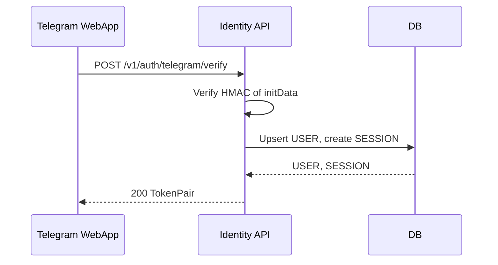
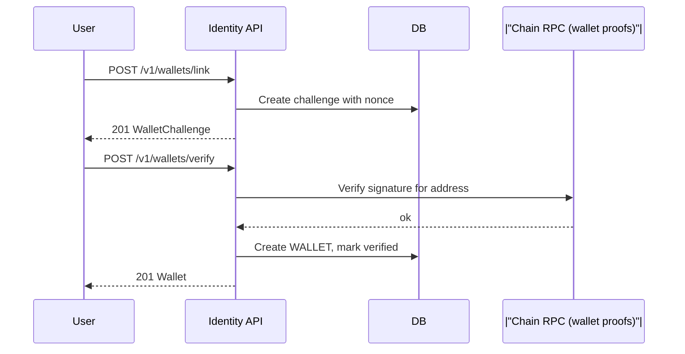
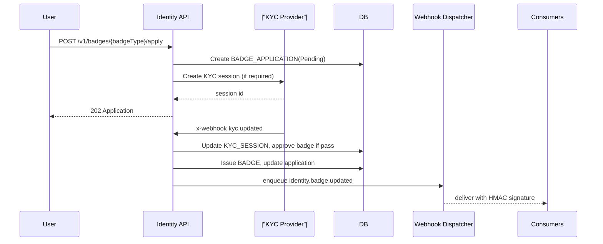
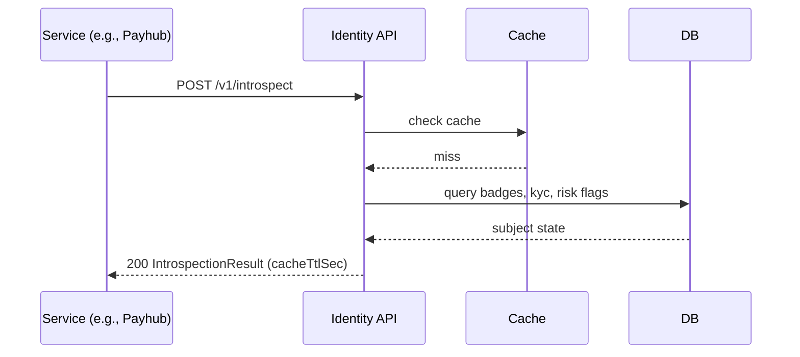
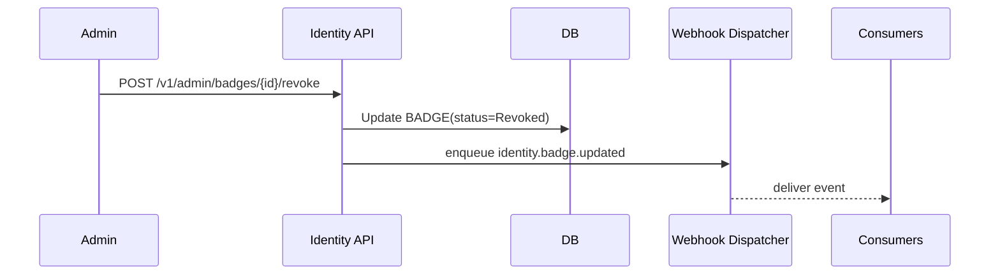
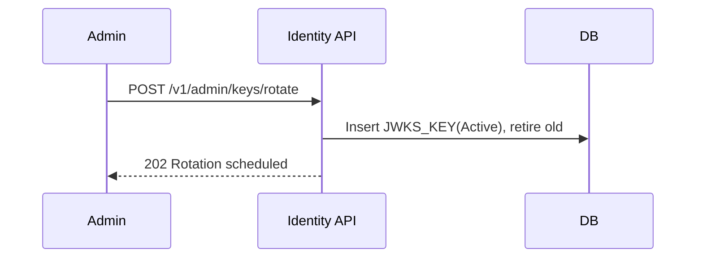

Repo: tg-miniapp-identity-service
File: SystemDesign.md
SHA-256: f43af056a6ca58ea5303432cb8216b132548965eaa5974f68247abf3396d2ffc
Bytes: 37985
Generated: 2025-09-27 13:28 GMT+7
Inputs: New UserStories.md (authoritative), API Spec Guide, Data Schema Guide

---

## 1. Architecture Diagram — Mermaid flowchart

```mermaid
flowchart LR
  subgraph "Clients"
    TG["Telegram WebApp"]
    W3["Web3 Portal"]
    ADM["Admin Console"]
  end

  subgraph "Identity Service"
    API["REST API"]
    AUTH["JWT/JWKS"]
    POL["Policy Engine"]
    AC["Access Control (RBAC/Badges)"]
    ER["Event Router"]
    Q["Jobs Queue"]
    DB["Primary DB"]
    CACH["Cache"]
    WH["Webhook Dispatcher"]
  end

  subgraph "Platform Services (consumers)"
    PH["Playhub"]
    PAY["Payhub"]
    ESC["Escrow"]
    FND["Funding"]
    CMP["Campaigns"]
    EVT["Events"]
    WAT["Watchlist"]
    PRC["Price"]
    ADM2["Admin/BFF"]
    WRK["Workers"]
  end

  subgraph "External Providers"
    TGPLAT["Telegram Platform"]
    KYC["KYC Provider"]
    RPC["|"Chain RPC (wallet proofs)"|"]
  end

  TG -->|"/v1/auth/telegram/verify"| API
  W3 -->|"/v1/*"| API
  ADM -->|"/v1/admin/*"| API

  API --> AUTH
  API --> POL
  POL --> AC
  API --> DB
  API --> CACH
  API --> Q
  API --> WH

  API --> KYC
  API --> RPC

  PH -->|"/v1/introspect"| API
  PAY -->|"/v1/introspect"| API
  ESC -->|"/v1/introspect"| API
  FND -->|"/v1/introspect"| API
  CMP -->|"/v1/webhooks (consume)"| WH
  EVT -->|"/v1/introspect"| API
  WAT -->|"/v1/introspect"| API
  PRC -->|"/v1/introspect"| API
  ADM2 -->|"/v1/admin/*"| API
  WRK -->|"/jobs"| Q
```

---

## 2. Technology Stack

- Language/Runtime: TypeScript (Node.js 20 LTS), pnpm
- Frameworks: Fastify (HTTP), Zod, OpenAPI Generator, jose
- Datastore: PostgreSQL 15, Redis 7, S3-compatible store (evidence)
- Messaging/Jobs: Kafka or NATS JetStream, BullMQ/Temporal
- Crypto: secp256k1/ed25519 verification, HMAC-SHA256 (webhooks)
- CI/CD: GitOps (Helm/Argo), OPA policy gates
- Observability: OpenTelemetry, Prometheus, Grafana, Loki/ELK
- Security: RBAC, JWT access+refresh, JWKS rotation, WAF, Rate limits

---

## 3. Responsibilities and Scope

**Owns**
- Users, Orgs, Sessions, JWT/JWKS, API clients
- Wallet link and verification
- Badge policies, applications, issuance, suspension, revoke
- KYC sessions and results (via provider)
- Introspection API (badges, KYC, roles, risk flags)
- Identity change webhooks, audit logs, idempotency

**Non-goals**
- Payments/settlements (Payhub)
- Game logic (Playhub), campaign logic (Campaigns), pricing (Price)

**Boundaries**
- Calls KYC provider and Chain RPC for evidence
- Emits events and webhooks to consumers

---

## 4. Data Design — Mermaid erDiagram

```mermaid
erDiagram
  USER ||--o{ SESSION : "has"
  USER ||--o{ WALLET : "owns"
  USER ||--o{ MEMBERSHIP : "belongs to"
  USER ||--o{ BADGE : "holds"
  USER ||--o{ BADGE_APPLICATION : "submits"
  USER ||--o{ KYC_SESSION : "initiates"
  USER ||--o{ API_CLIENT : "owns"
  ORG  ||--o{ MEMBERSHIP : "has"
  BADGE_POLICY ||--o{ BADGE_APPLICATION : "governs"
  BADGE_POLICY ||--o{ BADGE : "issues"
  WEBHOOK_ENDPOINT ||--o{ WEBHOOK_DELIVERY : "sends"
  API_CLIENT ||--o{ API_KEY : "has"
  USER ||--o{ AUDIT_LOG : "actor"

  USER {
    uuid id PK
    string tgId "unique"
    string username
    string displayName
    string locale
    string timezone
    string status "enum: Active|Suspended"
    datetime createdAt
    datetime updatedAt
  }

  ORG {
    uuid id PK
    string name
    string slug "unique"
    string status "enum: Active|Suspended|Deleted"
    datetime createdAt
    datetime updatedAt
  }

  MEMBERSHIP {
    uuid id PK
    uuid userId FK
    uuid orgId FK
    string role "enum: Owner|Admin|Member"
    datetime createdAt
    datetime updatedAt
  }

  SESSION {
    uuid id PK
    uuid userId FK
    string deviceHash
    string ipHash
    datetime expiresAt
    datetime createdAt
    datetime revokedAt
  }

  WALLET {
    uuid id PK
    uuid userId FK
    string chain "enum: EVM|TON|BTC|SOL"
    string address "unique per chain"
    boolean primary
    string proofNonce
    datetime verifiedAt
    datetime createdAt
  }

  BADGE_POLICY {
    uuid id PK
    string badgeType "enum: Investor|ProjectOwner|Operator|KYC_L1|KYC_L2"
    jsonb rules "normalized thresholds"
    integer validityDays
    boolean requiresKyc
    datetime createdAt
    datetime updatedAt
  }

  BADGE_APPLICATION {
    uuid id PK
    uuid userId FK
    string badgeType
    string status "enum: Pending|Approved|Rejected|Revoked|Suspended"
    uuid policyId FK
    uuid kycSessionId FK
    jsonb evidence
    datetime submittedAt
    datetime decidedAt
    string reason
  }

  BADGE {
    uuid id PK
    uuid userId FK
    string badgeType
    uuid policyId FK
    datetime issuedAt
    datetime expiresAt
    string status "enum: Active|Expired|Suspended|Revoked"
  }

  KYC_SESSION {
    uuid id PK
    uuid userId FK
    string provider
    string externalId "unique"
    string level "enum: L1|L2"
    string status "enum: Created|InProgress|Approved|Rejected|Expired"
    jsonb result
    datetime createdAt
    datetime updatedAt
  }

  WEBHOOK_ENDPOINT {
    uuid id PK
    uuid ownerId FK
    string url "unique"
    string secret
    string status "enum: Active|Disabled"
    string events "csv"
    datetime createdAt
  }

  WEBHOOK_DELIVERY {
    uuid id PK
    uuid endpointId FK
    string eventName
    uuid eventId "unique"
    integer attempt
    integer statusCode
    string state "enum: Pending|Succeeded|Failed|DLQ"
    datetime nextAttemptAt
    datetime createdAt
  }

  API_CLIENT {
    uuid id PK
    uuid ownerId FK
    string name
    string scopes "csv"
    datetime createdAt
  }

  API_KEY {
    uuid id PK
    uuid clientId FK
    string keyHash "unique"
    datetime createdAt
    datetime revokedAt
  }

  JWKS_KEY {
    uuid id PK
    string kid "unique"
    string alg
    string publicJwk
    string status "enum: Active|Retired"
    datetime createdAt
    datetime rotatedAt
  }

  AUDIT_LOG {
    uuid id PK
    uuid actorUserId FK
    string action
    jsonb target
    jsonb details
    datetime createdAt
  }

  IDEMPOTENCY_KEY {
    uuid id PK
    uuid ownerId FK
    string key "unique(ownerId,key)"
    string requestHash
    string responseHash
    datetime createdAt
  }
```



---

## 5. Interfaces — OpenAPI 3.1 (YAML)

```yaml
openapi: 3.1.0
info:
  title: tg-miniapp-identity-service API
  version: 1.0.0
servers:
  - url: https://identity.api.fuze.local
tags:
  - name: Auth
  - name: Users
  - name: Orgs
  - name: Wallets
  - name: Badges
  - name: KYC
  - name: Introspection
  - name: Webhooks
  - name: Admin
  - name: Audit
paths:
  /v1/auth/telegram/verify:
    post:
      operationId: auth.telegramVerify
      summary: Verify Telegram initData and issue session tokens
      tags: [Auth]
      security: []
      requestBody:
        required: true
        content:
          application/json:
            schema:
              type: object
              required: [initData, deviceHash, timezone]
              properties:
                initData: { type: string, description: "Telegram WebApp initData payload" }
                deviceHash: { type: string }
                timezone: { type: string, default: "GMT+7" }
                locale: { type: string }
      responses:
        "200":
          description: Token pair issued
          content:
            application/json:
              schema: { $ref: "#/components/schemas/TokenPair" }
        "400": { $ref: "#/components/responses/BadRequest" }
        "401": { $ref: "#/components/responses/Unauthorized" }
        "429": { $ref: "#/components/responses/RateLimited" }
        "500": { $ref: "#/components/responses/ServerError" }

  /v1/auth/refresh:
    post:
      operationId: auth.refresh
      summary: Refresh access token
      tags: [Auth]
      security: [{ BearerAuth: [] }]
      responses:
        "200":
          description: New access token
          content: { application/json: { schema: { $ref: "#/components/schemas/AccessToken" } } }
        "401": { $ref: "#/components/responses/Unauthorized" }
        "429": { $ref: "#/components/responses/RateLimited" }
        "500": { $ref: "#/components/responses/ServerError" }

  /v1/auth/logout:
    post:
      operationId: auth.logout
      summary: Revoke current session
      tags: [Auth]
      security: [{ BearerAuth: [] }]
      responses:
        "204": { description: Logged out }
        "401": { $ref: "#/components/responses/Unauthorized" }
        "500": { $ref: "#/components/responses/ServerError" }

  /v1/jwks.json:
    get:
      operationId: auth.jwks
      summary: Retrieve JWKS
      tags: [Auth]
      security: []
      responses:
        "200": { description: JWKS, content: { application/json: { schema: { $ref: "#/components/schemas/JWKS" } } } }
        "500": { $ref: "#/components/responses/ServerError" }

  /v1/me:
    get:
      operationId: users.meGet
      summary: Get current user profile and badges
      tags: [Users]
      security: [{ BearerAuth: [] }]
      responses:
        "200": { description: User profile, content: { application/json: { schema: { $ref: "#/components/schemas/User" } } } }
        "401": { $ref: "#/components/responses/Unauthorized" }
        "500": { $ref: "#/components/responses/ServerError" }
    patch:
      operationId: users.meUpdate
      summary: Update profile fields
      tags: [Users]
      security: [{ BearerAuth: [] }]
      requestBody:
        required: true
        content:
          application/json:
            schema:
              type: object
              properties:
                displayName: { type: string }
                locale: { type: string }
                timezone: { type: string }
      responses:
        "200": { description: Updated profile, content: { application/json: { schema: { $ref: "#/components/schemas/User" } } } }
        "400": { $ref: "#/components/responses/BadRequest" }
        "401": { $ref: "#/components/responses/Unauthorized" }
        "500": { $ref: "#/components/responses/ServerError" }

  /v1/orgs:
    post:
      operationId: orgs.create
      summary: Create an organization
      tags: [Orgs]
      security: [{ BearerAuth: [] }]
      parameters:
        - in: header
          name: Idempotency-Key
          required: true
          schema: { type: string }
      requestBody:
        required: true
        content:
          application/json:
            schema:
              type: object
              required: [name, slug]
              properties:
                name: { type: string }
                slug: { type: string }
      responses:
        "201": { description: Org created, content: { application/json: { schema: { $ref: "#/components/schemas/Org" } } } }
        "400": { $ref: "#/components/responses/BadRequest" }
        "401": { $ref: "#/components/responses/Unauthorized" }
        "409": { $ref: "#/components/responses/Conflict" }
        "429": { $ref: "#/components/responses/RateLimited" }
        "500": { $ref: "#/components/responses/ServerError" }

  /v1/orgs/{orgId}:
    get:
      operationId: orgs.get
      summary: Get organization
      tags: [Orgs]
      security: [{ BearerAuth: [] }]
      parameters:
        - in: path
          name: orgId
          required: true
          schema: { type: string, format: uuid }
      responses:
        "200": { description: Org, content: { application/json: { schema: { $ref: "#/components/schemas/Org" } } } }
        "401": { $ref: "#/components/responses/Unauthorized" }
        "404": { $ref: "#/components/responses/NotFound" }
        "500": { $ref: "#/components/responses/ServerError" }

  /v1/orgs/{orgId}/members:
    post:
      operationId: orgs.membersAdd
      summary: Add a member to org
      tags: [Orgs]
      security: [{ BearerAuth: [] }]
      parameters:
        - in: header
          name: Idempotency-Key
          required: true
          schema: { type: string }
        - in: path
          name: orgId
          required: true
          schema: { type: string, format: uuid }
      requestBody:
        required: true
        content:
          application/json:
            schema:
              type: object
              required: [userId, role]
              properties:
                userId: { type: string, format: uuid }
                role: { $ref: "#/components/schemas/OrgRole" }
      responses:
        "201": { description: Member added, content: { application/json: { schema: { $ref: "#/components/schemas/Membership" } } } }
        "400": { $ref: "#/components/responses/BadRequest" }
        "401": { $ref: "#/components/responses/Unauthorized" }
        "403": { $ref: "#/components/responses/Forbidden" }
        "404": { $ref: "#/components/responses/NotFound" }
        "409": { $ref: "#/components/responses/Conflict" }
        "429": { $ref: "#/components/responses/RateLimited" }
        "500": { $ref: "#/components/responses/ServerError" }

  /v1/orgs/{orgId}/members/{userId}:
    delete:
      operationId: orgs.membersRemove
      summary: Remove member from org
      tags: [Orgs]
      security: [{ BearerAuth: [] }]
      parameters:
        - in: path
          name: orgId
          required: true
          schema: { type: string, format: uuid }
        - in: path
          name: userId
          required: true
          schema: { type: string, format: uuid }
      responses:
        "204": { description: Removed }
        "401": { $ref: "#/components/responses/Unauthorized" }
        "403": { $ref: "#/components/responses/Forbidden" }
        "404": { $ref: "#/components/responses/NotFound" }
        "500": { $ref: "#/components/responses/ServerError" }

  /v1/wallets/link:
    post:
      operationId: wallets.startLink
      summary: Start wallet link (challenge)
      tags: [Wallets]
      security: [{ BearerAuth: [] }]
      parameters:
        - in: header
          name: Idempotency-Key
          required: true
          schema: { type: string }
      requestBody:
        required: true
        content:
          application/json:
            schema:
              type: object
              required: [chain, address]
              properties:
                chain: { $ref: "#/components/schemas/Chain" }
                address: { type: string }
      responses:
        "201": { description: Challenge created, content: { application/json: { schema: { $ref: "#/components/schemas/WalletChallenge" } } } }
        "400": { $ref: "#/components/responses/BadRequest" }
        "401": { $ref: "#/components/responses/Unauthorized" }
        "409": { $ref: "#/components/responses/Conflict" }
        "429": { $ref: "#/components/responses/RateLimited" }
        "500": { $ref: "#/components/responses/ServerError" }

  /v1/wallets/verify:
    post:
      operationId: wallets.verifyLink
      summary: Verify wallet signature and link
      tags: [Wallets]
      security: [{ BearerAuth: [] }]
      requestBody:
        required: true
        content:
          application/json:
            schema:
              type: object
              required: [challengeId, signature]
              properties:
                challengeId: { type: string, format: uuid }
                signature: { type: string }
      responses:
        "201": { description: Wallet linked, content: { application/json: { schema: { $ref: "#/components/schemas/Wallet" } } } }
        "400": { $ref: "#/components/responses/BadRequest" }
        "401": { $ref: "#/components/responses/Unauthorized" }
        "409": { $ref: "#/components/responses/Conflict" }
        "429": { $ref: "#/components/responses/RateLimited" }
        "500": { $ref: "#/components/responses/ServerError" }

  /v1/wallets:
    get:
      operationId: wallets.list
      summary: List linked wallets
      tags: [Wallets]
      security: [{ BearerAuth: [] }]
      responses:
        "200": { description: Wallets, content: { application/json: { schema: { type: array, items: { $ref: "#/components/schemas/Wallet" } } } } }
        "401": { $ref: "#/components/responses/Unauthorized" }
        "500": { $ref: "#/components/responses/ServerError" }

  /v1/wallets/{walletId}:
    delete:
      operationId: wallets.unlink
      summary: Unlink wallet
      tags: [Wallets]
      security: [{ BearerAuth: [] }]
      parameters:
        - in: path
          name: walletId
          required: true
          schema: { type: string, format: uuid }
      responses:
        "204": { description: Unlinked }
        "401": { $ref: "#/components/responses/Unauthorized" }
        "404": { $ref: "#/components/responses/NotFound" }
        "500": { $ref: "#/components/responses/ServerError" }

  /v1/badges/policies:
    post:
      operationId: badges.policyCreate
      summary: Create or update badge policy
      tags: [Badges]
      security: [{ BearerAuth: [] }]
      requestBody:
        required: true
        content:
          application/json:
            schema: { $ref: "#/components/schemas/BadgePolicy" }
      responses:
        "200": { description: Upserted, content: { application/json: { schema: { $ref: "#/components/schemas/BadgePolicy" } } } }
        "400": { $ref: "#/components/responses/BadRequest" }
        "401": { $ref: "#/components/responses/Unauthorized" }
        "403": { $ref: "#/components/responses/Forbidden" }
        "500": { $ref: "#/components/responses/ServerError" }

  /v1/badges/{badgeType}/apply:
    post:
      operationId: badges.apply
      summary: Apply for a badge
      tags: [Badges]
      security: [{ BearerAuth: [] }]
      parameters:
        - in: header
          name: Idempotency-Key
          required: true
          schema: { type: string }
        - in: path
          name: badgeType
          required: true
          schema: { $ref: "#/components/schemas/BadgeType" }
      requestBody:
        required: true
        content:
          application/json:
            schema:
              type: object
              properties:
                evidence: { type: object, additionalProperties: true }
      responses:
        "202": { description: Accepted, content: { application/json: { schema: { $ref: "#/components/schemas/BadgeApplication" } } } }
        "400": { $ref: "#/components/responses/BadRequest" }
        "401": { $ref: "#/components/responses/Unauthorized" }
        "409": { $ref: "#/components/responses/Conflict" }
        "429": { $ref: "#/components/responses/RateLimited" }
        "500": { $ref: "#/components/responses/ServerError" }

  /v1/kyc/sessions:
    post:
      operationId: kyc.start
      summary: Start KYC verification session
      tags: [KYC]
      security: [{ BearerAuth: [] }]
      requestBody:
        required: true
        content:
          application/json:
            schema:
              type: object
              required: [level]
              properties:
                level: { $ref: "#/components/schemas/KycLevel" }
      responses:
        "201": { description: Session, content: { application/json: { schema: { $ref: "#/components/schemas/KycSession" } } } }
        "401": { $ref: "#/components/responses/Unauthorized" }
        "429": { $ref: "#/components/responses/RateLimited" }
        "500": { $ref: "#/components/responses/ServerError" }

  /v1/kyc/sessions/{sessionId}:
    get:
      operationId: kyc.get
      summary: Get KYC session status
      tags: [KYC]
      security: [{ BearerAuth: [] }]
      parameters:
        - in: path
          name: sessionId
          required: true
          schema: { type: string, format: uuid }
      responses:
        "200": { description: Session, content: { application/json: { schema: { $ref: "#/components/schemas/KycSession" } } } }
        "401": { $ref: "#/components/responses/Unauthorized" }
        "404": { $ref: "#/components/responses/NotFound" }
        "500": { $ref: "#/components/responses/ServerError" }

  /v1/introspect:
    post:
      operationId: introspect.check
      summary: Introspect subject for badges, roles, KYC
      tags: [Introspection]
      security: [{ BearerAuth: [] }]
      requestBody:
        required: true
        content:
          application/json:
            schema:
              type: object
              properties:
                subjectUserId: { type: string, format: uuid }
                walletAddress: { type: string }
                requiredBadges:
                  type: array
                  items: { $ref: "#/components/schemas/BadgeType" }
      responses:
        "200": { description: Result, content: { application/json: { schema: { $ref: "#/components/schemas/IntrospectionResult" } } } }
        "400": { $ref: "#/components/responses/BadRequest" }
        "401": { $ref: "#/components/responses/Unauthorized" }
        "429": { $ref: "#/components/responses/RateLimited" }
        "500": { $ref: "#/components/responses/ServerError" }

  /v1/webhooks/endpoints:
    post:
      operationId: webhooks.endpointCreate
      summary: Register a webhook endpoint
      tags: [Webhooks]
      security: [{ BearerAuth: [] }]
      requestBody:
        required: true
        content:
          application/json:
            schema:
              type: object
              required: [url, events]
              properties:
                url: { type: string, format: uri }
                events: { type: array, items: { $ref: "#/components/schemas/WebhookEventName" } }
      responses:
        "201": { description: Endpoint, content: { application/json: { schema: { $ref: "#/components/schemas/WebhookEndpoint" } } } }
        "400": { $ref: "#/components/responses/BadRequest" }
        "401": { $ref: "#/components/responses/Unauthorized" }
        "409": { $ref: "#/components/responses/Conflict" }
        "500": { $ref: "#/components/responses/ServerError" }

  /v1/webhooks/deliveries:
    get:
      operationId: webhooks.deliveriesList
      summary: List webhook deliveries
      tags: [Webhooks]
      security: [{ BearerAuth: [] }]
      parameters:
        - in: query
          name: endpointId
          schema: { type: string, format: uuid }
        - in: query
          name: cursor
          schema: { type: string }
        - in: query
          name: limit
          schema: { type: integer, minimum: 1, maximum: 200, default: 50 }
      responses:
        "200":
          description: Deliveries
          content:
            application/json:
              schema:
                type: object
                properties:
                  items: { type: array, items: { $ref: "#/components/schemas/WebhookDelivery" } }
                  nextCursor: { type: string, nullable: true }
        "401": { $ref: "#/components/responses/Unauthorized" }
        "500": { $ref: "#/components/responses/ServerError" }

  /v1/admin/badges/{badgeId}/revoke:
    post:
      operationId: admin.badgesRevoke
      summary: Revoke a badge
      tags: [Admin]
      security: [{ BearerAuth: [] }]
      parameters:
        - in: path
          name: badgeId
          required: true
          schema: { type: string, format: uuid }
      requestBody:
        required: true
        content:
          application/json:
            schema:
              type: object
              properties:
                reason: { type: string }
      responses:
        "200": { description: Revoked, content: { application/json: { schema: { $ref: "#/components/schemas/Badge" } } } }
        "401": { $ref: "#/components/responses/Unauthorized" }
        "403": { $ref: "#/components/responses/Forbidden" }
        "404": { $ref: "#/components/responses/NotFound" }
        "500": { $ref: "#/components/responses/ServerError" }

  /v1/admin/keys/rotate:
    post:
      operationId: admin.keysRotate
      summary: Rotate JWKS signing key
      tags: [Admin]
      security: [{ BearerAuth: [] }]
      responses:
        "202": { description: Rotation scheduled }
        "401": { $ref: "#/components/responses/Unauthorized" }
        "403": { $ref: "#/components/responses/Forbidden" }
        "500": { $ref: "#/components/responses/ServerError" }

components:
  securitySchemes:
    BearerAuth:
      type: http
      scheme: bearer
      bearerFormat: JWT
  responses:
    BadRequest:
      description: Bad Request
      content: { application/json: { schema: { $ref: "#/components/schemas/Error" } } }
    Unauthorized:
      description: Unauthorized
      content: { application/json: { schema: { $ref: "#/components/schemas/Error" } } }
    Forbidden:
      description: Forbidden
      content: { application/json: { schema: { $ref: "#/components/schemas/Error" } } }
    NotFound:
      description: Not Found
      content: { application/json: { schema: { $ref: "#/components/schemas/Error" } } }
    Conflict:
      description: Conflict
      content: { application/json: { schema: { $ref: "#/components/schemas/Error" } } }
    RateLimited:
      description: Too Many Requests
      headers:
        Retry-After:
          schema: { type: integer, minimum: 0 }
      content: { application/json: { schema: { $ref: "#/components/schemas/Error" } } }
    ServerError:
      description: Server Error
      content: { application/json: { schema: { $ref: "#/components/schemas/Error" } } }
  schemas:
    Error:
      type: object
      required: [code, message]
      properties:
        code: { type: string }
        message: { type: string }
        details: { type: object, additionalProperties: true }
    User:
      type: object
      required: [id, tgId, status, createdAt]
      properties:
        id: { type: string, format: uuid }
        tgId: { type: string }
        username: { type: string, nullable: true }
        displayName: { type: string, nullable: true }
        locale: { type: string, nullable: true }
        timezone: { type: string, nullable: true }
        status: { $ref: "#/components/schemas/UserStatus" }
        wallets: { type: array, items: { $ref: "#/components/schemas/Wallet" } }
        badges: { type: array, items: { $ref: "#/components/schemas/Badge" } }
        createdAt: { type: string, format: date-time }
        updatedAt: { type: string, format: date-time, nullable: true }
    UserStatus:
      type: string
      enum: [Active, Suspended]
    Org:
      type: object
      required: [id, name, slug, status, createdAt]
      properties:
        id: { type: string, format: uuid }
        name: { type: string }
        slug: { type: string }
        status: { type: string, enum: [Active, Suspended, Deleted] }
        createdAt: { type: string, format: date-time }
        updatedAt: { type: string, format: date-time, nullable: true }
    Membership:
      type: object
      required: [id, userId, orgId, role, createdAt]
      properties:
        id: { type: string, format: uuid }
        userId: { type: string, format: uuid }
        orgId: { type: string, format: uuid }
        role: { $ref: "#/components/schemas/OrgRole" }
        createdAt: { type: string, format: date-time }
        updatedAt: { type: string, format: date-time, nullable: true }
    OrgRole:
      type: string
      enum: [Owner, Admin, Member]
    Wallet:
      type: object
      required: [id, chain, address, createdAt]
      properties:
        id: { type: string, format: uuid }
        chain: { $ref: "#/components/schemas/Chain" }
        address: { type: string }
        primary: { type: boolean }
        verifiedAt: { type: string, format: date-time, nullable: true }
        createdAt: { type: string, format: date-time }
    Chain:
      type: string
      enum: [EVM, TON, BTC, SOL]
    WalletChallenge:
      type: object
      required: [challengeId, message, expiresAt]
      properties:
        challengeId: { type: string, format: uuid }
        message: { type: string }
        expiresAt: { type: string, format: date-time }
    Badge:
      type: object
      required: [id, badgeType, status, issuedAt]
      properties:
        id: { type: string, format: uuid }
        badgeType: { $ref: "#/components/schemas/BadgeType" }
        policyId: { type: string, format: uuid }
        status: { type: string, enum: [Active, Expired, Suspended, Revoked] }
        issuedAt: { type: string, format: date-time }
        expiresAt: { type: string, format: date-time, nullable: true }
    BadgeType:
      type: string
      enum: [Investor, ProjectOwner, Operator, KYC_L1, KYC_L2]
    BadgePolicy:
      type: object
      required: [id, badgeType, rules, validityDays, requiresKyc]
      properties:
        id: { type: string, format: uuid }
        badgeType: { $ref: "#/components/schemas/BadgeType" }
        rules: { type: object, additionalProperties: true }
        validityDays: { type: integer, minimum: 1 }
        requiresKyc: { type: boolean }
        createdAt: { type: string, format: date-time }
        updatedAt: { type: string, format: date-time, nullable: true }
    BadgeApplication:
      type: object
      required: [id, badgeType, status, submittedAt]
      properties:
        id: { type: string, format: uuid }
        badgeType: { $ref: "#/components/schemas/BadgeType" }
        status: { type: string, enum: [Pending, Approved, Rejected, Revoked, Suspended] }
        policyId: { type: string, format: uuid, nullable: true }
        kycSessionId: { type: string, format: uuid, nullable: true }
        evidence: { type: object, additionalProperties: true, nullable: true }
        submittedAt: { type: string, format: date-time }
        decidedAt: { type: string, format: date-time, nullable: true }
        reason: { type: string, nullable: true }
    KycLevel:
      type: string
      enum: [L1, L2]
    KycSession:
      type: object
      required: [id, provider, level, status, createdAt]
      properties:
        id: { type: string, format: uuid }
        provider: { type: string }
        externalId: { type: string }
        level: { $ref: "#/components/schemas/KycLevel" }
        status: { type: string, enum: [Created, InProgress, Approved, Rejected, Expired] }
        result: { type: object, additionalProperties: true, nullable: true }
        createdAt: { type: string, format: date-time }
        updatedAt: { type: string, format: date-time, nullable: true }
    IntrospectionResult:
      type: object
      required: [subject, badges, kyc]
      properties:
        subject:
          type: object
          properties:
            userId: { type: string, format: uuid }
            orgIds: { type: array, items: { type: string, format: uuid } }
        badges: { type: array, items: { $ref: "#/components/schemas/Badge" } }
        kyc:
          type: object
          properties:
            level: { $ref: "#/components/schemas/KycLevel" }
            approved: { type: boolean }
        riskFlags: { type: array, items: { type: string } }
        cacheTtlSec: { type: integer }
    WebhookEventName:
      type: string
      enum: [identity.badge.updated, identity.kyc.updated, identity.wallet.updated, identity.user.updated]
    WebhookEndpoint:
      type: object
      required: [id, url, status, events, createdAt]
      properties:
        id: { type: string, format: uuid }
        url: { type: string, format: uri }
        status: { type: string, enum: [Active, Disabled] }
        events: { type: array, items: { $ref: "#/components/schemas/WebhookEventName" } }
        createdAt: { type: string, format: date-time }
    WebhookDelivery:
      type: object
      required: [id, endpointId, eventName, attempt, state, createdAt]
      properties:
        id: { type: string, format: uuid }
        endpointId: { type: string, format: uuid }
        eventName: { $ref: "#/components/schemas/WebhookEventName" }
        attempt: { type: integer }
        statusCode: { type: integer, nullable: true }
        state: { type: string, enum: [Pending, Succeeded, Failed, DLQ] }
        nextAttemptAt: { type: string, format: date-time, nullable: true }
        createdAt: { type: string, format: date-time }
    TokenPair:
      type: object
      required: [accessToken, refreshToken]
      properties:
        accessToken: { type: string }
        refreshToken: { type: string }
    AccessToken:
      type: object
      required: [accessToken]
      properties:
        accessToken: { type: string }
    JWKS:
      type: object
      required: [keys]
      properties:
        keys:
          type: array
          items:
            type: object
            additionalProperties: true
```

---

## 6. Data Flows — Mermaid sequenceDiagram

### 6.1 Telegram login → session tokens


### 6.2 Wallet link challenge → verify signature


### 6.3 Apply for badge with KYC start → approve


### 6.4 Service introspects user for gate


### 6.5 Admin revokes badge → webhooks


### 6.6 JWKS rotation


---

## 7. Rules and Calculations

- **Badge validity**: `expiresAt = issuedAt + validityDays` from policy. Auto-suspend if KYC expires or wallet proof becomes stale.
- **Idempotency**: For unsafe POSTs, require `Idempotency-Key`, lock on `(ownerId,key)` for 24h.
- **Rate limits**: `introspect.check` per-service QPS; `wallets.verifyLink` per-user per-5m.
- **Risk flags**: derived from KYC result, sanction checks, device signals; exposed via `IntrospectionResult.riskFlags`.
- **Time**: store in UTC; client-facing displays respect GMT+7 when used in UI flows.

---

## 8. Security and Compliance

- **Auth**: JWT bearer; JWKS published at `/v1/jwks.json`.
- **Scopes**: service tokens limited to `introspect:read`, `webhooks:read`, `admin:*` for operators.
- **PII**: KYC results stored with retention and access controls; evidence objects encrypted at rest.
- **Webhooks**: HMAC signed (`X-Signature`), 3 retries with exponential backoff, idempotency by `eventId`.
- **Secrets**: Vault/KMS; no plaintext in logs; structured audit for every change.
- **Compliance**: audit logs, data retention for KYC, right-to-erasure procedure referencing USER and EVIDENCE objects.

---

## 9. Scalability and Reliability

- **Caching**: introspection results cached with TTL; invalidation on badge/KYC changes.
- **Backpressure**: queue for webhook deliveries with DLQ and replay.
- **DB**: indexes on `(tgId)`, `(badgeType,userId)`, `(address,chain)`, `(externalId)`.
- **HA**: stateless API with multi-AZ; P99 latency SLOs; circuit breakers on KYC/RPC.

---

## 10. Observability

- **Logs**: audit trails with correlation ids; redacted fields for PII.
- **Metrics**: rate, error, duration for each operationId; queue depth; webhook success rate.
- **Traces**: propagate trace ids to KYC provider and across webhooks.

---

## 11. Configuration and ENV

- `JWT_ISSUER` string
- `JWT_AUDIENCE` string
- `JWKS_ROTATE_CRON` cron
- `DB_URL` secret
- `REDIS_URL` secret
- `KYC_PROVIDER` enum
- `WEBHOOK_HMAC_SECRET` secret
- `RATE_LIMITS_JSON` json
- `EVIDENCE_BUCKET` string

---

## 12. Roadmap

- Add OIDC discovery (`.well-known/openid-configuration`).
- Self-serve webhook test UI and replay.
- Multiple KYC providers with routing policy.
- Device binding and session anomaly detection.

---

## 13. Compatibility Notes

- JWT audience versioning, `kid` in headers for JWKS rotation.
- Backward-compatible schema changes via additive fields.
- Deprecation policy: 90 days for webhook payload changes.

---

## 14. Design Coverage Checklist

- ✅ Every story action maps to an OpenAPI operationId
- ✅ Every operationId appears in at least one sequence
- ✅ No sequence uses an undefined API
- ✅ OpenAPI schemas map to ER entities/enums
- ✅ Flowchart actors appear in sequences
- ✅ Mermaid renders on GitHub (syntax checked)
- ✅ Error and resilience paths modeled (webhook retries, KYC flows)
- ✅ Observability signals tied to operationIds
