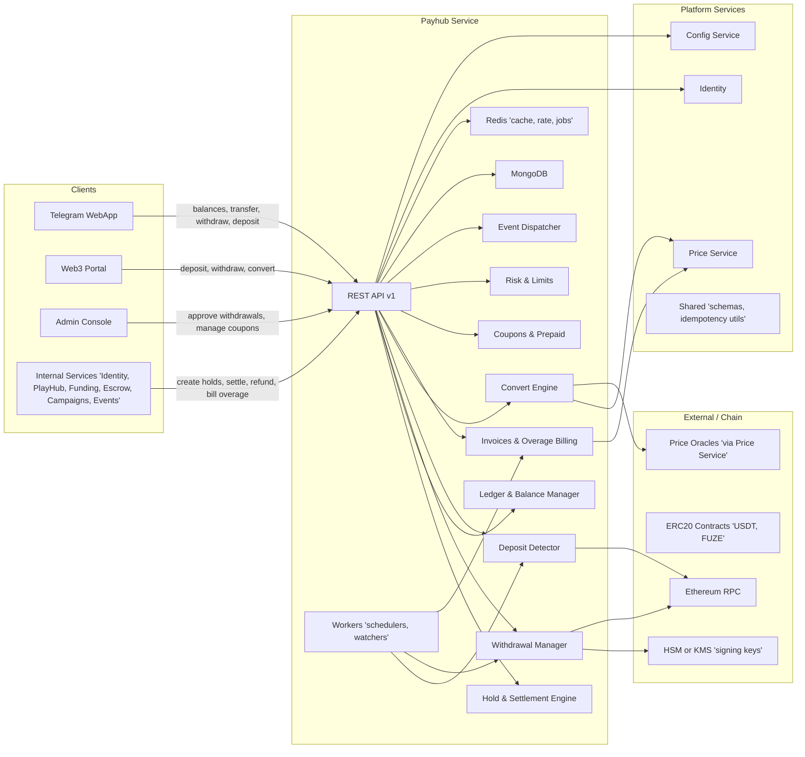
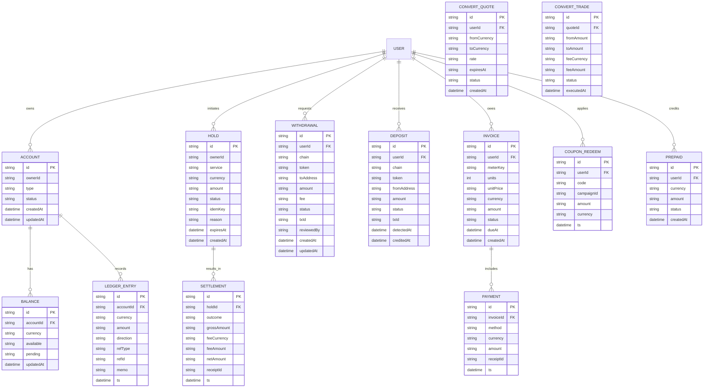
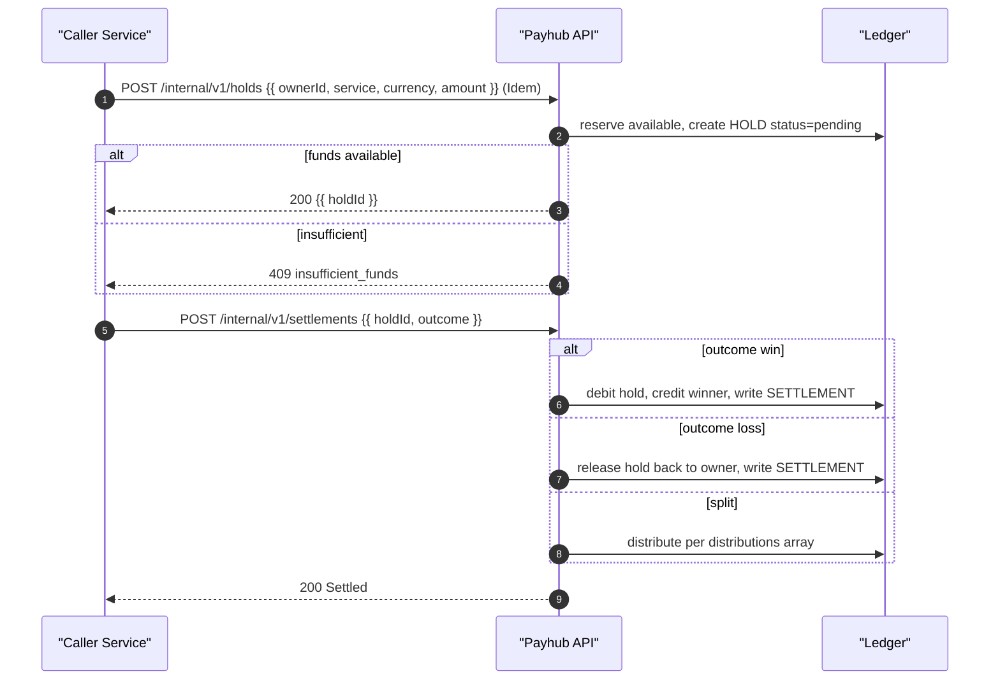
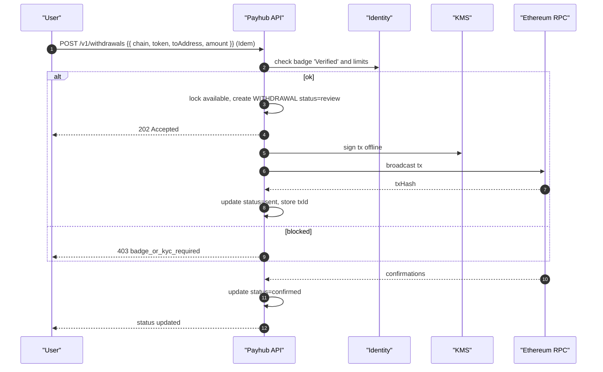
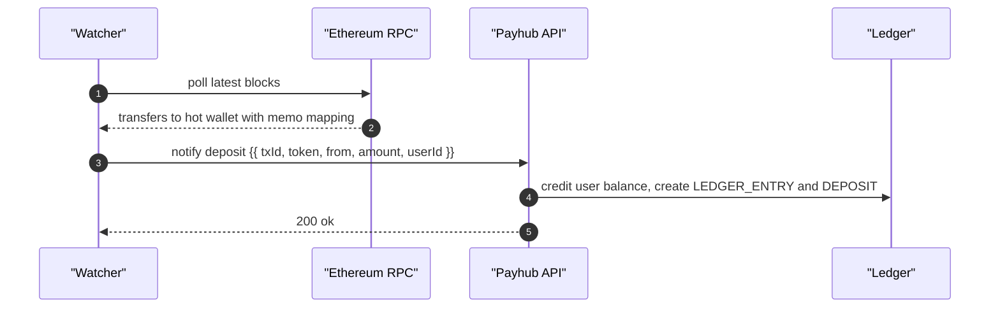
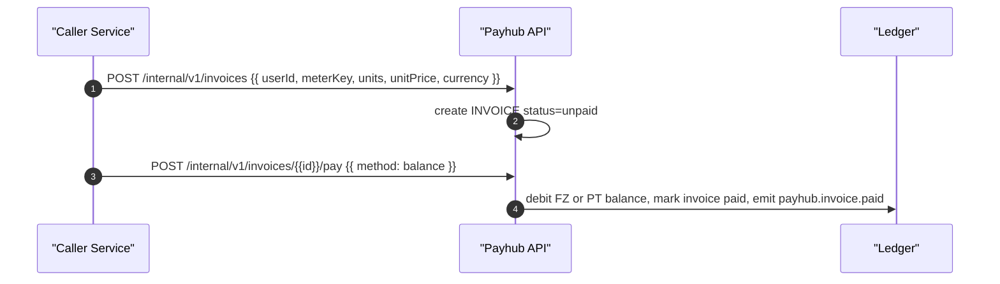

Repo: tg-miniapp-payhub-service
File: SystemDesign.md
SHA-256: 38989e94d8db7de6225a2c8108f6255207c760ac3da0a0149e65e40750fcaa81
Bytes: 20271
Generated: 2025-09-26 14:09 GMT+7
Inputs: Old SystemDesign.md (ref), UserStories.md (authoritative), API Spec Guide, Data Schema Guide
Change Basis: Updated to reflect latest UserStories

---

# 1) Architecture Diagram (flowchart)


---

# 2) Technology Stack

| Layer | Choice | Notes |
|---|---|---|
| Runtime | Node.js 20 + TypeScript | Uniform across platform |
| API | Fastify + Zod + OpenAPI 3.1 | Strict request/response validation |
| Data | MongoDB (replica set) | Double-entry ledger, balances, holds, settlements, w/d, deposits, invoices |
| Cache/Jobs | Redis + BullMQ | Idempotency, queues, DLQ, schedulers |
| Cryptography | Ed25519 (jose), HMAC-SHA256 | JWT verify, webhook signatures |
| Keys | Cloud KMS or HSM | Withdrawal signing keys, rotation |
| Chain | Ethereum JSON-RPC, ERC-20 | USDT and FUZE on EVM networks |
| Observability | OpenTelemetry, Prometheus, Loki | RED/USE dashboards |
| CI/CD | Docker, Helm, Argo CD | Blue/green deploy |
| Timezone | Presentation GMT+7, system UTC | Consistent timestamps |

---

# 3) Responsibilities and Scope

**Owns**
- **Custody (off‑chain)** for STAR, FZ, PT with internal ledger and balances.
- **Holds and settlements** for platform services (matchmaking bets, CFB, escrow, funding).
- **Deposits and withdrawals** for ERC‑20 **USDT** and **FUZE** via Web3 Portal, signed by hot wallet with KMS control.
- **Conversion** and pricing snapshots between STAR/FZ/PT and USDT reference (via Price Service).
- **Overage billing**: issue invoices, accept payment in **FZ/PT**, coupons, prepaid credits.
- **Limits & risk**: daily withdrawal caps, velocity checks, sanctions blocklist via Identity/Config.
- **Events & audit** for financial actions.

**Collaborates**
- Identity (badges/KYC, org roles), Config (fees, limits, tax), Price Service (quotes), Shared (ids, signatures).

**Explicit non-goals**
- On‑chain market-making, DEX routing, fiat rails, KYC document storage.

**SLAs**
- Create hold P95 ≤ 120 ms, Settle P95 ≤ 200 ms (ex‑RPC), Withdrawal create P95 ≤ 250 ms.

---

# 4) Data Design (Mermaid ER)



**Indexes**
- BALANCE(accountId, currency), HOLD(ownerId, service, status, expiresAt), SETTLEMENT(holdId), WITHDRAWAL(userId, status, createdAt), DEPOSIT(userId, status, detectedAt), LEDGER_ENTRY(accountId, ts), INVOICE(userId, status, dueAt), PAYMENT(invoiceId).  
- Unique: HOLD(idemKey).

**Ledger model**
- Double-entry: each credit has an equal debit across system and user accounts; `direction` ∈ `debit,credit`; sum per currency = 0.

**Retention**
- Ledger 7y, invoices 7y, chain tx references 7y.

---

# 5) Interfaces (API Specification)

```yaml
openapi: 3.1.0
info:
  title: tg-miniapp-payhub-service API
  version: 2.0.0
servers:
  - url: https://payhub.api
components:
  securitySchemes:
    BearerAuth:
      type: http
      scheme: bearer
      bearerFormat: JWT
  parameters:
    IdempotencyKey:
      in: header
      name: Idempotency-Key
      schema: { type: string }
  responses:
    BadRequest: { description: Bad request }
    Unauthorized: { description: Unauthorized }
    Forbidden: { description: Forbidden }
    NotFound: { description: Not found }
    Conflict: { description: Conflict }
paths:
  /v1/wallets/balances:
    get:
      summary: Get user balances
      security: [{ BearerAuth: [] }]
      responses:
        "200": { description: OK }
  /v1/wallets/transfer:
    post:
      summary: Internal transfer STAR/FZ/PT
      security: [{ BearerAuth: [] }]
      parameters: [{{ $ref: '#/components/parameters/IdempotencyKey' }}]
      requestBody:
        required: true
        content:
          application/json:
            schema:
              type: object
              required: [toUserId, currency, amount]
              properties:
                toUserId: {{ type: string }}
                currency: {{ type: string, enum: [STAR, FZ, PT] }}
                amount: {{ type: string }}
      responses:
        "200": {{ description: OK }}
        "409": {{ description: insufficient_funds }}
  /v1/withdrawals:
    post:
      summary: Request ERC20 withdrawal (badge/KYC gated)
      security: [{ BearerAuth: [] }]
      parameters: [{{ $ref: '#/components/parameters/IdempotencyKey' }}]
      requestBody:
        required: true
        content:
          application/json:
            schema:
              type: object
              required: [chain, token, toAddress, amount]
              properties:
                chain: {{ type: string, enum: [ethereum] }}
                token: {{ type: string, enum: [USDT, FUZE] }}
                toAddress: {{ type: string }}
                amount: {{ type: string }}
      responses:
        "202": {{ description: Accepted }}
        "403": {{ description: badge_or_kyc_required }}
        "409": {{ description: insufficient_funds }}
  /v1/withdrawals/{{withdrawalId}}:
    get:
      summary: Get withdrawal status
      security: [{ BearerAuth: [] }]
      parameters:
        - in: path
          name: withdrawalId
          required: true
          schema: {{ type: string }}
      responses:
        "200": {{ description: OK }}
  /v1/deposits/intent:
    post:
      summary: Create deposit intent for ERC20
      security: [{ BearerAuth: [] }]
      requestBody:
        required: true
        content:
          application/json:
            schema:
              type: object
              required: [token]
              properties:
                token: {{ type: string, enum: [USDT, FUZE] }}
      responses:
        "201": {{ description: Created }}
  /v1/convert/quote:
    post:
      summary: Quote conversion between STAR/FZ/PT (internal FX)
      security: [{ BearerAuth: [] }]
      requestBody:
        required: true
        content:
          application/json:
            schema:
              type: object
              required: [fromCurrency, toCurrency, amount]
              properties:
                fromCurrency: {{ type: string, enum: [STAR, FZ, PT] }}
                toCurrency: {{ type: string, enum: [STAR, FZ, PT] }}
                amount: {{ type: string }}
      responses:
        "200": {{ description: OK }}
  /v1/convert/execute:
    post:
      summary: Execute conversion using quoteId
      security: [{ BearerAuth: [] }]
      parameters: [{{ $ref: '#/components/parameters/IdempotencyKey' }}]
      requestBody:
        required: true
        content:
          application/json:
            schema:
              type: object
              required: [quoteId]
              properties:
                quoteId: {{ type: string }}
      responses:
        "200": {{ description: Executed }}
        "409": {{ description: quote_expired }}
  /internal/v1/holds:
    post:
      summary: Create a hold for a service
      security: [{ BearerAuth: [] }]
      parameters: [{{ $ref: '#/components/parameters/IdempotencyKey' }}]
      requestBody:
        required: true
        content:
          application/json:
            schema:
              type: object
              required: [ownerId, service, currency, amount, reason]
              properties:
                ownerId: {{ type: string }}
                service: {{ type: string }}
                currency: {{ type: string, enum: [STAR, FZ, PT] }}
                amount: {{ type: string }}
                reason: {{ type: string }}
      responses:
        "200": {{ description: Hold created }}
        "409": {{ description: insufficient_funds }}
  /internal/v1/settlements:
    post:
      summary: Settle a hold with outcome
      security: [{ BearerAuth: [] }]
      parameters: [{{ $ref: '#/components/parameters/IdempotencyKey' }}]
      requestBody:
        required: true
        content:
          application/json:
            schema:
              type: object
              required: [holdId, outcome]
              properties:
                holdId: {{ type: string }}
                outcome: {{ type: string, enum: [win, loss, split] }}
                distributions:
                  type: array
                  items:
                    type: object
                    required: [accountId, currency, amount]
                    properties:
                      accountId: {{ type: string }}
                      currency: {{ type: string }}
                      amount: {{ type: string }}
      responses:
        "200": {{ description: Settled }}
```

**Events (produced)**
- payhub.balance.updated, payhub.hold.created, payhub.settlement.completed, payhub.withdrawal.requested, payhub.withdrawal.broadcasted, payhub.withdrawal.confirmed, payhub.deposit.detected, payhub.convert.executed, payhub.invoice.created, payhub.invoice.paid.  
Headers: X-Payhub-Signature, X-Payhub-Timestamp. Delivery: at-least-once with retry and DLQ.

---

# 6) Data Flows (sequence diagrams)

## 6.1 Create Hold → Settle Win/Loss



## 6.2 Withdrawal (KYC/badge gated)



## 6.3 Deposit detection



## 6.4 Overage invoice pay in FZ/PT



---

# 7) Rules and Calculations

- **Currencies**: STAR, FZ, PT (off‑chain), USDT, FUZE (on‑chain). Balances maintained per currency.  
- **Fees**: config driven percentage + fixed. Withdrawal fee may be network or flat. Fees posted as separate ledger entries to treasury account.  
- **Holds**: reduce `available`, increase `pending`; expire by TTL, auto‑release.  
- **Settlement**: `win` moves pending to counterparty, `loss` releases to owner, `split` distributes per request.  
- **Quotas & overage**: free monthly limits — withdrawals count, conversions count, internal transfers count; on exceed, create invoice priced in FZ/PT; coupons and prepaid applied first.  
- **Badges/KYC gates**:  
  - Withdrawals: **Verified** badge required, large amounts require **Pro** badge.  
  - High‑velocity internal transfers may require **Investor** or **Trader** depending on service context.  
- **Idempotency**: all POST accept `Idempotency-Key`; duplicate returns original result.  
- **Pricing snapshots**: conversions use Price Service rate with expiry.

---

# 8) Security and Compliance

- **AuthN**: JWT from Identity; mTLS for internal `/internal` endpoints optional.  
- **AuthZ**: per‑route scopes; service principals for internal calls.  
- **KMS/HSM**: withdrawal keys, periodic rotation; quorum for key operations.  
- **PII**: no KYC docs stored; only badge state from Identity.  
- **Audit**: immutable ledger, append‑only; all changes emit events with HMAC signatures.  
- **Webhook verification**: timestamped HMAC with 5‑minute window; reject replays.

---

# 9) Scalability and Reliability

- Stateless API, horizontal scale; Redis queues for withdrawals, deposit detection, invoice retries.  
- Circuit breakers to chain RPC and KMS; exponential backoff with jitter.  
- DLQ and reconciliation jobs for stuck withdrawals or deposits.  
- DR: Mongo replica set, RPO 5 min, RTO 30 min.

---

# 10) Observability

- **Metrics**: holds.created, settlements.completed, withdrawals.sent/confirmed, deposits.credited, convert.executed, invoice.paid.  
- **Traces**: spans from API → Ledger → Chain; correlation id `X-Request-Id`.  
- **Alerts**: DLQ growth, RPC error ratio, ledger imbalance != 0, unconfirmed w/d > SLO.

---

# 11) Configuration and ENV

| Key | Type | Example | Secret | Notes |
|---|---|---|---|---|
| PAYHUB_MONGO_URI | string | mongodb+srv://... | yes | Primary DB |
| PAYHUB_REDIS_URI | string | redis://... | yes | Cache & jobs |
| IDENTITY_BASE_URL | string | https://identity.api | no | Auth and badges |
| CONFIG_BASE_URL | string | https://config.api | no | Limits and fees |
| PRICE_BASE_URL | string | https://price.api | no | Quotes |
| ETH_RPC_URL | string | https://mainnet.infura.io/v3/... | yes | Ethereum RPC |
| HOT_WALLET_KEY_ID | string | kms-key-123 | no | KMS key id |
| HMAC_SECRET | string | base64 | yes | Webhook/event signatures |
| WITHDRAWAL_CONFIRMATIONS | int | 12 | no | Finality threshold |
| LEDGER_TREASURY_ACCOUNT | string | acct_treasury | no | Fee sink |
| TZ | string | Asia/Bangkok | no | Presentation TZ |

Precedence: ENV > Config Service > defaults.

---

# 12) User Stories and Feature List (Traceability)

| Story ID | Title | APIs/Events | Entities | Diagram |
|---|---|---|---|---|
| PH-01 | Create hold | POST /internal/v1/holds, payhub.hold.created | HOLD, BALANCE, LEDGER_ENTRY | 6.1 |
| PH-02 | Settle outcome | POST /internal/v1/settlements, payhub.settlement.completed | SETTLEMENT, LEDGER_ENTRY | 6.1 |
| PH-03 | Withdrawal request | POST /v1/withdrawals, payhub.withdrawal.requested | WITHDRAWAL, BALANCE | 6.2 |
| PH-04 | Withdrawal confirm | chain watcher events | WITHDRAWAL | 6.2 |
| PH-05 | Deposit intent/detect | POST /v1/deposits/intent, payhub.deposit.detected | DEPOSIT, LEDGER_ENTRY | 6.3 |
| PH-06 | Convert | POST /v1/convert/quote, /v1/convert/execute, payhub.convert.executed | CONVERT_QUOTE, CONVERT_TRADE | — |
| PH-07 | Overage invoice | /internal invoice APIs, payhub.invoice.created/paid | INVOICE, PAYMENT | 6.4 |

---

# 13) Roadmap

- Multi‑chain support (Arbitrum, BSC), gas abstraction, fee sponsorship.  
- Automated risk scoring and anomaly detection.  
- Cold storage sweeps and thresholds.  
- Fiat on/off‑ramps integration (future).

---

# 14) Compatibility Notes

- Aligns to latest UserStories: explicit overage billing in FZ/PT, coupons and prepaid, stronger badge gates for withdrawals, idempotent holds/settlements, double‑entry ledger.  
- Delta vs old design: expanded schemas (INVOICE, PAYMENT, PREPAID), clarified event contracts, added conversion flows and risk gates.  
- Migration: create system treasury account, backfill balances from historical ledgers, add unique index on HOLD.idemKey.
