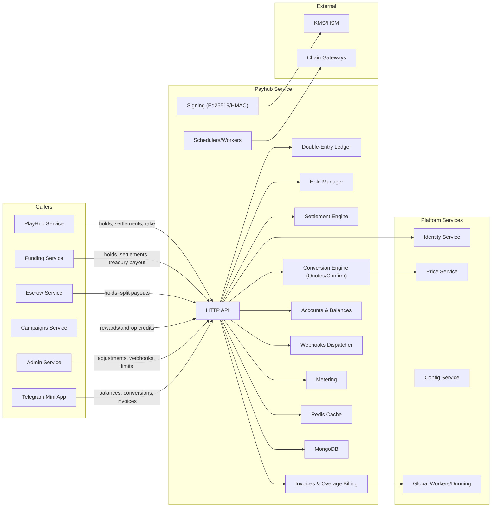
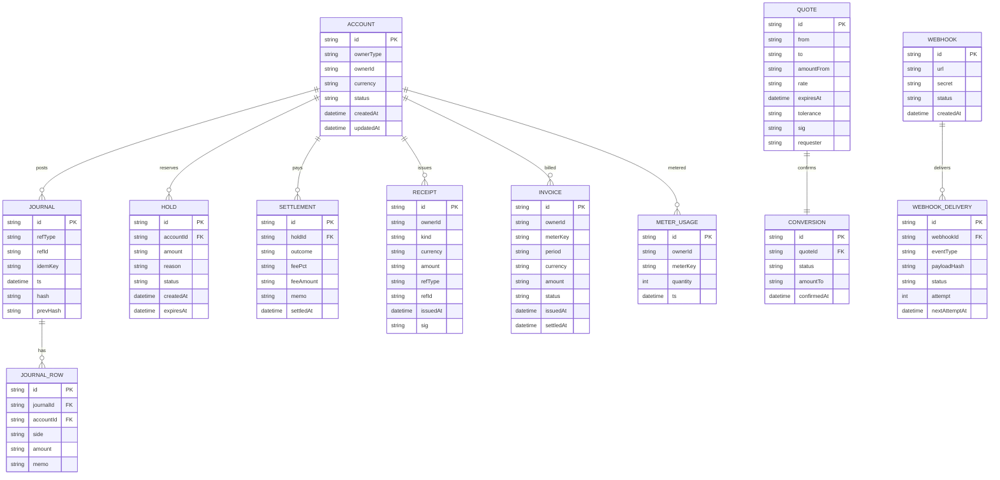
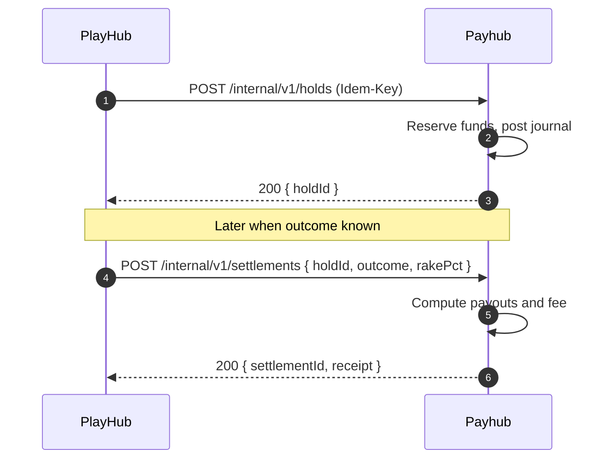
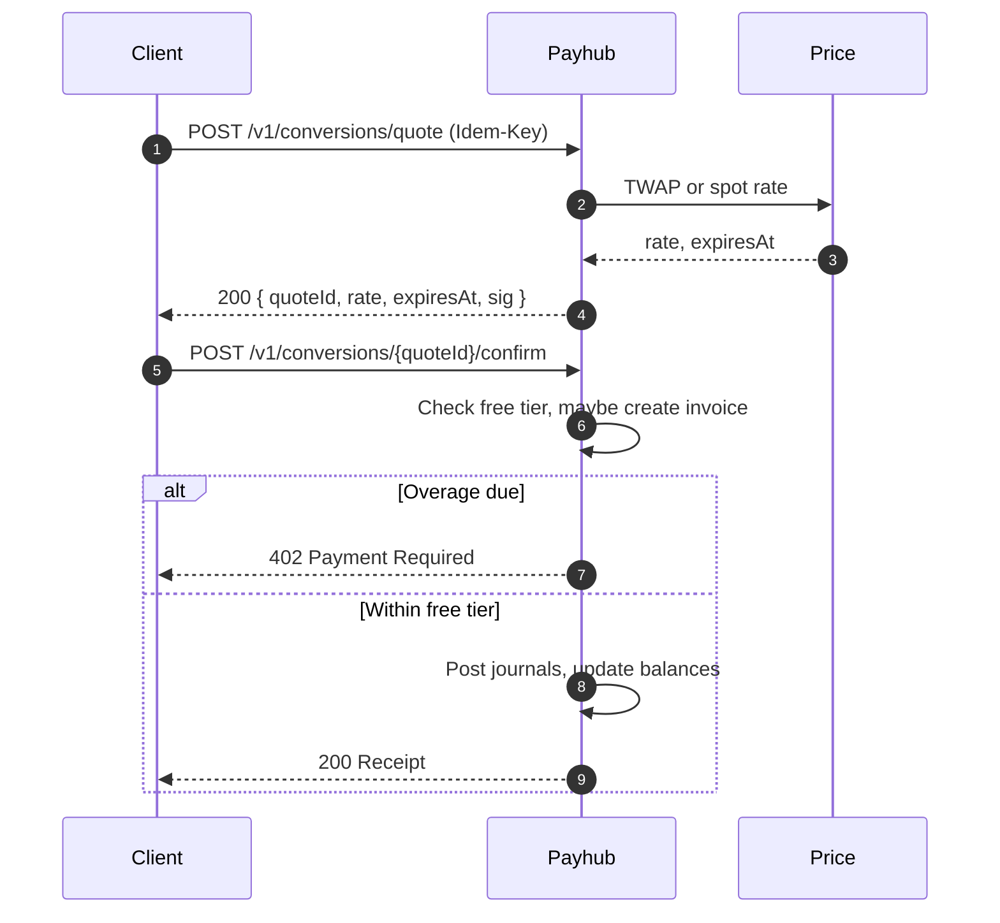
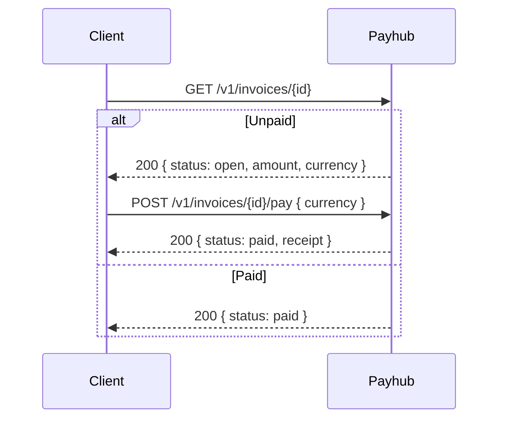
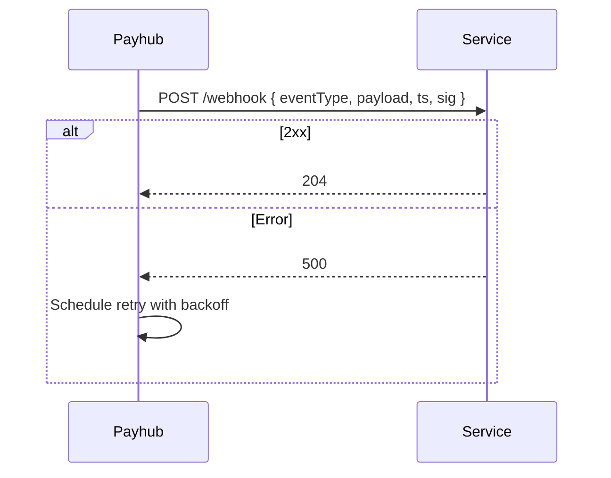

Repo: tg-miniapp-payhub-service
File: SystemDesign.md
SHA-256: 86163f4abf80ebea4f37212d831b27d5caf1c86ea83e60742f24f61a0dffa073
Bytes: 18760
Generated: 2025-09-26 02:26 GMT+7
Inputs: Old SystemDesign.md (ref), UserStories.md (authoritative), API Spec Guide, Data Schema Guide
Change Basis: Updated to reflect latest UserStories

---

# 1) Architecture Diagram (flowchart)



---

# 2) Technology Stack

| Layer | Choice | Notes |
|---|---|---|
| Runtime | Node.js 20 + TypeScript | Consistent across platform |
| Web | Fastify + Zod | JSON APIs, input validation |
| Data | MongoDB | Ledger, holds, settlements, invoices, quotes |
| Cache | Redis Cluster | Idempotency keys, rate limits, hot balances |
| Jobs | BullMQ | Expiry (holds/quotes), dunning, webhook retries |
| Crypto | jose, tweetnacl | JWT/HMAC + Ed25519 signatures |
| Observability | OpenTelemetry, Pino, Prometheus | RED/USE metrics & traces |
| Deploy | Docker, Helm, Argo CD | Blue/green/canary |

---

# 3) Responsibilities and Scope

**Owns**
- Accounts & double-entry ledger for STAR/FZ/PT/USDT (off-chain custody MVP).
- Holds & settlements for PlayHub/Funding/Escrow/CFB with platform rake (e.g., 7%).
- Credits/Debits for rewards, refunds, and overage charges.
- Conversions: Quote + Confirm between STAR/FZ/PT/USDT using Price Service.
- Invoices, metering, dunning for free-tier overage payable in FZ/PT.
- Receipts & webhooks for downstream state sync.

**Collaborates**
- Identity (auth, badges/KYC), Price (rates), Config (limits, fees), Workers (dunning, scheduled expiry).

**Not responsible**
- On-chain custody in MVP (future), AML heuristics (beyond basic checks), UI rendering.

**SLA**
- Balance read P95 ≤ 80 ms; hold/settle P95 ≤ 150 ms; webhook delivery within 60 s (P95). Availability 99.9%/mo.

---

# 4) Data Design (Mermaid ER)



**Indexes**
- ACCOUNT(ownerType, ownerId, currency) unique.
- HOLD(accountId, status, expiresAt); TTL voiding worker uses expiresAt.
- JOURNAL(ts); JOURNAL(idemKey) unique.
- INVOICE(ownerId, period, meterKey) unique.
- QUOTE(expiresAt); CONVERSION(quoteId) unique.
- WEBHOOK_DELIVERY(status, nextAttemptAt) for retries.

**Retention**
- Journals and receipts retained 7 years; invoices 7 years; webhook deliveries 30 days; quotes 2 days.

**Idempotency**
- All mutations require Idempotency-Key; stored on JOURNAL or operation record.

---

# 5) Interfaces (API Specification)

```yaml
openapi: 3.1.0
info:
  title: Payhub API
  version: 1.3.0
servers:
  - url: https://payhub.api
security:
  - BearerAuth: []
paths:
  /v1/accounts/me:
    get:
      summary: Get my balances
      operationId: balancesGet
      responses:
        "200": { description: Balances with available, pending, onHold }
  /internal/v1/holds:
    post:
      summary: Create a hold
      operationId: holdCreate
      security: [{ ServiceAuth: [] }]
      parameters:
        - in: header
          name: Idempotency-Key
          required: true
          schema: { type: string }
      requestBody:
        required: true
        content:
          application/json:
            schema:
              type: object
              required: [userId, currency, amount, reason]
              properties:
                userId: { type: string }
                currency: { type: string, enum: [STAR, FZ, PT, USDT] }
                amount: { type: string }
                reason: { type: string }
                ttlSec: { type: integer, minimum: 60 }
      responses:
        "200": { description: Created, returns holdId }
        "409": { description: insufficient_funds }
  /internal/v1/settlements:
    post:
      summary: Settle a hold
      operationId: settlementCreate
      security: [{ ServiceAuth: [] }]
      parameters:
        - in: header
          name: Idempotency-Key
          required: true
          schema: { type: string }
      requestBody:
        required: true
        content:
          application/json:
            schema:
              type: object
              required: [holdId, outcome]
              properties:
                holdId: { type: string }
                outcome: { type: string, enum: [win, loss, split] }
                splits:
                  type: array
                  items:
                    type: object
                    required: [userId, amount]
                    properties:
                      userId: { type: string }
                      amount: { type: string }
                rakePct: { type: number, format: float }
                memo: { type: string }
      responses:
        "200": { description: Settlement receipt }
        "409": { description: hold_invalid_or_expired }
  /internal/v1/credits:
    post:
      summary: Credit balance
      operationId: creditCreate
      security: [{ ServiceAuth: [] }]
      parameters:
        - in: header
          name: Idempotency-Key
          required: true
          schema: { type: string }
      requestBody:
        required: true
        content:
          application/json:
            schema:
              type: object
              required: [ownerId, currency, amount, refType, refId]
              properties:
                ownerId: { type: string }
                currency: { type: string, enum: [STAR, FZ, PT, USDT] }
                amount: { type: string }
                refType: { type: string }
                refId: { type: string }
      responses:
        "200": { description: Receipt }
  /internal/v1/debits:
    post:
      summary: Debit balance (overage)
      operationId: debitCreate
      security: [{ ServiceAuth: [] }]
      parameters:
        - in: header
          name: Idempotency-Key
          required: true
          schema: { type: string }
      requestBody:
        required: true
        content:
          application/json:
            schema:
              type: object
              required: [ownerId, currency, amount, meterKey, period]
              properties:
                ownerId: { type: string }
                currency: { type: string, enum: [FZ, PT] }
                amount: { type: string }
                meterKey: { type: string }
                period: { type: string }
      responses:
        "200": { description: Invoice settled or balance debited }
        "402": { description: payment_required }
  /v1/conversions/quote:
    post:
      summary: Create a conversion quote
      operationId: conversionQuote
      parameters:
        - in: header
          name: Idempotency-Key
          required: true
          schema: { type: string }
      requestBody:
        required: true
        content:
          application/json:
            schema:
              type: object
              required: [from, to, amountFrom, tolerance]
              properties:
                from: { type: string, enum: [STAR, FZ, PT, USDT] }
                to: { type: string, enum: [STAR, FZ, PT, USDT] }
                amountFrom: { type: string }
                tolerance: { type: string }
      responses:
        "200": { description: Quote with expiresAt and sig }
        "409": { description: illiquid_or_unsuppported }
  /v1/conversions/{quoteId}/confirm:
    post:
      summary: Confirm a conversion
      operationId: conversionConfirm
      parameters:
        - in: path
          name: quoteId
          required: true
          schema: { type: string }
      requestBody:
        required: true
        content:
          application/json:
            schema:
              type: object
              properties:
                acceptSlippage: { type: boolean, default: true }
      responses:
        "200": { description: Conversion success + receipt }
        "410": { description: quote_expired }
  /v1/invoices/{id}:
    get:
      summary: Get invoice
      operationId: invoiceGet
      responses:
        "200": { description: Invoice state }
        "404": { description: Not found }
  /v1/invoices/{id}/pay:
    post:
      summary: Pay invoice with FZ or PT
      operationId: invoicePay
      requestBody:
        required: true
        content:
          application/json:
            schema:
              type: object
              required: [currency]
              properties:
                currency: { type: string, enum: [FZ, PT] }
      responses:
        "200": { description: Paid }
        "409": { description: insufficient_funds }
  /admin/v1/webhooks:
    post:
      summary: Register webhook
      operationId: webhookRegister
      requestBody:
        required: true
        content:
          application/json:
            schema:
              type: object
              required: [url, secret]
              properties:
                url: { type: string, format: uri }
                secret: { type: string }
      responses:
        "201": { description: Created }
components:
  securitySchemes:
    BearerAuth:
      type: http
      scheme: bearer
      bearerFormat: JWT
    ServiceAuth:
      type: http
      scheme: bearer
      bearerFormat: JWT
```

**Standards**
- Error envelope {{ code, message, requestId }}; idempotent mutations via Idempotency-Key; 402 used for payment_required.
- Rate limits: public 20 rps/user; internal 200 rps/service; 429 with Retry-After header.
- Webhooks signed with X-Payhub-Signature (HMAC SHA256) and X-Payhub-Timestamp.

---

# 6) Data Flows (sequence diagrams)

## 6.1 Hold then settle with 7% rake



## 6.2 Conversion quote then confirm with overage charge



## 6.3 Invoice payment flow



## 6.4 Webhook delivery with retry



---

# 7) Rules and Calculations

- Ledger: double-entry, journals must balance; available, onHold, pending.
- Holds: reduce available, increase onHold; expiry returns to available.
- Settlements: win releases hold to winner, loss forfeits; split supported; rakePct (e.g., 7%) credited to platform revenue.
- Quotes: from Price Service; expiresAt default 30 s; tolerance applied; conversions atomic.
- Badges/KYC: withdrawals and large conversions require KYC badge (level configurable); enforcement via Identity introspection.
- Quotas & Overage: meter keys hold.create.day, settlement.confirm.day, conversion.confirm.day, transfer.create.day, withdrawal.create.month, webhook.deliver.day. Free limits from Config; FZ/PT used for overage via invoices.
- Receipts: signed with Ed25519; include refType, refId, journalHash.

---

# 8) Security and Compliance

- AuthN/Z: user JWT for wallet actions; ServiceAuth JWT + HMAC body check for internal callers.
- Encryption: TLS in transit; secrets in KMS; signatures rotate every 90 days.
- PII/KYC: minimal PII; rely on Identity for KYC status; store only badge IDs and decision refs.
- Audit: append-only journals, hash chaining; admin actions audited.
- Fraud: velocity limits, anomaly alerts; manual review queue for flagged withdrawals (future).

---

# 9) Scalability and Reliability

- Stateless API; horizontal scale; Redis for hot paths.
- Jobs with backoff and DLQ; idempotent consumers.
- Dependency timeouts and circuit breakers to Price or Identity.
- DR: multi-AZ Mongo; PITR; periodic ledger snapshots for recovery.

---

# 10) Observability

- Logs: structured with requestId, ownerId, operation, idemKey.
- Metrics: ledger post ok/error, hold create fail rate, quote latency, webhook success ratio, invoice conversion.
- Tracing: spans across quote to confirm, and hold to settle.
- SLO Alerts: webhook backlog, ledger imbalance, price dependency timeouts.

---

# 11) Configuration and ENV

| Key | Type | Example | Secret | Notes |
|---|---|---|---|---|
| PAY_MONGO_URI | string | mongodb+srv://... | yes | Primary store |
| PAY_REDIS_URI | string | redis://... | yes | Cache/idempotency |
| PAY_QUOTE_TTL_SEC | int | 30 | no | Quote expiry |
| PAY_RAKE_PCT | number | 7 | no | Default CFB rake |
| PAY_RATE_LIMITS | json | {{}} | no | Per route |
| PAY_WEBHOOK_HMAC | string | base64 | yes | Signing secrets |
| PAY_TIMEZONE | string | Asia/Bangkok | no | GMT+7 |
| PAY_CONFIG_NAMESPACE | string | payhub | no | Dynamic config |
| PAY_SIGNING_KEY | string | base64 | yes | Receipt signing |

Precedence: ENV > Config Service > defaults.

---

# 12) User Stories and Feature Traceability

| Story | Feature | APIs/Events | Entities | Diagram |
|---|---|---|---|---|
| A1.1 Accounts & balances | Ledger | /v1/accounts/me | ACCOUNT, JOURNAL | — |
| B1.1 Create hold | Holds | /internal/v1/holds | HOLD, JOURNAL | 6.1 |
| B1.2 Settle hold | Settlements | /internal/v1/settlements | SETTLEMENT, RECEIPT | 6.1 |
| B1.3 Platform rake | Fees | settlements | JOURNAL | 6.1 |
| C1.1 Credit | Credits | /internal/v1/credits | JOURNAL, RECEIPT | — |
| C1.2 Debit overage | Debits | /internal/v1/debits | INVOICE, JOURNAL | 6.2 or 6.3 |
| D1.1 Quote/Confirm | FX | /v1/conversions/* | QUOTE, CONVERSION, RECEIPT | 6.2 |
| F1.1 Treasury payout | Funding | settlements | RECEIPT | — |
| F1.2 Game/CFB payout | PlayHub | settlements | RECEIPT | 6.1 |
| G1.1 Webhooks | Webhooks | deliveries | WEBHOOK, WEBHOOK_DELIVERY | 6.4 |

---

# 13) Roadmap

- MVP: off-chain balances for STAR/FZ/PT/USDT, holds/settlements, quotes/confirm, invoices for overage, webhooks.
- GA: on-chain deposit watchers and withdrawal pipelines, multi-chain USDT networks, automated compliance flags.
- Future: fiat on-ramps, staking treasury accounts, revenue share accounting.

---

# 14) Compatibility Notes

- Aligned to UserStories: explicit metering + invoices (FZ/PT), 7% rake support, signed receipts, split settlements.
- Delta vs old SystemDesign: normalized entity names, added invoice endpoints, clarified webhook delivery retries; Mermaid labels quoted and ER has no inline comments.
- Migration: create unique indexes; backfill existing hold/settlement refs; rotate signing keys; map existing fees into rakePct config.
