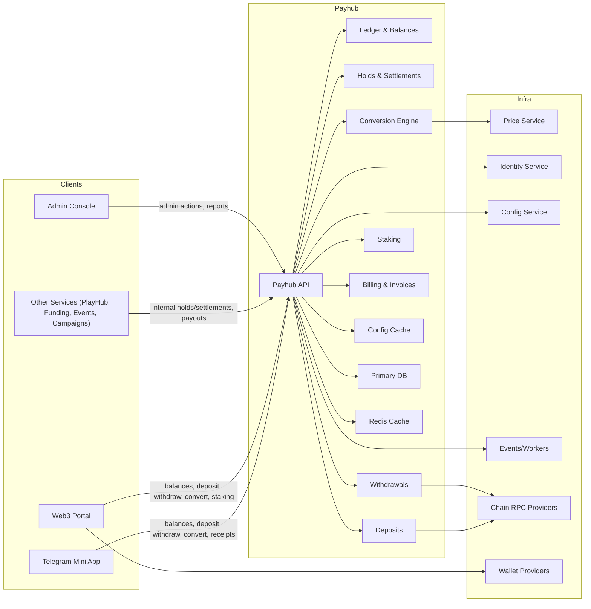
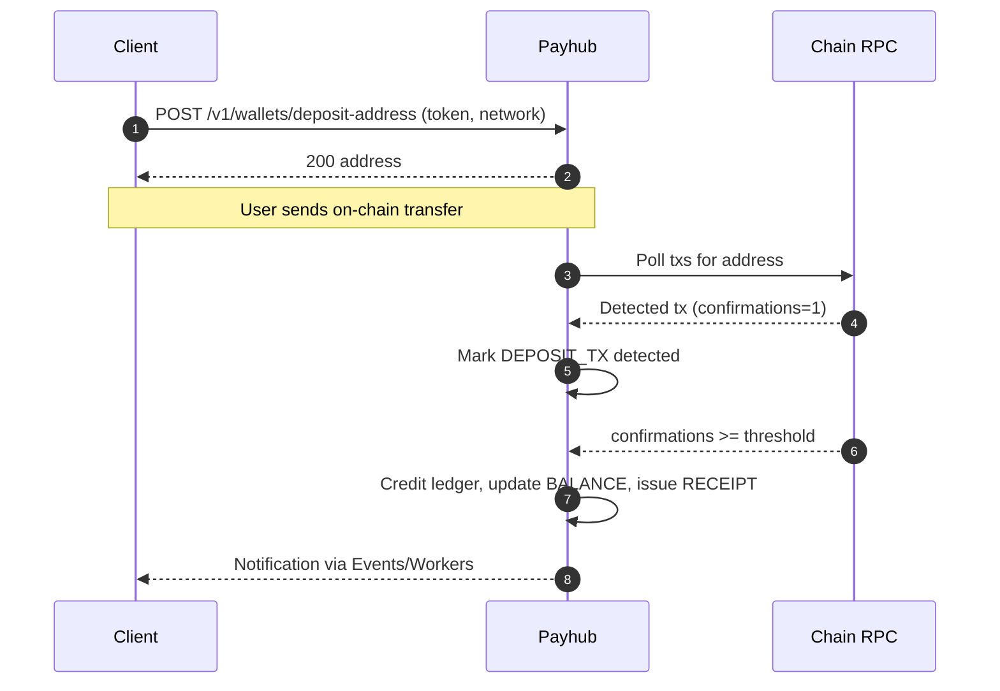
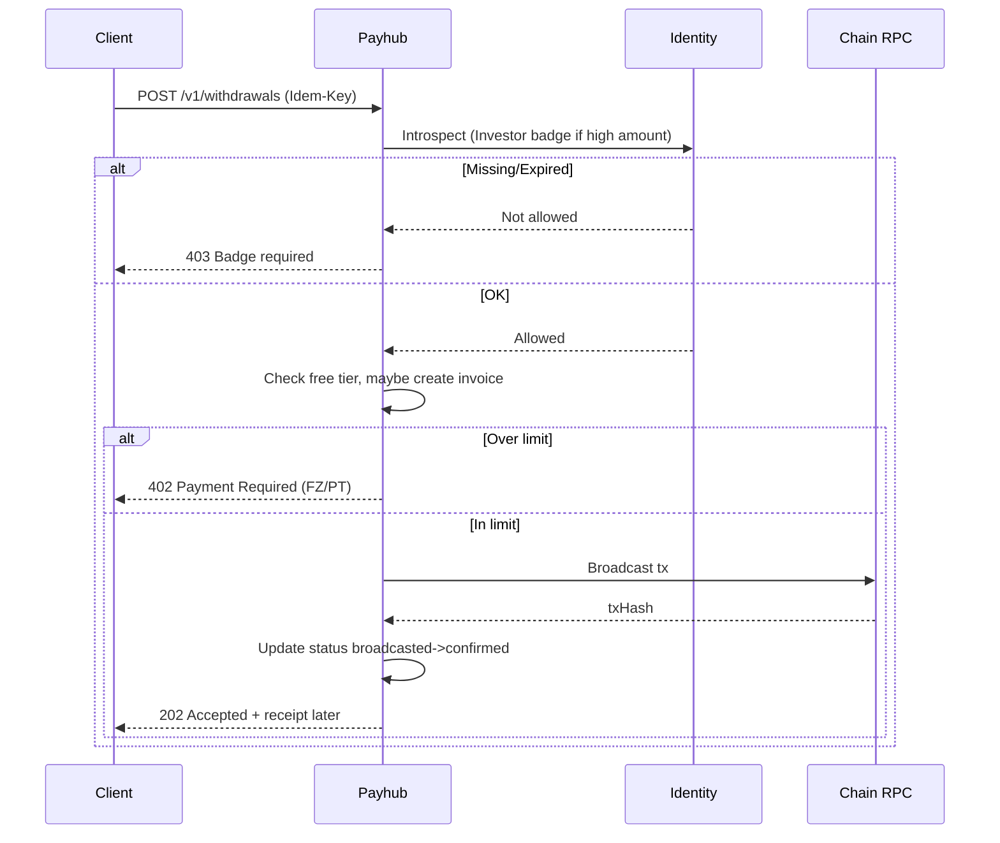
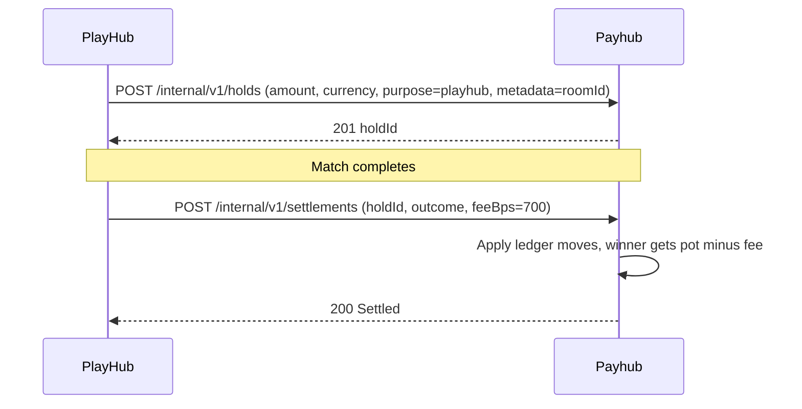
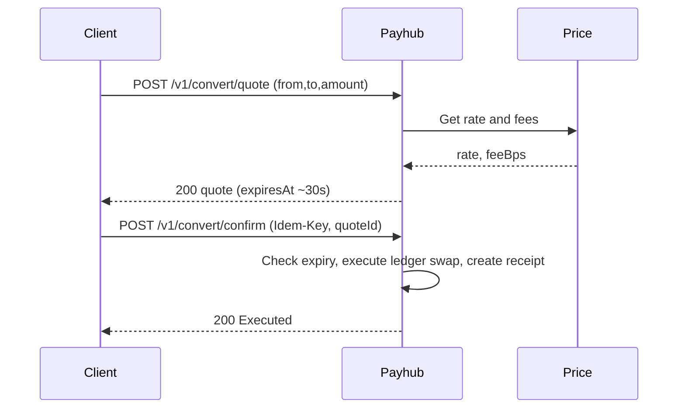

Repo: tg-miniapp-payhub-service
File: SystemDesign.md
SHA-256: 8c3e51532d2f8789d5e68474faedefad3fa4c07532fae624428b6ca616dcd2d7
Bytes: 18938
Generated: 2025-09-26 00:40 GMT+7
Inputs: Old SystemDesign.md (ref), UserStories.md (authoritative), API Spec Guide, Data Schema Guide
Change Basis: Updated to reflect latest UserStories

---

# 1) Architecture Diagram (flowchart)



---

# 2) Technology Stack

| Layer | Choice | Notes |
|---|---|---|
| Runtime | Node.js 20 + TypeScript | Service parity across platform |
| Web | Express, Zod | JSON APIs, strict validation |
| Data | MongoDB (replica set) | Accounts, balances, ledger entries, holds, invoices, receipts, staking |
| Cache | Redis Cluster | Idempotency keys, rate limits, quotes, short TTLs |
| Jobs | BullMQ | Withdraw broadcasts, staking distributions, invoice dunning |
| Crypto | Ethers v6 | ERC‑20 allowance/transfer encoding, checksum, parsing |
| Pricing | Price Service (HTTP) | Mid‑prices, FX, fee tables |
| Telemetry | OpenTelemetry + Pino | RED/USE metrics, traces |
| Deploy | Docker + Helm + Argo CD | Blue/green & canary supported |

---

# 3) Responsibilities and Scope

**Owns**
- **Custody abstraction (off‑chain for Fz/PT/STAR)** and on‑chain interactions for **FUZE/USDT** deposits/withdrawals.
- **Authoritative ledger** with double‑entry invariants and **idempotent** mutations.
- **Holds & Settlements** for peer services (PlayHub matchmaking/CFB, Funding purchases, Escrow releases).
- **Conversion** between on‑platform units (Fz/PT/STAR) and pricing/fees; quotes with expiry.
- **Staking** accounting for FUZE stake positions and quarterly distributions in stablecoin.
- **Billing** for **free‑tier metering** and **paid overage** (FZ/PT), invoices & receipts.
- **Receipts & statements** surfaces to clients and Admin.

**Collaborates**
- **Identity** for auth and badge/KYC introspection (withdrawal limits, high‑risk gating).
- **Config** for prices, fee schedules, free limits, currencies, taxes.
- **Price Service** for quotes, conversion rates.
- **Events/Workers** for async broadcasts, reconciliations, distributions.

**Not responsible**
- Badge decisioning (Identity/Admin), gameplay results (PlayHub/Game), AI project evaluation (Funding).

**SLA to callers**
- Idempotent write latency P95 ≤ 300ms; balance reads P95 ≤ 100ms. Availability 99.9%/mo.

---

# 4) Data Design (Mermaid ER)

```mermaid
erDiagram
  ACCOUNT ||--o{ BALANCE : has
  ACCOUNT ||--o{ LEDGER_ENTRY : posts
  ACCOUNT ||--o{ HOLD_TX : reserves
  ACCOUNT ||--o{ INVOICE : billed
  ACCOUNT ||--o{ RECEIPT : receives
  ACCOUNT ||--o{ WITHDRAWAL : requests
  ACCOUNT ||--o{ STAKE_POSITION : stakes
  QUOTE ||--o{ CONVERSION_TRADE : materializes

  ACCOUNT { 
    string id PK
    string ownerType        
    string ownerId
    datetime createdAt
    string status           
  }
  BALANCE {
    string id PK
    string accountId FK
    string currency         
    string available
    string pending
    datetime updatedAt
  }
  LEDGER_ENTRY {
    string id PK
    string accountId FK
    string currency
    string debit
    string credit
    string refType          
    string refId
    string desc
    datetime ts
    string idemKey          
  }
  HOLD_TX {
    string id PK
    string accountId FK
    string currency
    string amount
    string state            
    string purpose          
    string metadata         
    datetime createdAt
    datetime updatedAt
  }
  SETTLEMENT {
    string id PK
    string holdId FK
    string outcome          
    string amount
    string feeBps
    string feeAmount
    datetime settledAt
  }
  DEPOSIT_ADDR {
    string id PK
    string accountId FK
    string token           
    string network         
    string address
    datetime createdAt
  }
  DEPOSIT_TX {
    string id PK
    string accountId FK
    string token
    string network
    string txHash
    string amount
    int confirmations
    string status           
    datetime detectedAt
    datetime creditedAt
  }
  WITHDRAWAL {
    string id PK
    string accountId FK
    string token
    string network
    string toAddress
    string amount
    string fee
    string status          
    string txHash
    datetime requestedAt
    datetime updatedAt
  }
  QUOTE {
    string id PK
    string fromCurrency
    string toCurrency
    string amountFrom
    string rate
    int feeBps
    datetime expiresAt
    string status          
  }
  CONVERSION_TRADE {
    string id PK
    string quoteId FK
    string accountId FK
    string amountFrom
    string amountTo
    string feeAmount
    datetime executedAt
  }
  STAKE_POSITION {
    string id PK
    string accountId FK
    string token          
    string staked
    datetime since
    string status        
  }
  DISTRIBUTION {
    string id PK
    string period       
    string token           
    string totalPayout
    datetime executedAt
  }
  INVOICE {
    string id PK
    string accountId FK
    string meterKey       
    string period 
    string currency  
    string amount
    string status      
    datetime issuedAt
    datetime settledAt
  }
  RECEIPT {
    string id PK
    string accountId FK
    string refType
    string refId
    string currency
    string amount
    datetime issuedAt
  }
```



**Indexes**  
- Unique: DEPOSIT_ADDR(accountId, token, network), HOLD_TX(idemKey), LEDGER_ENTRY(idemKey).  
- Search: WITHDRAWAL(status), DEPOSIT_TX(status, txHash), INVOICE(period, accountId).

**Retention**  
- Ledger/receipts retained 7 years. Quotes TTL by expiresAt.

**Idempotency & Constraints**  
- All money‑moving endpoints require Idempotency-Key. Ledger invariants: sum(debit)==sum(credit) per transaction group.

---

# 5) Interfaces (OpenAPI 3.1)

```yaml
openapi: 3.1.0
info:
  title: Payhub Service API
  version: 1.2.0
servers:
  - url: https://payhub.api
security:
  - BearerAuth: []
paths:
  /v1/balances:
    get:
      summary: Get account balances
      operationId: balancesList
      responses:
        "200": { description: OK }
  /v1/wallets/deposit-address:
    post:
      summary: Issue deposit address for token/network
      operationId: depositAddressCreate
      requestBody:
        required: true
        content:
          application/json:
            schema:
              type: object
              required: [token, network]
              properties:
                token: { type: string, enum: [FUZE, USDT] }
                network: { type: string }
      responses:
        "200": { description: Address }
  /v1/withdrawals:
    post:
      summary: Request withdrawal
      operationId: withdrawalsCreate
      parameters:
        - in: header
          name: Idempotency-Key
          required: true
          schema: { type: string }
      requestBody:
        required: true
        content:
          application/json:
            schema:
              type: object
              required: [token, network, toAddress, amount]
              properties:
                token: { type: string, enum: [FUZE, USDT] }
                network: { type: string }
                toAddress: { type: string }
                amount: { type: string }
      responses:
        "202": { description: Accepted }
        "402": { description: Over free limit (pay FZ/PT) }
        "403": { description: Badge required }
  /v1/convert/quote:
    post:
      summary: Create quote for currency conversion
      operationId: convertQuote
      requestBody:
        required: true
        content:
          application/json:
            schema:
              type: object
              required: [from, to, amount]
              properties:
                from: { type: string, enum: [FZ, PT, STAR, FUZE, USDT] }
                to: { type: string, enum: [FZ, PT, STAR, FUZE, USDT] }
                amount: { type: string }
      responses:
        "200": { description: Quote }
        "409": { description: Unsupported pair }
  /v1/convert/confirm:
    post:
      summary: Confirm quote and execute conversion
      operationId: convertConfirm
      parameters:
        - in: header
          name: Idempotency-Key
          required: true
          schema: { type: string }
      requestBody:
        required: true
        content:
          application/json:
            schema:
              type: object
              required: [quoteId]
              properties:
                quoteId: { type: string }
      responses:
        "200": { description: Executed }
        "409": { description: Quote expired/used }
  /v1/staking/positions:
    get:
      summary: List staking positions
      operationId: stakeList
      responses:
        "200": { description: OK }
  /v1/invoices:
    post:
      summary: Create invoice for overage
      operationId: invoiceCreate
      requestBody:
        required: true
        content:
          application/json:
            schema:
              type: object
              required: [meterKey, period, amount, currency]
              properties:
                meterKey: { type: string }
                period: { type: string }
                amount: { type: string }
                currency: { type: string, enum: [FZ, PT] }
      responses:
        "201": { description: Created }
  /v1/receipts:
    get:
      summary: List receipts
      operationId: receiptsList
      responses:
        "200": { description: OK }
  /internal/v1/holds:
    post:
      summary: Create a hold (server-to-server)
      operationId: holdsCreate
      parameters:
        - in: header
          name: Idempotency-Key
          required: true
          schema: { type: string }
      requestBody:
        required: true
        content:
          application/json:
            schema:
              type: object
              required: [ownerId, currency, amount, purpose, metadata]
              properties:
                ownerId: { type: string }
                currency: { type: string }
                amount: { type: string }
                purpose: { type: string }
                metadata: { type: object, additionalProperties: true }
      responses:
        "201": { description: Hold created }
        "402": { description: Insufficient funds }
  /internal/v1/settlements:
    post:
      summary: Settle a hold outcome
      operationId: settlementsCreate
      requestBody:
        required: true
        content:
          application/json:
            schema:
              type: object
              required: [holdId, outcome]
              properties:
                holdId: { type: string }
                outcome: { type: string, enum: [win, loss, release] }
                feeBps: { type: integer }
      responses:
        "200": { description: Settled }
components:
  securitySchemes:
    BearerAuth:
      type: http
      scheme: bearer
      bearerFormat: JWT
```

**Standards**  
- Error envelope: {{ code, message, requestId }}; RFC7807 optional.  
- Pagination: cursor style for list endpoints.  
- Rate limits: 30 rps/user; internal endpoints whitelisted by mTLS + service JWT.  
- Idempotency: Idempotency-Key required on all mutations.

---

# 6) Data Flows (sequence diagrams)

## 6.1 Deposit crediting



## 6.2 Withdrawal with badge/limit & overage



## 6.3 Hold then settle (PlayHub)



## 6.4 Convert quote then confirm



---

# 7) Rules and Calculations

- Currencies: FZ, PT, STAR (platform) and FUZE, USDT (on-chain).  
- Badge/KYC gates: Investor badge for high withdrawals & unlimited purchases; Gamer badge for high‑stake PlayHub holds.  
- Free tier & overage: monthly free usage metrics (withdraw attempts, conversion volume, service‑initiated holds); overage payable in FZ/PT via invoices.  
- CFB/PlayHub fee: winner fee default 7% (configurable) sent as feeBps.  
- Quotes: rate, feeBps, expiresAt; round down credits, separate fee line.  
- Confirmations: credit after N confirmations per token/network (configurable).  
- Staking: time‑weighted FUZE stakes, quarterly stablecoin distributions.  
- Idempotency: identical Idempotency-Key returns same outcome.

---

# 8) Security and Compliance

- JWT auth (Identity), mTLS for internal routes, per‑scope authorization.  
- Hot wallet operations via KMS/HSM; withdrawal risk checks; geofence rules.  
- HMAC‑signed webhooks; replay protection; audit every money move.  
- Sensitive values redacted in logs; privacy retention windows applied.

---

# 9) Scalability and Reliability

- Append‑only ledger, batched writes, worker queues for RPC‑bound tasks.  
- Circuit breakers on RPC/Price; retry with jitter; DLQ for stuck jobs.  
- Multi‑AZ DB and cache; snapshots & PITR; RTO 30m, RPO 15m.

---

# 10) Observability

- Logs with requestId, accountId, idemKey.  
- Metrics: deposits detect lag, withdrawal success rate, ledger imbalance gauge.  
- Tracing across quote creation, ledger, RPC.  
- Alerts: DLQ backlog, imbalance, RPC error burst.

---

# 11) Configuration and ENV

| Key | Type | Example | Secret | Notes |
|---|---|---|---|---|
| PAY_MONGO_URI | string | mongodb+srv://... | yes | Primary DB |
| PAY_REDIS_URI | string | redis://... | yes | Cache/queue |
| PAY_RPC_ETH | string | https://... | yes | Chain RPC |
| PAY_HOT_WALLET_KEY | string | hex or KMS ref | yes | Prefer KMS/HSM |
| PAY_QUOTE_TTL_SEC | int | 30 | no | Quote expiry |
| PAY_CONFIRMATIONS_USDT | int | 6 | no | Credit threshold |
| PAY_CONFIRMATIONS_FUZE | int | 12 | no | Credit threshold |
| PAY_CFB_FEE_BPS | int | 700 | no | Winner fee default |
| PAY_RATE_LIMITS | json | {{}} | no | Per route |
| PAY_TIMEZONE | string | Asia/Bangkok | no | GMT+7 |
| PAY_CONFIG_NAMESPACE | string | payhub | no | Dynamic config |

*Precedence:* ENV > Config Service > defaults.

---

# 12) User Stories Traceability

| Story | Area | APIs/Jobs | Entities | Diagram |
|---|---|---|---|---|
| Deposit ERC‑20 | Deposits | /v1/wallets/deposit-address, worker | DEPOSIT_ADDR, DEPOSIT_TX, LEDGER_ENTRY, RECEIPT | 6.1 |
| Withdraw ERC‑20 | Withdrawals | /v1/withdrawals, worker | WITHDRAWAL, LEDGER_ENTRY, RECEIPT | 6.2 |
| Convert funds | Conversion | /v1/convert/* | QUOTE, CONVERSION_TRADE, LEDGER_ENTRY | 6.4 |
| Hold & Settle | Holds | /internal/v1/holds, /internal/v1/settlements | HOLD_TX, SETTLEMENT, LEDGER_ENTRY | 6.3 |
| Staking | Staking | jobs + /v1/staking/positions | STAKE_POSITION, DISTRIBUTION, LEDGER_ENTRY | — |
| Overage billing | Billing | /v1/invoices, /v1/receipts | INVOICE, RECEIPT, LEDGER_ENTRY | 6.2 |

---

# 13) Roadmap

- MVP: ERC‑20 deposit/withdraw, holds/settlements, FZ/PT/STAR ledger, conversion quotes & confirm, invoices/receipts.  
- GA: staking distributions automation, multi‑chain support, advanced risk & address book, partial withdrawals, batched payouts.  
- Future: on‑chain proof of reserves, L2 bridges, account abstraction.

---

# 14) Compatibility Notes

- Aligned to UserStories: added explicit free‑tier metering & overage billing, 7% CFB fee via settlement feeBps, staking distribution surfaces, stricter idempotency.  
- Differences from old SystemDesign: consolidates internal endpoints under /internal/v1/*; clarifies quote TTL and rounding; formalizes ledger entities for holds/settlements and invoices.  
- Migration: backfill existing holds to new HOLD_TX with purpose and metadata; reindex ledger by idemKey; rotate hot wallet secrets to KMS references.
