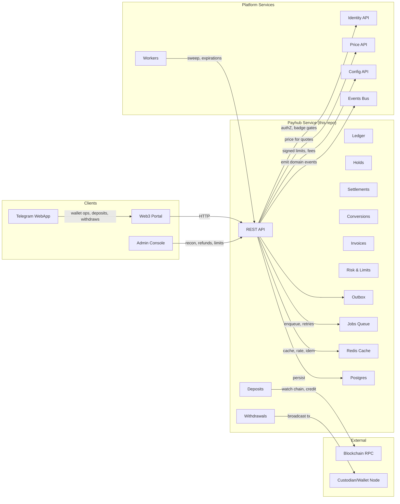
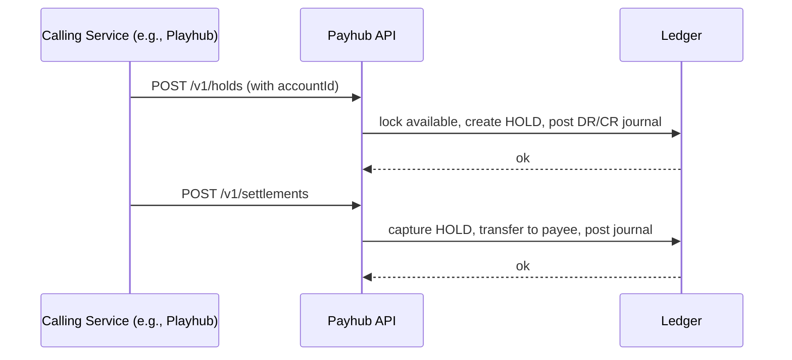
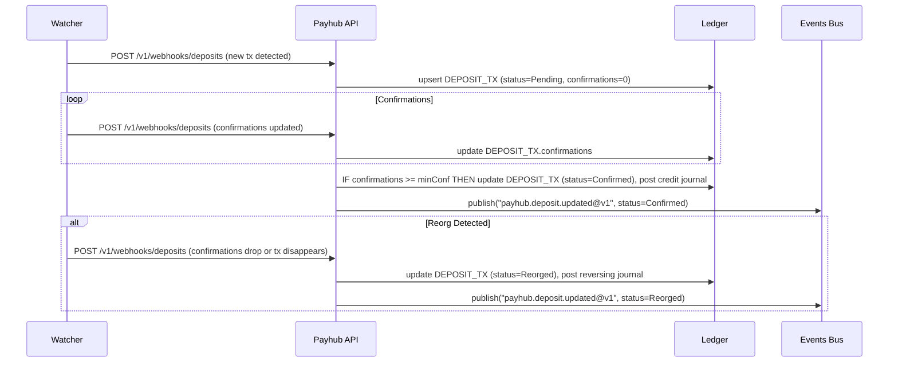
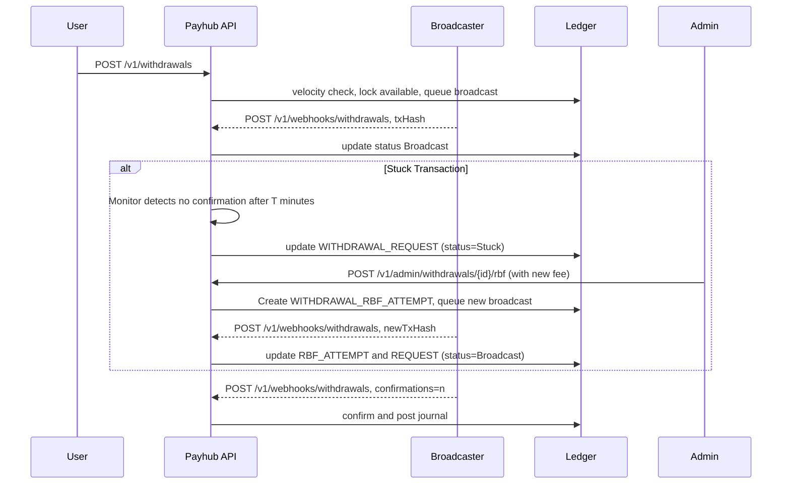
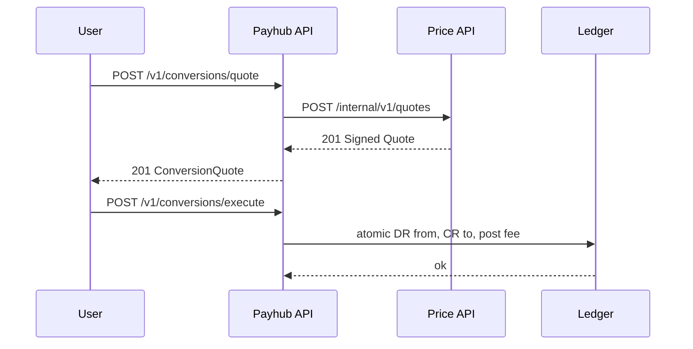
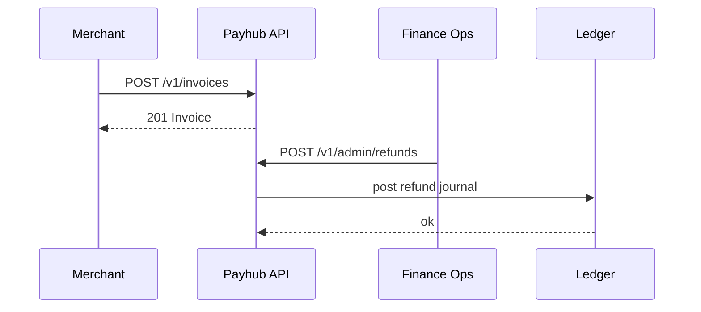

Repo: tg-miniapp-payhub-service

---

## 1. Architecture Diagram — Mermaid flowchart


---

## 2. Technology Stack

- **Runtime**: Node.js 20, TypeScript, Fastify, OpenAPI 3.1 spec‑first
- **DB**: PostgreSQL 15 (PKs are UUID v7), partitioned tables for `ledger_entry`, `journal_tx`, `deposit_tx`, `withdrawal_tx`
- **Ledger**: strict double‑entry, serializable journal posting inside DB txn
- **Cache/Queue**: Redis 7, BullMQ for outbox relay, expirations, DLQs
- **Crypto/Chain**: EVM and TON abstraction, confirmations policy with reorg handling
- **Idempotency & Rate**: Redis keys, sliding windows per endpoint
- **Secrets**: KMS for webhook HMAC secrets and custodian API keys
- **Observability**: OpenTelemetry + Prometheus, JSON logs
- **CI/CD**: GitHub Actions, spectral (OpenAPI), db migrations (Kysely/Prisma), canary

---

## 3. Responsibilities and Scope

**Owns**
- Accounts, balances, double‑entry ledger and receipts
- Holds lifecycle and settlements for Playhub/Escrow/Funding
- Deposits crediting with watchers, withdrawals broadcasting and tracking
- Conversions quoting and execution with oracle snapshots
- Invoices and refunds
- Limits/velocity checks and risk flags
- Financial reporting and reconciliation outbox

**Non‑Goals**
- Identity/KYC storage (delegated to Identity)
- Price oracle generation (delegated to Price service)
- On‑chain custody — interacts with custodian or wallet node

**Boundaries**
- Consumes `Identity` for authZ/badge/limits, `Price` for quotes, Config for signed fees/limits, `emits` events to Events service

---

## 4. Data Design — Mermaid erDiagram

```mermaid
erDiagram
  ACCOUNT ||--o{ BALANCE : "has"
  ACCOUNT ||--o{ RECEIPT : "produces"
  ACCOUNT ||--o{ HOLD : "locks"
  ACCOUNT ||--o{ WITHDRAWAL_REQUEST : "requests"
  ACCOUNT ||--o{ DEPOSIT_INTENT : "initiates"
  ACCOUNT ||--o{ CONVERSION_ORDER : "converts"
  JOURNAL_TX ||--o{ LEDGER_ENTRY : "posts"
  DEPOSIT_INTENT ||--o{ DEPOSIT_TX : "observes"
  WITHDRAWAL_REQUEST ||--o{ WITHDRAWAL_TX : "broadcasts"
  WITHDRAWAL_REQUEST ||--o{ WITHDRAWAL_RBF_ATTEMPT : "retries"
  CONVERSION_QUOTE ||--|| CONVERSION_ORDER : "consumes"
  OUTBOX_EVENT ||--o{ WEBHOOK_DELIVERY : "delivers"

  ACCOUNT {
    string id PK "uuidv7"
    string userId FK "uuidv7"
    string orgId FK "uuidv7"
    string status "enum: Active|Suspended|Closed"
    datetime createdAt
    datetime updatedAt
  }

  BALANCE {
    string id PK "uuidv7"
    string accountId FK "uuidv7"
    string asset "enum: STAR|FZ|PT|USDT"
    numeric available
    numeric held
    datetime updatedAt
    string "unique(accountId, asset)" "unique"
  }

  JOURNAL_TX {
    string id PK "uuidv7"
    string type "enum: Deposit|Withdrawal|Hold|Capture|Release|Conversion|Invoice|Refund|Transfer|Adjustment"
    string status "enum: Posted|Reversed"
    string correlationId "uuidv7"
    datetime postedAt
    bigint journalSeq "index"
  }

  LEDGER_ENTRY {
    string id PK "uuidv7"
    string journalTxId FK "uuidv7"
    string accountId FK "uuidv7"
    string asset
    numeric amount "positive for credit, negative for debit"
    string narrative
    string eventId "uuidv7"
    datetime postingTs
  }

  HOLD {
    string id PK "uuidv7"
    string accountId FK "uuidv7"
    string purpose "enum: Match|Escrow|Funding|Invoice|Other"
    string purposeId "uuidv7"
    string asset
    numeric amount
    string status "enum: Active|Captured|Released|Expired|Voided"
    datetime expiresAt "nullable"
    string idemKey "unique"
    datetime createdAt
    datetime updatedAt
  }

  SETTLEMENT {
    string id PK "uuidv7"
    string purpose "enum: Match|Escrow|Funding|Invoice|Other"
    string purposeId "uuidv7"
    string status "enum: Pending|Succeeded|Failed|Voided"
    jsonb breakdown
    string receiptsHash
    datetime createdAt
    datetime updatedAt
  }

  DEPOSIT_INTENT {
    string id PK "uuidv7"
    string accountId FK "uuidv7"
    string asset
    string network "enum: EVM|TON"
    string address
    string memo "nullable"
    integer minConf
    string status "enum: Pending|Monitoring|Credited|Expired|Canceled"
    datetime createdAt
    datetime updatedAt
  }

  DEPOSIT_TX {
    string id PK "uuidv7"
    string intentId FK "uuidv7"
    string txHash "unique"
    numeric amount
    integer confirmations
    string status "enum: Pending|Confirmed|Reorged"
    datetime detectedAt
    datetime creditedAt "nullable"
  }

  WITHDRAWAL_REQUEST {
    string id PK "uuidv7"
    string accountId FK "uuidv7"
    string asset
    string network "enum: EVM|TON"
    string toAddress
    numeric amount
    numeric fee "nullable"
    string status "enum: Created|Queued|Broadcast|Confirmed|Failed|Canceled|Stuck"
    string idemKey "unique"
    datetime createdAt
    datetime updatedAt
  }

  WITHDRAWAL_TX {
    string id PK "uuidv7"
    string requestId FK "uuidv7"
    string txHash "unique"
    integer confirmations
    string status "enum: Pending|Confirmed|Reorged|Failed"
    datetime broadcastAt
    datetime confirmedAt "nullable"
  }

  WITHDRAWAL_RBF_ATTEMPT {
      string id PK "uuidv7"
      string requestId FK "uuidv7"
      string originalTxHash
      string newTxHash "unique"
      numeric newFee
      string status "enum: Pending|Broadcast|Confirmed|Failed"
      datetime attemptedAt
  }

  CONVERSION_QUOTE {
    string id PK "uuidv7"
    string accountId FK "uuidv7"
    string fromAsset
    string toAsset
    numeric amount
    numeric rate
    numeric feeBps
    numeric feeAmount
    string snapshotId "uuidv7"
    string signature
    datetime expiresAt
    string status "enum: Active|Expired|Revoked"
    string idemKey "unique"
    datetime createdAt
  }

  CONVERSION_ORDER {
    string id PK "uuidv7"
    string quoteId FK "uuidv7"
    string status "enum: Succeeded|Failed"
    numeric fromAmount
    numeric toAmount
    numeric feeAmount
    string journalTxId FK "uuidv7"
    datetime executedAt
  }

  INVOICE {
    string id PK "uuidv7"
    string payeeAccountId FK "uuidv7"
    string payerAccountId FK "uuidv7"
    string asset
    numeric amount
    string status "enum: Draft|Open|Paid|Canceled|Expired"
    datetime dueAt "nullable"
    jsonb meta
    datetime createdAt
    datetime updatedAt
  }

  REFUND {
    string id PK "uuidv7"
    string invoiceId FK "uuidv7"
    string accountId FK "uuidv7"
    string asset
    numeric amount
    string reason
    string status "enum: Issued|Failed"
    string journalTxId FK "uuidv7"
    datetime createdAt
  }

  LIMIT_PROFILE {
    string id PK "uuidv7"
    string accountId FK "uuidv7"
    string tier "enum: Tier0|Tier1|Tier2|Tier3"
    numeric dailyWithdrawLimit
    numeric monthlyWithdrawLimit
    numeric conversionExposureLimit
    datetime lastResetAt
    datetime updatedAt
  }

  USAGE_COUNTER {
    string id PK "uuidv7"
    string accountId FK "uuidv7"
    string metric "enum: WithdrawDaily|WithdrawMonthly|ConversionExposure"
    datetime windowStart
    datetime windowEnd
    numeric amountUsed
    string "unique(accountId, metric, windowStart)" "unique"
  }

  FEE_SCHEDULE {
    string id PK "uuidv7"
    string version
    jsonb rules
    datetime publishedAt
  }

  OUTBOX_EVENT {
    string id PK "uuidv7"
    string eventName
    jsonb payload
    string status "enum: Pending|Committed|Failed"
    integer attempts
    datetime createdAt
    datetime updatedAt
  }

  WEBHOOK_DELIVERY {
    string id PK "uuidv7"
    string outboxId FK "uuidv7"
    string destination
    string status "enum: Pending|Succeeded|Failed"
    integer attempts
    datetime nextAttemptAt
  }

  IDEMPOTENCY_KEY {
    string id PK "uuidv7"
    string scope
    string key "unique"
    string targetId FK "uuidv7"
    datetime storedAt
    datetime expiresAt
  }

  RECEIPT {
    string id PK "uuidv7"
    string kind "enum: Hold|Settlement|Deposit|Withdrawal|Conversion|Invoice|Refund"
    string refId "uuidv7"
    jsonb lines
    numeric total
    string currency
    datetime createdAt
  }
```
---

## 5. Interfaces — OpenAPI 3.1 (YAML)

```yaml
openapi: 3.1.0
info:
  title: tg-miniapp-payhub-service API
  version: 1.0.0
servers:
  - url: [https://payhub.api.fuze.local](https://payhub.api.fuze.local)
security:
  - BearerAuth: []
tags:
  - name: Accounts
  - name: Ledger
  - name: Holds
  - name: Settlements
  - name: Deposits
  - name: Withdrawals
  - name: Conversions
  - name: Invoices
  - name: Admin
  - name: Webhooks

paths:
  /v1/accounts:
    post:
      operationId: accounts.create
      summary: Create an account for a user or org
      tags: [Accounts]
      parameters:
        - in: header
          name: Idempotency-Key
          required: true
          schema: { type: string }
      requestBody:
        required: true
        content:
          application/json:
            schema:
              type: object
              oneOf:
                - required: [userId]
                - required: [orgId]
              properties:
                userId: { type: string, format: uuid, example: "018f2a2e-9b1c-7b1f-bc1d-7f3b3f7c5e6a", nullable: true }
                orgId: { type: string, format: uuid, example: "018f2a2e-9b1c-7b1f-bc1d-7f3b3f7c5e6a", nullable: true }
      responses:
        "201": { description: Account, content: { application/json: { schema: { $ref: "#/components/schemas/Account" } } } }
        "400": { $ref: "#/components/responses/BadRequest" }
        "401": { $ref: "#/components/responses/Unauthorized" }
        "409": { $ref: "#/components/responses/Conflict" }
        "500": { $ref: "#/components/responses/ServerError" } 
    get:
      operationId: accounts.list
      summary: List my accounts
      tags: [Accounts]
      parameters:
        - in: query
          name: cursor
          schema: { type: string }
        - in: query
          name: limit
          schema: { type: integer, minimum: 1, maximum: 200, default: 50 }
      responses:
        "200": { description: Page, content: { application/json: { schema: { $ref: "#/components/schemas/AccountPage" } } } }
        "401": { $ref: "#/components/responses/Unauthorized" }
        "500": { $ref: "#/components/responses/ServerError" }

  /v1/accounts/{accountId}/balances:
    get:
      operationId: accounts.balances
      summary: Get balances for an account
      tags: [Accounts]
      parameters:
        - in: path
          name: accountId
          required: true
          schema: { type: string, format: uuid, example: "018f2a2e-9b1c-7b1f-bc1d-7f3b3f7c5e6a" }
      responses:
        "200": { description: Balances, content: { application/json: { schema: { type: array, items: { $ref: "#/components/schemas/Balance" } } } } }
        "401": { $ref: "#/components/responses/Unauthorized" }
        "404": { $ref: "#/components/responses/NotFound" }
        "500": { $ref: "#/components/responses/ServerError" }

  /v1/holds:
    post:
      operationId: holds.create
      summary: Create a hold on funds
      tags: [Holds]
      parameters:
        - in: header
          name: Idempotency-Key
          required: true
          schema: { type: string }
      requestBody:
        required: true
        content:
          application/json:
            schema:
              type: object
              required: [accountId, asset, amount, purpose, purposeId]
              properties:
                accountId: { type: string, format: uuid, example: "018f2a2e-9b1c-7b1f-bc1d-7f3b3f7c5e6a" }
                asset: { $ref: "#/components/schemas/Asset" }
                amount: { type: number, minimum: 0 }
                purpose: { $ref: "#/components/schemas/HoldPurpose" }
                purposeId: { type: string, format: uuid, example: "018f2a2e-9b1c-7b1f-bc1d-7f3b3f7c5e6a" }
                expiresAt: { type: string, format: date-time, nullable: true }
      responses:
        "201": { description: Hold, content: { application/json: { schema: { $ref: "#/components/schemas/Hold" } } } }
        "401": { $ref: "#/components/responses/Unauthorized" }
        "402": { $ref: "#/components/responses/InsufficientFunds" }
        "409": { $ref: "#/components/responses/Conflict" }
        "422": { $ref: "#/components/responses/Unprocessable" }
        "429": { $ref: "#/components/responses/RateLimited" }
        "500": { $ref: "#/components/responses/ServerError" }
    get:
      operationId: holds.search
      summary: Search holds
      tags: [Holds]
      parameters:
        - in: query
          name: accountId
          schema: { type: string, format: uuid }
        - in: query
          name: status
          schema: { $ref: "#/components/schemas/HoldStatus" }
        - in: query
          name: cursor
          schema: { type: string }
        - in: query
          name: limit
          schema: { type: integer, minimum: 1, maximum: 200, default: 50 }
      responses:
        "200": { description: Page, content: { application/json: { schema: { $ref: "#/components/schemas/HoldPage" } } } }
        "401": { $ref: "#/components/responses/Unauthorized" }
        "500": { $ref: "#/components/responses/ServerError" }

  /v1/holds/{holdId}/release:
    post:
      operationId: holds.release
      summary: Release a hold back to available
      tags: [Holds]
      parameters:
        - in: path
          name: holdId
          required: true
          schema: { type: string, format: uuid, example: "018f2a2e-9b1c-7b1f-bc1d-7f3b3f7c5e6a" }
      responses:
        "202": { description: Release queued }
        "401": { $ref: "#/components/responses/Unauthorized" }
        "409": { $ref: "#/components/responses/Conflict" }
        "500": { $ref: "#/components/responses/ServerError" }

  /v1/settlements:
    post:
      operationId: settlements.create
      summary: Capture one or more holds and issue transfers
      tags: [Settlements]
      requestBody:
        required: true
        content:
          application/json:
            schema:
              type: object
              required: [purpose, purposeId, items]
              properties:
                purpose: { $ref: "#/components/schemas/HoldPurpose" }
                purposeId: { type: string, format: uuid }
                items:
                  type: array
                  items:
                    type: object
                    required: [holdId, toAccountId, amount]
                    properties:
                      holdId: { type: string, format: uuid }
                      toAccountId: { type: string, format: uuid }
                      amount: { type: number }
                rakeBps: { type: number, minimum: 0, maximum: 10000, default: 0 }
      responses:
        "202": { description: Settlement queued, content: { application/json: { schema: { $ref: "#/components/schemas/Settlement" } } } }
        "401": { $ref: "#/components/responses/Unauthorized" }
        "409": { $ref: "#/components/responses/Conflict" }
        "422": { $ref: "#/components/responses/Unprocessable" }
        "500": { $ref: "#/components/responses/ServerError" }

  /v1/deposits:
    post:
      operationId: deposits.createIntent
      summary: Create a deposit intent and address
      tags: [Deposits]
      requestBody:
        required: true
        content:
          application/json:
            schema:
              type: object
              required: [accountId, asset, network]
              properties:
                accountId: { type: string, format: uuid }
                asset: { $ref: "#/components/schemas/Asset" }
                network: { $ref: "#/components/schemas/Network" }
      responses:
        "201": { description: Intent, content: { application/json: { schema: { $ref: "#/components/schemas/DepositIntent" } } } }
        "401": { $ref: "#/components/responses/Unauthorized" }
        "409": { $ref: "#/components/responses/Conflict" }
        "500": { $ref: "#/components/responses/ServerError" }

  /v1/withdrawals:
    post:
      operationId: withdrawals.create
      summary: Request a withdrawal
      tags: [Withdrawals]
      parameters:
        - in: header
          name: Idempotency-Key
          required: true
          schema: { type: string }
      requestBody:
        required: true
        content:
          application/json:
            schema:
              type: object
              required: [accountId, asset, network, toAddress, amount]
              properties:
                accountId: { type: string, format: uuid }
                asset: { $ref: "#/components/schemas/Asset" }
                network: { $ref: "#/components/schemas/Network" }
                toAddress: { type: string }
                amount: { type: number, minimum: 0 }
      responses:
        "201": { description: Withdrawal, content: { application/json: { schema: { $ref: "#/components/schemas/WithdrawalRequest" } } } }
        "401": { $ref: "#/components/responses/Unauthorized" }
        "403": { $ref: "#/components/responses/Forbidden" }
        "409": { $ref: "#/components/responses/Conflict" }
        "422": { $ref: "#/components/responses/Unprocessable" }
        "500": { $ref: "#/components/responses/ServerError" }

  /v1/withdrawals/{withdrawalId}:
    delete:
      operationId: withdrawals.cancel
      summary: Cancel a withdrawal if not yet broadcast
      tags: [Withdrawals]
      parameters:
        - in: path
          name: withdrawalId
          required: true
          schema: { type: string, format: uuid }
      responses:
        "204": { description: Canceled }
        "401": { $ref: "#/components/responses/Unauthorized" }
        "409": { $ref: "#/components/responses/Conflict" }
        "500": { $ref: "#/components/responses/ServerError" }

  /v1/conversions/quote:
    post:
      operationId: conversions.quote
      summary: Request a conversion quote
      tags: [Conversions]
      parameters:
        - in: header
          name: Idempotency-Key
          required: true
          schema: { type: string }
      requestBody:
        required: true
        content:
          application/json:
            schema:
              type: object
              required: [accountId, from, to, amount]
              properties:
                accountId: { type: string, format: uuid }
                from: { $ref: "#/components/schemas/Asset" }
                to: { $ref: "#/components/schemas/Asset" }
                amount: { type: number, minimum: 0 }
      responses:
        "201": { description: Quote, content: { application/json: { schema: { $ref: "#/components/schemas/ConversionQuote" } } } }
        "401": { $ref: "#/components/responses/Unauthorized" }
        "422": { $ref: "#/components/responses/Unprocessable" }
        "429": { $ref: "#/components/responses/RateLimited" }
        "502": { $ref: "#/components/responses/UpstreamUnavailable" }
        "500": { $ref: "#/components/responses/ServerError" }

  /v1/conversions/execute:
    post:
      operationId: conversions.execute
      summary: Execute a conversion using a valid quote
      tags: [Conversions]
      requestBody:
        required: true
        content:
          application/json:
            schema:
              type: object
              required: [quoteId]
              properties:
                quoteId: { type: string, format: uuid }
      responses:
        "201": { description: Order, content: { application/json: { schema: { $ref: "#/components/schemas/ConversionOrder" } } } }
        "401": { $ref: "#/components/responses/Unauthorized" }
        "409": { $ref: "#/components/responses/Conflict" }
        "422": { $ref: "#/components/responses/Unprocessable" }
        "500": { $ref: "#/components/responses/ServerError" }

  /v1/invoices:
    post:
      operationId: invoices.create
      summary: Create an invoice
      tags: [Invoices]
      requestBody:
        required: true
        content:
          application/json:
            schema:
              type: object
              required: [payeeAccountId, asset, amount]
              properties:
                payeeAccountId: { type: string, format: uuid }
                payerAccountId: { type: string, format: uuid, nullable: true }
                asset: { $ref: "#/components/schemas/Asset" }
                amount: { type: number, minimum: 0 }
                dueAt: { type: string, format: date-time, nullable: true }
                meta: { type: object, additionalProperties: true, nullable: true }
      responses:
        "201": { description: Invoice, content: { application/json: { schema: { $ref: "#/components/schemas/Invoice" } } } }
        "401": { $ref: "#/components/responses/Unauthorized" }
        "409": { $ref: "#/components/responses/Conflict" }
        "500": { $ref: "#/components/responses/ServerError" }

  /v1/admin/refunds:
    post:
      operationId: admin.refunds.issue
      summary: Issue a refund to an account
      tags: [Admin]
      requestBody:
        required: true
        content:
          application/json:
            schema:
              type: object
              required: [accountId, asset, amount, reason]
              properties:
                accountId: { type: string, format: uuid }
                asset: { $ref: "#/components/schemas/Asset" }
                amount: { type: number, minimum: 0 }
                reason: { type: string }
      responses:
        "201": { description: Refund, content: { application/json: { schema: { $ref: "#/components/schemas/Refund" } } } }
        "401": { $ref: "#/components/responses/Unauthorized" }
        "403": { $ref: "#/components/responses/Forbidden" }
        "422": { $ref: "#/components/responses/Unprocessable" }
        "500": { $ref: "#/components/responses/ServerError" }

  /v1/admin/withdrawals/{withdrawalId}/rbf:
    post:
      operationId: admin.withdrawals.rbf
      summary: Retry a stuck withdrawal with a higher fee (Replace-by-Fee)
      tags: [Admin]
      parameters:
        - in: path
          name: withdrawalId
          required: true
          schema: { type: string, format: uuid }
      requestBody:
        required: true
        content:
          application/json:
            schema:
              type: object
              properties:
                newFee: { type: number, description: "Optional new fee, if not provided, it will be auto-calculated." }
      responses:
        "202": { description: RBF attempt accepted }
        "401": { $ref: "#/components/responses/Unauthorized" }
        "403": { $ref: "#/components/responses/Forbidden" }
        "404": { $ref: "#/components/responses/NotFound" }
        "409": { $ref: "#/components/responses/Conflict" }

  /v1/webhooks/deposits:
    post:
      operationId: webhooks.deposits
      summary: Receive deposit tx from watcher
      tags: [Webhooks]
      security: []
      requestBody:
        required: true
        content:
          application/json:
            schema:
              $ref: "#/components/schemas/DepositTx"
      responses:
        "202": { description: Accepted }
        "400": { $ref: "#/components/responses/BadRequest" }
        "401": { $ref: "#/components/responses/Unauthorized" }
        "500": { $ref: "#/components/responses/ServerError" }

  /v1/webhooks/withdrawals:
    post:
      operationId: webhooks.withdrawals
      summary: Receive withdrawal tx status from broadcaster
      tags: [Webhooks]
      security: []
      requestBody:
        required: true
        content:
          application/json:
            schema:
              $ref: "#/components/schemas/WithdrawalTx"
      responses:
        "202": { description: Accepted }
        "400": { $ref: "#/components/responses/BadRequest" }
        "401": { $ref: "#/components/responses/Unauthorized" }
        "500": { $ref: "#/components/responses/ServerError" }

components:
  securitySchemes:
    BearerAuth:
      type: http
      scheme: bearer
      bearerFormat: JWT

  responses:
    BadRequest:
      description: Bad Request
      content: { application/json: { schema: { $ref: "#/components/schemas/Error" } } }
    Unauthorized:
      description: Unauthorized
      content: { application/json: { schema: { $ref: "#/components/schemas/Error" } } }
    Forbidden:
      description: Forbidden
      content: { application/json: { schema: { $ref: "#/components/schemas/Error" } } }
    NotFound:
      description: Not Found
      content: { application/json: { schema: { $ref: "#/components/schemas/Error" } } }
    Conflict:
      description: Conflict
      content: { application/json: { schema: { $ref: "#/components/schemas/Error" } } }
    Unprocessable:
      description: Unprocessable
      content: { application/json: { schema: { $ref: "#/components/schemas/Error" } } }
    InsufficientFunds:
      description: Insufficient funds
      content: { application/json: { schema: { $ref: "#/components/schemas/Error" } } }
    RateLimited:
      description: Too Many Requests
      headers: { Retry-After: { schema: { type: integer, minimum: 0 } } }
      content: { application/json: { schema: { $ref: "#/components/schemas/Error" } } }
    UpstreamUnavailable:
      description: Upstream service unavailable
      content: { application/json: { schema: { $ref: "#/components/schemas/Error" } } }
    ServerError:
      description: Server Error
      content: { application/json: { schema: { $ref: "#/components/schemas/Error" } } }

  schemas:
    Error:
      type: object
      required: [code, message]
      properties:
        code: { type: string }
        message: { type: string }
        details: { type: object, additionalProperties: true }

    Asset:
      type: string
      enum: [STAR, FZ, PT, USDT]

    Network:
      type: string
      enum: [EVM, TON]

    Account:
      type: object
      required: [id, status]
      properties:
        id: { type: string, format: uuid, example: "018f2a2e-9b1c-7b1f-bc1d-7f3b3f7c5e6a" }
        userId: { type: string, format: uuid, nullable: true }
        orgId: { type: string, format: uuid, nullable: true }
        status: { type: string, enum: [Active, Suspended, Closed] }
        createdAt: { type: string, format: date-time }
        updatedAt: { type: string, format: date-time }

    AccountPage:
      type: object
      required: [items]
      properties:
        items: { type: array, items: { $ref: "#/components/schemas/Account" } }
        nextCursor: { type: string, nullable: true }

    Balance:
      type: object
      required: [id, accountId, asset, available, held]
      properties:
        id: { type: string, format: uuid, example: "018f2a2e-9b1c-7b1f-bc1d-7f3b3f7c5e6a" }
        accountId: { type: string, format: uuid, example: "018f2a2e-9b1c-7b1f-bc1d-7f3b3f7c5e6a" }
        asset: { $ref: "#/components/schemas/Asset" }
        available: { type: number }
        held: { type: number }
        updatedAt: { type: string, format: date-time }

    HoldPurpose:
      type: string
      enum: [Match, Escrow, Funding, Invoice, Other]

    HoldStatus:
      type: string
      enum: [Active, Captured, Released, Expired, Voided]

    Hold:
      type: object
      required: [id, accountId, asset, amount, status]
      properties:
        id: { type: string, format: uuid, example: "018f2a2e-9b1c-7b1f-bc1d-7f3b3f7c5e6a" }
        accountId: { type: string, format: uuid, example: "018f2a2e-9b1c-7b1f-bc1d-7f3b3f7c5e6a" }
        asset: { $ref: "#/components/schemas/Asset" }
        amount: { type: number }
        status: { $ref: "#/components/schemas/HoldStatus" }
        purpose: { $ref: "#/components/schemas/HoldPurpose" }
        purposeId: { type: string, format: uuid }
        expiresAt: { type: string, format: date-time, nullable: true }
        createdAt: { type: string, format: date-time }

    HoldPage:
      type: object
      required: [items]
      properties:
        items: { type: array, items: { $ref: "#/components/schemas/Hold" } }
        nextCursor: { type: string, nullable: true }

    Settlement:
      type: object
      required: [id, purpose, purposeId, status]
      properties:
        id: { type: string, format: uuid, example: "018f2a2e-9b1c-7b1f-bc1d-7f3b3f7c5e6a" }
        purpose: { $ref: "#/components/schemas/HoldPurpose" }
        purposeId: { type: string, format: uuid }
        status: { type: string, enum: [Pending, Succeeded, Failed, Voided] }
        breakdown: { type: object, additionalProperties: true }
        receiptsHash: { type: string }
        createdAt: { type: string, format: date-time }

    DepositIntent:
      type: object
      required: [id, accountId, asset, network, address, status]
      properties:
        id: { type: string, format: uuid, example: "018f2a2e-9b1c-7b1f-bc1d-7f3b3f7c5e6a" }
        accountId: { type: string, format: uuid }
        asset: { $ref: "#/components/schemas/Asset" }
        network: { $ref: "#/components/schemas/Network" }
        address: { type: string }
        memo: { type: string, nullable: true }
        minConf: { type: integer }
        status: { type: string, enum: [Pending, Monitoring, Credited, Expired, Canceled] }
        createdAt: { type: string, format: date-time }

    DepositTx:
      type: object
      required: [intentId, txHash, amount, confirmations, status]
      properties:
        intentId: { type: string, format: uuid }
        txHash: { type: string }
        amount: { type: number }
        confirmations: { type: integer }
        status: { type: string, enum: [Pending, Confirmed, Reorged] }
        detectedAt: { type: string, format: date-time }
        creditedAt: { type: string, format: date-time, nullable: true }

    WithdrawalRequest:
      type: object
      required: [id, accountId, asset, network, toAddress, amount, status]
      properties:
        id: { type: string, format: uuid, example: "018f2a2e-9b1c-7b1f-bc1d-7f3b3f7c5e6a" }
        accountId: { type: string, format: uuid }
        asset: { $ref: "#/components/schemas/Asset" }
        network: { $ref: "#/components/schemas/Network" }
        toAddress: { type: string }
        amount: { type: number }
        fee: { type: number, nullable: true }
        status: { type: string, enum: [Created, Queued, Broadcast, Confirmed, Failed, Canceled, Stuck] }
        createdAt: { type: string, format: date-time }

    WithdrawalTx:
      type: object
      required: [requestId, txHash, confirmations, status]
      properties:
        requestId: { type: string, format: uuid }
        txHash: { type: string }
        confirmations: { type: integer }
        status: { type: string, enum: [Pending, Confirmed, Reorged, Failed] }
        broadcastAt: { type: string, format: date-time }
        confirmedAt: { type: string, format: date-time, nullable: true }

    ConversionQuote:
      type: object
      required: [id, accountId, from, to, amount, rate, feeBps, feeAmount, snapshotId, signature, expiresAt, status]
      properties:
        id: { type: string, format: uuid, example: "018f2a2e-9b1c-7b1f-bc1d-7f3b3f7c5e6a" }
        accountId: { type: string, format: uuid }
        from: { $ref: "#/components/schemas/Asset" }
        to: { $ref: "#/components/schemas/Asset" }
        amount: { type: number }
        rate: { type: number }
        feeBps: { type: number }
        feeAmount: { type: number }
        snapshotId: { type: string, format: uuid }
        signature: { type: string }
        expiresAt: { type: string, format: date-time }
        status: { type: string, enum: [Active, Expired, Revoked] }

    ConversionOrder:
      type: object
      required: [id, quoteId, status, fromAmount, toAmount, feeAmount, executedAt]
      properties:
        id: { type: string, format: uuid, example: "018f2a2e-9b1c-7b1f-bc1d-7f3b3f7c5e6a" }
        quoteId: { type: string, format: uuid }
        status: { type: string, enum: [Succeeded, Failed] }
        fromAmount: { type: number }
        toAmount: { type: number }
        feeAmount: { type: number }
        executedAt: { type: string, format: date-time }

    Invoice:
      type: object
      required: [id, payeeAccountId, asset, amount, status]
      properties:
        id: { type: string, format: uuid, example: "018f2a2e-9b1c-7b1f-bc1d-7f3b3f7c5e6a" }
        payeeAccountId: { type: string, format: uuid }
        payerAccountId: { type: string, format: uuid, nullable: true }
        asset: { $ref: "#/components/schemas/Asset" }
        amount: { type: number }
        status: { type: string, enum: [Draft, Open, Paid, Canceled, Expired] }
        dueAt: { type: string, format: date-time, nullable: true }
        meta: { type: object, additionalProperties: true, nullable: true }
        createdAt: { type: string, format: date-time }
        updatedAt: { type: string, format: date-time }

    Refund:
      type: object
      required: [id, asset, amount, status]
      properties:
        id: { type: string, format: uuid, example: "018f2a2e-9b1c-7b1f-bc1d-7f3b3f7c5e6a" }
        invoiceId: { type: string, format: uuid, nullable: true }
        accountId: { type: string, format: uuid }
        asset: { $ref: "#/components/schemas/Asset" }
        amount: { type: number }
        reason: { type: string }
        status: { type: string, enum: [Issued, Failed] }
        createdAt: { type: string, format: date-time }
```
---

## 6. Data Flows — Mermaid sequenceDiagram

### 6.1 Create hold → capture via settlement


### 6.2 Deposit credited via watcher


### 6.3 Withdrawal broadcast → confirm → reorg handling


### 6.4 Conversion quote → execute


### 6.5 Invoice create → refund issue


---

## 7. Rules and Calculations

- **Double‑entry**: every mutation posts balanced entries, enforced by DB constraint on `journal_tx`.
- **Rounding**: assets use minor units, banker’s rounding; dust below threshold remains as credit.
- **Fees**: from `FEE_SCHEDULE`, applied as separate journal lines, audit visible.
- **Velocity & Limits**: `USAGE_COUNTER` windows UTC; resets daily at 00:00 UTC; exceed → 403 with `required_badge` or `review_required`.
- **Idempotency**: required for write endpoints, stored 24h; repeat returns same resource.
- **Withdrawals**: min confirmations per network, RBF on spikes, reorg rollback to Pending.
- **Deposits**: minConf policy per asset; reorg sets tx to Reorged and reverses provisional credit.
- **Conversions**: valid only until `expiresAt`; price slippage bound enforced; stale snapshot → 409.
- **Invoices/Refunds**: refunds require dual‑control and staff scope.

---

## 8. Security and Compliance

- **Auth**: Bearer JWT; staff scopes for Admin endpoints; service tokens for webhooks.
- **Webhooks**: HMAC `X-Signature` with timestamp and id, 5‑minute tolerance, replay cache.
- **KYC/Badges**: delegated to Identity enforcement hooks pre‑withdrawal and pre‑high‑value conversion.
- **PII**: minimal storage; addresses considered sensitive; encryption at rest.
- **Audit**: immutable `journal_tx` and `ledger_entry`, `outbox_event`, `webhook_delivery` with correlation ids.
- **Compliance**: address screening hooks, manual risk cases for overrides.

---

## 9. Scalability and Reliability

- **Outbox** for exactly‑once events, DLQ for failed deliveries.
- **Partitioning**: monthly partitions for heavy tables, index by accountId and postedAt.
- **Backpressure**: queue concurrency limits; circuit breakers for Price and Broadcaster.
- **RTO/RPO**: 30 min / 5 min, PITR; multi‑AZ.
- **Graceful degradation**: block conversions if price down, allow deposits display, queue withdrawals.

---

## 10. Observability

- **SLOs**: posting p95 ≤ 80 ms, webhook apply ≥ 99.9 percent, withdrawal broadcast TTF p95 ≤ 30 s.
- **Metrics**: balances, ledger postings, holds active, settlement latency, confirmations lag, quote hit rate, conversion success, refunds count.
- **Tracing**: spans with `operationId`, `journalTxId`, webhook ids; sampling tuned for write paths.
- **Logs**: structured with event ids; redaction of addresses in debug level.

---

## 11. Configuration and ENV

- POSTGRES_URL secret
- REDIS_URL secret
- IDENTITY_API_URL string
- PRICE_API_URL string
- CONFIG_API_URL string
- EVENTS_API_URL string
- BROADCASTER_WEBHOOK_SECRET secret
- WATCHER_WEBHOOK_SECRET secret
- WITHDRAW_MIN_CONF json
- DEPOSIT_MIN_CONF json
- IDEMPOTENCY_TTL_HOURS int default 24
- RATE_LIMIT_JSON json
- FEE_SCHEDULE_VERSION string
- RBF_POLICY json

---

## 12. Roadmap

- Multi‑asset conversions with RFQ aggregator
- TON/EVM address book and screening integrations
- Automated reconciliation with custodian statements
- Batch withdrawals and fee optimization

---

## 13. Compatibility Notes

- Additive schema changes only in `v1`; breaking changes introduce `v1.1`.
- Webhook payloads are versioned; previous version accepted for 90 days.
- Fee schedule changes versioned via `FEE_SCHEDULE.version`.

---

## 14. Design Coverage Checklist

- ✅ Every story action maps to an OpenAPI operationId
- ✅ Every operationId appears in at least one sequence
- ✅ No sequence uses an undefined API
- ✅ OpenAPI schemas map to ER entities
- ✅ All flowchart actors appear in sequences
- ✅ Mermaid blocks follow GitHub rules
- ✅ Error and resilience paths represented
- ✅ Observability tied to operationIds
