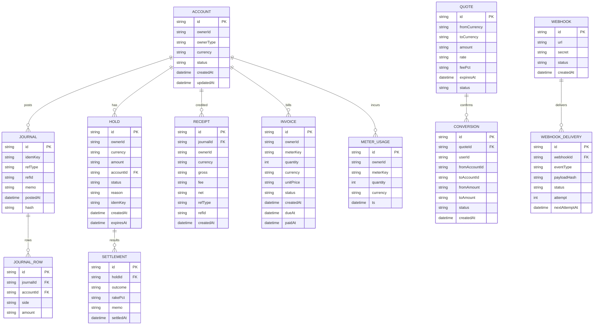

# Repo: tg-miniapp-payhub-service
- File: SystemDesign.md
- SHA-256: d9366cb921c0fb9bb8cb9f3cb0a37a117376ef9224cab49f8f061b858e9bcf82
- Bytes: 17705
- Generated: 2025-09-26 03:46 GMT+7
- Inputs: Old SystemDesign.md (ref), UserStories.md (authoritative), API Spec Guide, Data Schema Guide
- Change Basis: Updated to reflect latest UserStories

---

# 1) Architecture Diagram (flowchart)


---

# 2) Technology Stack

| Layer | Choice | Notes |
|---|---|---|
| Runtime | Node.js 20 + TypeScript | Consistent across platform |
| API | Fastify + Zod | Strict schema validation |
| Data | MongoDB | Accounts, journals, holds, settlements, quotes, invoices |
| Cache/Queues | Redis + BullMQ | Idempotency, rate limits, DLQ, retries |
| Auth | JWT (ServiceAuth) + HMAC body signature | S2S trust & anti‑replay |
| Crypto | jose (Ed25519), HMAC‑SHA256 | Sign events/webhooks |
| Observability | OpenTelemetry, Pino, Prometheus | Traces + RED/USE |
| Deploy | Docker, Helm, Argo CD | Blue/green/canary |

---

# 3) Responsibilities and Scope

**Owns**
- Double‑entry ledger, accounts, balances, and receipts.
- Holds & Settlements for PlayHub, Funding, Escrow, CFB (pro‑rata, rake).
- Conversions (STAR/FZ/PT/USDT) via internal FX book + Price Service.
- Invoices/Overage billing in FZ/PT for platform services.
- Events/Webhooks for downstream state sync.

**Collaborates**
- Price Service for rates, quote expiry; Identity for auth; Config for limits and fees.
- Workers for confirmations, retries, statement generation.

**Not responsible**
- On‑chain custody/bridges (future), gameplay logic, KYC (Identity).

**SLA**
- Hold/create P95 ≤ 60 ms; settlement schedule within 2 min P95. Availability 99.9%/mo.

---

# 4) Data Design (Mermaid ER)



**Indexes**
- ACCOUNT(ownerId, currency) unique; HOLD(ownerId, status, expiresAt);
- JOURNAL(idemKey); JOURNAL_ROW(journalId); RECEIPT(ownerId, createdAt);
- QUOTE(status, expiresAt); CONVERSION(quoteId);
- INVOICE(ownerId, status, dueAt); WEBHOOK_DELIVERY(status, nextAttemptAt).

**Invariants**
- Double‑entry sum per JOURNAL equals zero; HOLD reduces available, increases onHold; settlement posts compensating rows.

**Retention**
- Journals/receipts 7y; quotes 90d; webhook deliveries 30d.

**Idempotency**
- Uniqueness by idemKey on JOURNAL and HOLD; settlements are idem by (holdId, checksum) from caller context.

---

# 5) Interfaces (API Specification)

```yaml
openapi: 3.1.0
info:
  title: Payhub API
  version: 1.6.0
servers:
  - url: https://payhub.api
components:
  securitySchemes:
    BearerAuth:
      type: http
      scheme: bearer
      bearerFormat: JWT
    ServiceAuth:
      type: http
      scheme: bearer
      bearerFormat: JWT
  parameters:
    IdemKey:
      in: header
      name: Idempotency-Key
      required: true
      schema: {{ type: string }}
paths:
  /v1/accounts/me:
    get:
      summary: Get my balances
      security: [{{ BearerAuth: [] }}]
      responses:
        "200": {{ description: Balances including available, onHold, pending }}
  /v1/conversions/quote:
    post:
      summary: Request a conversion quote
      security: [{{ BearerAuth: [] }}]
      parameters: [{{ $ref: '#/components/parameters/IdemKey' }}]
      requestBody:
        required: true
        content:
          application/json:
            schema:
              type: object
              required: [from, to, amount]
              properties:
                from: {{ type: string, enum: [STAR, FZ, PT, USDT] }}
                to: {{ type: string, enum: [STAR, FZ, PT, USDT] }}
                amount: {{ type: string }}
      responses:
        "201": {{ description: Quote created }}
        "400": {{ description: invalid_currency_or_amount }}
  /v1/conversions/{{quoteId}}/confirm:
    post:
      summary: Confirm a quote
      security: [{{ BearerAuth: [] }}]
      parameters:
        - in: path
          name: quoteId
          required: true
          schema: {{ type: string }}
        - $ref: '#/components/parameters/IdemKey'
      responses:
        "201": {{ description: Conversion executed }}
        "410": {{ description: quote_expired }}
  /internal/v1/holds:
    post:
      summary: Create a hold
      security: [{{ ServiceAuth: [] }}]
      parameters: [{{ $ref: '#/components/parameters/IdemKey' }}]
      requestBody:
        required: true
        content:
          application/json:
            schema:
              type: object
              required: [userId, currency, amount, reason]
              properties:
                userId: {{ type: string }}
                currency: {{ type: string, enum: [STAR, FZ, PT, USDT] }}
                amount: {{ type: string }}
                reason: {{ type: string }}
                expiresAt: {{ type: string, format: date-time }}
                context: {{ type: object, additionalProperties: true }}
      responses:
        "200": {{ description: Hold created with holdId }}
        "409": {{ description: insufficient_funds_or_idem_conflict }}
  /internal/v1/settlements:
    post:
      summary: Settle a hold (win/loss/split + rake)
      security: [{{ ServiceAuth: [] }}]
      parameters: [{{ $ref: '#/components/parameters/IdemKey' }}]
      requestBody:
        required: true
        content:
          application/json:
            schema:
              type: object
              required: [holdId, outcome]
              properties:
                holdId: {{ type: string }}
                outcome: {{ type: string, enum: [win, loss, push, split] }}
                payouts:
                  type: array
                  items:
                    type: object
                    required: [userId, amount]
                    properties:
                      userId: {{ type: string }}
                      amount: {{ type: string }}
                rakePct: {{ type: number }}
                memo: {{ type: string }}
                checksum: {{ type: string }}
      responses:
        "200": {{ description: Settled; receipts returned }}
        "409": {{ description: already_settled_or_idem_conflict }}
  /internal/v1/credits:
    post:
      summary: Credit an account (rewards/refunds)
      security: [{{ ServiceAuth: [] }}]
      parameters: [{{ $ref: '#/components/parameters/IdemKey' }}]
      requestBody:
        required: true
        content:
          application/json:
            schema:
              type: object
              required: [userId, currency, amount, refType, refId]
              properties:
                userId: {{ type: string }}
                currency: {{ type: string }}
                amount: {{ type: string }}
                refType: {{ type: string }}
                refId: {{ type: string }}
                memo: {{ type: string }}
      responses:
        "200": {{ description: Credited; receiptId }}
  /internal/v1/debits:
    post:
      summary: Debit an account (overage, fees)
      security: [{{ ServiceAuth: [] }}]
      parameters: [{{ $ref: '#/components/parameters/IdemKey' }}]
      requestBody:
        required: true
        content:
          application/json:
            schema:
              type: object
              required: [userId, currency, amount, meterKey]
              properties:
                userId: {{ type: string }}
                currency: {{ type: string }}
                amount: {{ type: string }}
                meterKey: {{ type: string }}
                memo: {{ type: string }}
      responses:
        "200": {{ description: Debited; receiptId }}
        "402": {{ description: payment_required }}
  /admin/v1/webhooks:
    post:
      summary: Register webhook
      security: [{{ BearerAuth: [] }}]
      requestBody:
        required: true
        content:
          application/json:
            schema:
              type: object
              required: [url, secret]
              properties:
                url: {{ type: string, format: uri }}
                secret: {{ type: string }}
                eventFilter: {{ type: string }}
      responses:
        "201": {{ description: Created }}
```

**Error Envelope & Rate Limits**
- Error format {{ code, message, requestId }}.
- Rate limits: public 20 rps/user; internal 300 rps/service; 429 with Retry-After.

**Events/Webhooks (HMAC signed)**
- Types: payhub.hold.created, payhub.hold.released, payhub.settlement.posted, payhub.credit.posted, payhub.debit.posted, payhub.conversion.executed, payhub.invoice.created, payhub.invoice.paid.
- Headers: X-Payhub-Signature, X-Payhub-Timestamp.

**Event Payload (example)**
```json
{{
  "eventId": "evt_01H...",
  "type": "payhub.settlement.posted",
  "ts": "2025-09-26T10:00:00Z",
  "holdId": "hold_123",
  "currency": "FZ",
  "gross": "200",
  "fee": "14",
  "net": "186",
  "payouts": [{{ "userId": "usr_win", "amount": "186" }}],
  "context": {{ "sourceService": "PlayHub", "roomId": "rm_123" }},
  "requestId": "req_..."
}}
```

---

# 6) Data Flows (sequence diagrams)

## 6.1 Hold → Settlement with 7% rake (PlayHub)


## 6.2 Overage debit


## 6.3 Quote → Confirm conversion


---

# 7) Rules and Calculations

- Currencies: STAR, FZ, PT, USDT. Decimal precision defined per currency.
- Holds: reduce user available, increase onHold. Expire returns to available.
- Settlement outcomes: win pays net pot to winner, loss forfeits hold to counterparty or treasury, split supports multiple payouts, push releases hold.
- Rake: fee = pot * rakePct / 100, debited to platform revenue account before payouts.
- Idempotency: Idempotency-Key required for all mutation; conflict returns 409 idem_conflict.
- Quotes: rate from Price Service; expiresAt enforced strictly; rounding by banker's rules configured.
- Overage: debits in FZ or PT per Config; 402 signals service to throttle.
- Receipts: include refType, refId, and journal hash for audit.

---

# 8) Security and Compliance

- Auth: ServiceAuth JWT plus HMAC signature of body; replay window 5 min.
- Least privilege: internal scopes holds:create, settlements:post, credits:post, debits:post.
- PII: only user IDs and financial amounts; no KYC evidence stored.
- Encryption: TLS, at‑rest via disk/KMS; secrets in Secret Manager.
- Audit: append‑only journals, chain of hashes across journals per day.
- Privacy: receipts exclude unnecessary personal data.

---

# 9) Scalability and Reliability

- Horizontal scale stateless API; background workers for retries and expiries.
- Backpressure via queue depth limits; settlements batched when safe.
- Circuit breakers to Price Service with cached fallback; DLQ for webhook deliveries.
- DR/HA: replica sets; RTO 30 min, RPO 5 min.

---

# 10) Observability

- Metrics: holds.created, settlements.ok/error, fx.quote/confirm, debits.402 count, webhook.success/fail.
- Logs: structured with requestId, idemKey, journalId; redact secrets.
- Traces: span from API → ledger → price.
- Alerts: ledger invariant violation, settlement retry storm, webhook backlog.

---

# 11) Configuration and ENV

| Key | Type | Example | Secret | Notes |
|---|---|---|---|---|
| PAY_MONGO_URI | string | mongodb+srv://... | yes | Primary |
| PAY_REDIS_URI | string | redis://... | yes | Idem, queues |
| PAY_RATE_LIMITS | json | {{}} | no | Per route |
| PAY_TIMEZONE | string | Asia/Bangkok | no | GMT+7 |
| PAY_RAKE_PCT | number | 7 | no | Default CFB fee |
| PAY_SIGNING_SECRET | string | base64 | yes | HMAC for webhooks |
| PAY_SERVICE_JWT_KEY | string | base64 | yes | S2S JWT |
| PAY_CURRENCIES | json | ["STAR","FZ","PT","USDT"] | no | Enabled list |

Precedence: ENV > Config Service > defaults.

---

# 12) User Stories and Feature List (Traceability)

| Story | Feature | APIs/Events | Entities | Diagram |
|---|---|---|---|---|
| A1.1 | Create accounts & balances | implicit on first use | ACCOUNT | — |
| A1.2 | Idempotent posting | Idempotency on holds/journals | JOURNAL | 6.1 |
| B1.1 | Create hold | /internal/v1/holds | HOLD | 6.1 |
| B1.2 | Settle hold | /internal/v1/settlements | SETTLEMENT, RECEIPT | 6.1 |
| B1.3 | Platform rake | settlements with rakePct | JOURNAL, RECEIPT | 6.1 |
| C1.1 | Credits | /internal/v1/credits | JOURNAL, RECEIPT | — |
| C1.2 | Debits (overage) | /internal/v1/debits | JOURNAL, RECEIPT | 6.2 |
| D1.1 | FX quote/confirm | /v1/conversions/* | QUOTE, CONVERSION | 6.3 |
| G1.1 | Webhooks | /admin/v1/webhooks + events | WEBHOOK, WEBHOOK_DELIVERY | — |

---

# 13) Roadmap

- MVP: holds, settlements with rake, conversions, debits/credits, events.
- GA: withdrawal/deposit rails, statements, reconciliation reports, multi‑region failover.
- Future: on‑chain bridges and custodians, cross‑currency netting.

---

# 14) Compatibility Notes

- Aligned to UserStories: explicit 7% rake path, idem guarantees, 402 billing signal, FX expiry.
- Delta vs old SystemDesign: normalized endpoints, expanded ER for invoices and webhook deliveries, clarified receipt content.
- Migration: add unique indexes; backfill journal hash chain; publish default rake and enabled currency set.
